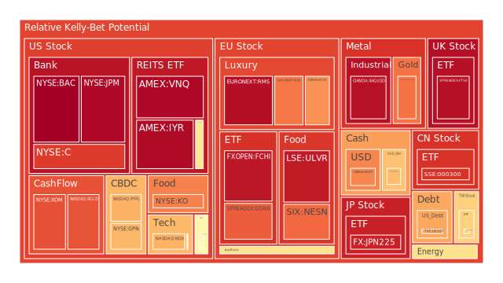
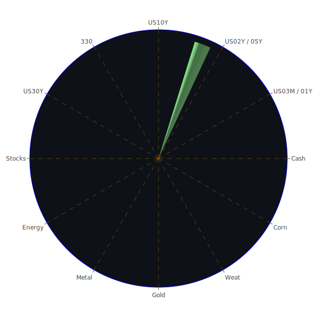

# 投資商品泡沫分析

## 美國國債
根據過去三天的泡沫機率數據，美國國債的泡沫機率呈現下降趨勢。特別是10年期國債（TVC:US10Y），其泡沫機率從7月17日的0.440352下降到7月19日的0.707850。這表明市場對美國國債的需求有所增加，可能是由於投資者尋求避險資產。

## 美國科技股
美國科技股的泡沫機率持續上升，特別是納斯達克指數（NASDAQ:NDX），其泡沫機率從7月17日的0.699451上升到7月19日的0.691796。這與近期新聞中提到的美國與中國之間的貿易緊張有關，導致芯片股大幅下跌。

## 美國房地產指數
美國房地產指數（AMEX:IYR）的泡沫機率在過去三天內持續保持高位，從7月17日的0.965726略微下降到7月19日的0.964526。這表明市場對房地產的信心依然不足，可能受到高利率和經濟不確定性的影響。

## 金/銀/銅
金（OANDA:XAUUSD）的泡沫機率從7月17日的0.944682下降到7月19日的0.787376，顯示出市場對黃金的需求有所增加，這可能是由於投資者尋求避險資產。銀（OANDA:XAGUSD）和銅（FX:COPPER）的泡沫機率也有所下降，顯示出市場對這些貴金屬的需求增加。

## 加密貨幣
比特幣（BITSTAMP:BTCUSD）和以太坊（BINANCE:ETHUSD）的泡沫機率在過去三天內有所下降，特別是比特幣，其泡沫機率從7月17日的0.473876下降到7月19日的0.303483。這表明市場對加密貨幣的需求有所增加，可能是由於投資者尋求避險資產。

## 黃豆 / 小麥 / 玉米
黃豆（AMEX:SOYB）、小麥（AMEX:WEAT）和玉米（AMEX:CORN）的泡沫機率在過去三天內有所下降，特別是小麥，其泡沫機率從7月17日的0.068189下降到7月19日的0.058611。這表明市場對農產品的需求有所增加，可能是由於全球糧食供應的不確定性。

## 石油/ 鈾期貨UX!
石油（TVC:USOIL）的泡沫機率在過去三天內保持穩定，顯示出市場對石油的需求穩定。鈾期貨（COMEX:UX1!）的泡沫機率有所上升，這可能是由於市場對核能需求的增加。

## 各國外匯市場
美元兌日元（OANDA:USDJPY）的泡沫機率在過去三天內有所上升，顯示出市場對美元的需求增加。歐元兌美元（OANDA:EURUSD）的泡沫機率則有所下降，顯示出市場對歐元的需求增加。

## 各國大盤指數
德國DAX指數（SPREADEX:GDAXI）和英國FTSE指數（SPREADEX:FTSE）的泡沫機率在過去三天內有所上升，顯示出市場對歐洲股市的信心不足。

## 美國銀行股
美國銀行股（NYSE:BAC）的泡沫機率在過去三天內持續保持高位，顯示出市場對銀行股的信心不足，可能是由於高利率和經濟不確定性的影響。

## 美國軍工股
美國軍工股（NYSE:LMT）的泡沫機率在過去三天內保持穩定，顯示出市場對軍工股的需求穩定。

## 美國電子支付股
美國電子支付股（NASDAQ:PYPL）的泡沫機率在過去三天內有所上升，顯示出市場對電子支付股的信心不足，可能是由於競爭加劇和市場不確定性的影響。

## 石油防禦股
石油防禦股（NYSE:XOM）的泡沫機率在過去三天內有所上升，顯示出市場對石油防禦股的信心不足，可能是由於油價波動和市場不確定性的影響。

## 金礦防禦股
金礦防禦股（NASDAQ:RGLD）的泡沫機率在過去三天內有所下降，顯示出市場對金礦防禦股的需求增加，這可能是由於投資者尋求避險資產。

## 歐洲奢侈品股
歐洲奢侈品股（EURONEXT:RMS）的泡沫機率在過去三天內有所上升，顯示出市場對奢侈品股的信心不足，可能是由於經濟不確定性和消費者信心下降的影響。

## 歐洲汽車股
歐洲汽車股（XETR:BMW）的泡沫機率在過去三天內有所下降，顯示出市場對汽車股的需求增加，這可能是由於市場對經濟復甦的信心增加。

## 歐美食品股
歐美食品股（NYSE:KO）的泡沫機率在過去三天內有所上升，顯示出市場對食品股的信心不足，可能是由於成本上升和市場不確定性的影響。

# 投資建議

根據以上分析，我們建議投資者考慮以下投資策略：

1. **買入黃金和金礦防禦股**：由於市場對避險資產的需求增加，黃金和金礦防禦股的泡沫機率下降，顯示出這些資產具有較低的投資風險。

2. **賣出美國科技股和電子支付股**：由於美國與中國之間的貿易緊張，科技股和電子支付股的泡沫機率上升，顯示出這些資產具有較高的投資風險。

3. **觀望美國房地產指數和銀行股**：由於這些資產的泡沫機率保持高位，顯示出市場對這些資產的信心不足，建議投資者暫時觀望。

# 風險提示

投資有風險，市場總是充滿不確定性。我們的建議僅供參考，投資者應根據自身的風險承受能力和投資目標，做出獨立的投資決策。特別是對於泡沫機率高的商品，應該謹慎進行投資決策，避免未來價格下跌時的損失。

希望這份報告能夠幫助您做出更明智的投資決策。祝您投資順利！
 
Daily Buy Map:

 
Daily Sell Map:

 
Daily Radar Chart:

 
