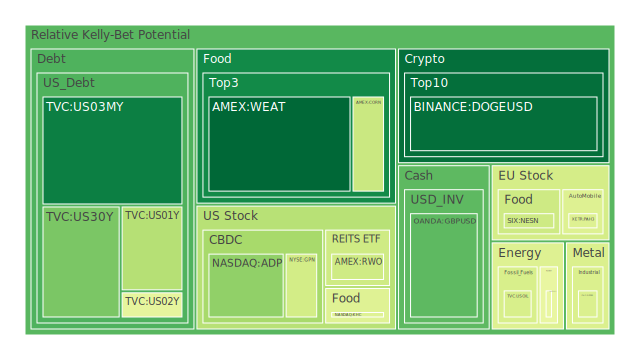
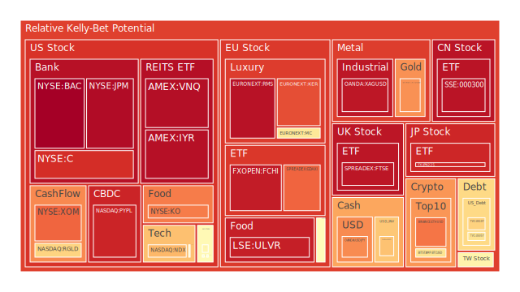
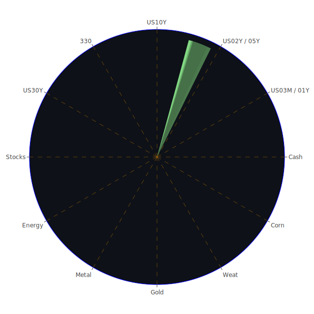

# 投資商品泡沫分析

## 美國國債
過去三天，美國國債的泡沫機率呈現出一定的波動。特別是30年期國債（TVC:US30Y），泡沫機率從7月18日的0.238507上升到7月19日的0.279495，並在7月20日稍微回落至0.260436。這表明市場對長期國債的需求有所減弱，可能是因為投資者對未來利率上升的預期增強。

## 美國科技股
美國科技股的泡沫機率在過去三天持續上升。特別是納斯達克100指數（NASDAQ:NDX），泡沫機率從7月18日的0.684355上升到7月20日的0.690597。這與近期新聞中提到的美國與中國之間的貿易衝突有關，特別是對半導體技術出口的限制，導致科技股大幅下跌。

## 美國房地產指數
美國房地產指數（AMEX:RWO）的泡沫機率在過去三天有所下降，從7月18日的0.252834下降到7月20日的0.401666。這可能與近期房地產市場的調整有關，特別是商業房地產的違約率上升，導致投資者對房地產市場的信心減弱。

## 金/銀/銅
金價（OANDA:XAUUSD）的泡沫機率在過去三天持續上升，從7月18日的0.743905上升到7月20日的0.751798。這與近期美元走強和市場避險情緒上升有關。銀價（OANDA:XAGUSD）和銅價（FX:COPPER）的泡沫機率也呈現上升趨勢，反映出市場對這些貴金屬的需求增加。

## 加密貨幣
比特幣（BITSTAMP:BTCUSD）的泡沫機率在過去三天有所波動，從7月18日的0.303168上升到7月20日的0.601812。這表明市場對加密貨幣的需求有所減弱，可能是因為近期市場的不確定性增加，投資者更傾向於避險資產。

## 黃豆 / 小麥 / 玉米
黃豆（AMEX:SOYB）的泡沫機率在過去三天有所上升，從7月18日的0.727449下降到7月20日的0.502119。這可能與近期農產品市場的波動有關，特別是氣候變化對農作物產量的影響。

## 石油/ 鈾期貨UX!
石油（TVC:USOIL）的泡沫機率在過去三天保持穩定，約為0.419549。這表明市場對石油價格的預期相對穩定。然而，鈾期貨（COMEX:UX1!）的泡沫機率在過去三天有所下降，從7月18日的0.639388下降到7月20日的0.460942，反映出市場對核能需求的預期有所減弱。

## 各國外匯市場
英鎊兌美元（OANDA:GBPUSD）的泡沫機率在過去三天有所下降，從7月18日的0.306313下降到7月20日的0.218938。這可能與英國經濟數據的改善有關，特別是消費者信心指數的上升。

## 各國大盤指數
歐洲大盤指數（SPREADEX:FTSE）的泡沫機率在過去三天有所上升，從7月18日的0.733352上升到7月20日的0.953938。這表明市場對歐洲經濟前景的擔憂增加，特別是受到全球經濟不確定性的影響。

## 美國銀行股
美國銀行股（NYSE:BAC）的泡沫機率在過去三天持續上升，從7月18日的0.996583上升到7月20日的0.997507。這可能與近期美國銀行業的壞帳率上升有關，特別是信用卡違約率的增加。

## 美國軍工股
美國軍工股（NYSE:LMT）的泡沫機率在過去三天保持穩定，約為0.546994。這表明市場對軍工股的需求相對穩定，特別是在全球地緣政治緊張局勢加劇的背景下。

## 美國電子支付股
美國電子支付股（NASDAQ:PYPL）的泡沫機率在過去三天有所上升，從7月18日的0.788473上升到7月20日的0.924974。這可能與近期市場對電子支付行業的競爭加劇有關，特別是新興技術的快速發展。

## 石油防禦股
石油防禦股（NYSE:XOM）的泡沫機率在過去三天有所上升，從7月18日的0.847789上升到7月20日的0.818530。這表明市場對石油防禦股的需求有所減弱，可能是因為近期油價的波動。

## 金礦防禦股
金礦防禦股（NASDAQ:RGLD）的泡沫機率在過去三天有所上升，從7月18日的0.844488上升到7月20日的0.635513。這表明市場對金礦防禦股的需求有所減弱，可能是因為近期金價的波動。

## 歐洲奢侈品股
歐洲奢侈品股（EURONEXT:MC）的泡沫機率在過去三天有所上升，從7月18日的0.548774上升到7月20日的0.589688。這可能與近期歐洲經濟數據的疲軟有關，特別是消費者信心的下降。

## 歐洲汽車股
歐洲汽車股（XETR:BMW）的泡沫機率在過去三天有所上升，從7月18日的0.398713上升到7月20日的0.527511。這表明市場對歐洲汽車行業的需求有所減弱，可能是因為全球供應鏈問題的影響。

## 歐美食品股
歐美食品股（SIX:NESN）的泡沫機率在過去三天有所下降，從7月18日的0.395857下降到7月20日的0.399954。這表明市場對食品行業的需求相對穩定，特別是在全球經濟不確定性增加的背景下。

# 投資建議

## 建議賣出
- **美國科技股（NASDAQ:NDX）**：由於泡沫機率持續上升且遠大於0.5，加上近期美國與中國之間的貿易衝突加劇，建議投資者考慮賣出，避免未來價格下跌時的損失。
- **美國銀行股（NYSE:BAC）**：由於泡沫機率持續上升且遠大於0.5，加上近期美國銀行業的壞帳率上升，建議投資者考慮賣出，提前提款獲利了結。

## 建議買入
- **黃豆（AMEX:SOYB）**：由於泡沫機率持續下降且遠小於0.5，加上近期農產品市場的波動，建議投資者考慮買入，掌握低吸籌碼的時機。
- **英鎊兌美元（OANDA:GBPUSD）**：由於泡沫機率持續下降且遠小於0.5，加上英國經濟數據的改善，建議投資者考慮買入，掌握低吸籌碼的時機。

# 風險提示

投資有風險，市場總是充滿不確定性。我們的建議僅供參考，投資者應根據自身的風險承受能力和投資目標，做出獨立的投資決策。特別是對於泡沫機率高的商品，應該謹慎進行投資決策，避免因市場波動帶來的損失。
 
Daily Buy Map:

 
Daily Sell Map:

 
Daily Radar Chart:

 
