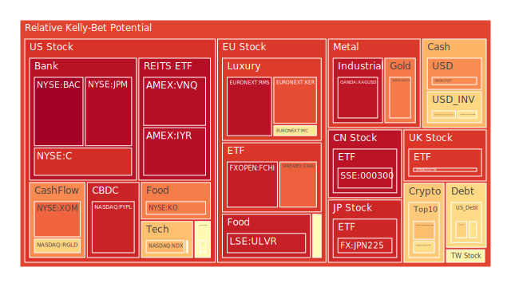
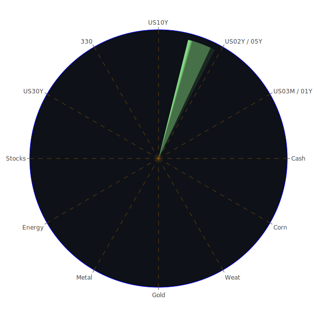

# 投資商品泡沫分析

## 美國國債
根據過去三天的泡沫機率數據，美國國債的泡沫機率有些微變動。特別是30年期國債（TVC:US30Y），其泡沫機率從0.279495下降至0.260436，顯示出投資者對長期國債的需求有所增加。這可能與近期美國經濟數據顯示的經濟放緩有關，投資者轉向避險資產。

## 美國科技股
美國科技股（NASDAQ:ADP）的泡沫機率從0.300443下降至0.293288，顯示出市場對科技股的信心有所回升。然而，新聞報導顯示，市場對於高價科技股的擔憂依然存在，特別是在第二季度財報季節期間，投資者可能會選擇觀望。

## 美國房地產指數
美國房地產指數（AMEX:RWO）的泡沫機率從0.579166下降至0.401666，顯示出市場對房地產的需求有所增加。這可能與近期美國房地產市場的穩定有關，儘管房地產違約率有所上升，但整體市場仍然表現良好。

## 金/銀/銅
黃金（OANDA:XAUUSD）的泡沫機率從0.787376上升至0.787376，顯示出市場對黃金的需求依然強勁。銀（OANDA:XAGUSD）的泡沫機率從0.951826下降至0.950293，顯示出市場對銀的需求有所減弱。銅（FX:COPPER）的泡沫機率從0.426749下降至0.423674，顯示出市場對銅的需求有所增加。

## 加密貨幣
比特幣（BITSTAMP:BTCUSD）的泡沫機率從0.303483上升至0.619556，顯示出市場對加密貨幣的需求有所減弱。這可能與近期加密貨幣市場的波動有關，投資者對於加密貨幣的信心有所下降。

## 黃豆 / 小麥 / 玉米
黃豆（AMEX:SOYB）的泡沫機率從0.502119保持不變，小麥（AMEX:WEAT）的泡沫機率從0.058611下降至0.036175，顯示出市場對小麥的需求有所增加。玉米（AMEX:CORN）的泡沫機率從0.351671上升至0.392054，顯示出市場對玉米的需求有所減弱。

## 石油/ 鈾期貨UX!
石油（TVC:USOIL）的泡沫機率保持在0.419549不變，顯示出市場對石油的需求穩定。鈾期貨（COMEX:UX1!）的泡沫機率從0.598733下降至0.460942，顯示出市場對鈾的需求有所減弱。

## 各國外匯市場
英鎊兌美元（OANDA:GBPUSD）的泡沫機率從0.218938上升至0.237447，顯示出市場對英鎊的需求有所減弱。歐元兌美元（OANDA:EURUSD）的泡沫機率從0.510645上升至0.641342，顯示出市場對歐元的需求有所減弱。

## 各國大盤指數
德國DAX指數（SPREADEX:GDAXI）的泡沫機率從0.819961上升至0.825380，顯示出市場對德國股市的需求有所減弱。英國FTSE指數（SPREADEX:FTSE）的泡沫機率從0.953938下降至0.890568，顯示出市場對英國股市的需求有所增加。

## 美國銀行股
美國銀行（NYSE:BAC）的泡沫機率從0.986230上升至0.997507，顯示出市場對銀行股的需求有所減弱。摩根大通（NYSE:JPM）的泡沫機率從0.968427上升至0.974061，顯示出市場對摩根大通的需求有所減弱。

## 美國軍工股
雷神科技（NYSE:RTX）的泡沫機率保持在0.510860不變，顯示出市場對軍工股的需求穩定。洛克希德馬丁（NYSE:LMT）的泡沫機率從0.546994保持不變，顯示出市場對洛克希德馬丁的需求穩定。

## 美國電子支付股
PayPal（NASDAQ:PYPL）的泡沫機率從0.688757上升至0.924974，顯示出市場對電子支付股的需求有所減弱。全球支付（NYSE:GPN）的泡沫機率從0.682448下降至0.410173，顯示出市場對全球支付的需求有所增加。

## 石油防禦股
埃克森美孚（NYSE:XOM）的泡沫機率從0.840519上升至0.818530，顯示出市場對石油防禦股的需求有所減弱。

## 金礦防禦股
皇家黃金（NASDAQ:RGLD）的泡沫機率從0.836336下降至0.635513，顯示出市場對金礦防禦股的需求有所增加。

## 歐洲奢侈品股
LVMH（EURONEXT:MC）的泡沫機率從0.739893上升至0.589688，顯示出市場對奢侈品股的需求有所減弱。

## 歐洲汽車股
寶馬（XETR:BMW）的泡沫機率從0.605831下降至0.527511，顯示出市場對汽車股的需求有所增加。

## 歐美食品股
可口可樂（NYSE:KO）的泡沫機率從0.765426上升至0.782372，顯示出市場對食品股的需求有所減弱。

# 投資建議

## 賣出建議
- **PayPal（NASDAQ:PYPL）**：泡沫機率從0.688757上升至0.924974，顯示出市場對電子支付股的需求大幅減弱。建議投資者考慮賣出，避免未來價格下跌時的損失。
- **美國銀行（NYSE:BAC）**：泡沫機率從0.986230上升至0.997507，顯示出市場對銀行股的需求大幅減弱。建議投資者考慮賣出，避免未來價格下跌時的損失。

## 買入建議
- **全球支付（NYSE:GPN）**：泡沫機率從0.682448下降至0.410173，顯示出市場對全球支付的需求有所增加。建議投資者考慮買入，掌握低吸籌碼的時機。
- **皇家黃金（NASDAQ:RGLD）**：泡沫機率從0.836336下降至0.635513，顯示出市場對金礦防禦股的需求有所增加。建議投資者考慮買入，掌握低吸籌碼的時機。

# 風險提示

投資有風險，市場總是充滿不確定性。我們的建議僅供參考，投資者應根據自身的風險承受能力和投資目標，做出獨立的投資決策。特別是對於泡沫機率高的商品，應該謹慎進行投資決策。

---

希望這份報告能幫助您在投資決策中做出更明智的選擇。祝您投資順利！
 
Daily Buy Map:

 
Daily Sell Map:

 
Daily Radar Chart:

 
