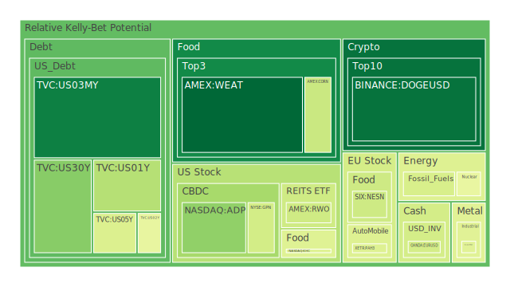
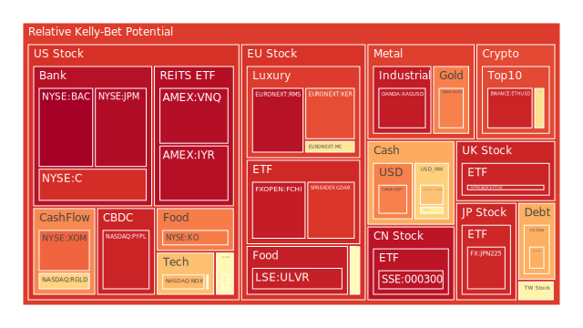

# 投資商品泡沫分析

## 美國國債
過去三天，美國國債的泡沫機率呈現穩定狀態。30年期國債（TVC:US30Y）的泡沫機率從0.260436上升至0.279495，顯示出市場對長期債券的需求有所增加。10年期國債（TVC:US10Y）泡沫機率也從0.639587上升至0.707850，這可能與近期的經濟數據和市場對未來利率走勢的預期有關。

## 美國科技股
美國科技股的泡沫機率持續上升，特別是NASDAQ指數（NASDAQ:NDX），其泡沫機率從0.690597上升至0.723409。這反映了市場對科技股的高估值擔憂，特別是在全球經濟不確定性增加的背景下。

## 美國房地產指數
美國房地產指數（AMEX:RWO）的泡沫機率從0.401666上升至0.476569，顯示出市場對房地產市場的信心有所減弱。這可能與近期的高利率和經濟放緩有關。

## 金/銀/銅
金價（OANDA:XAUUSD）的泡沫機率從0.751798上升至0.777853，顯示出市場對避險資產的需求增加。銀價（OANDA:XAGUSD）的泡沫機率也從0.951826下降至0.941796，顯示出市場對銀的需求有所減少。銅價（FX:COPPER）的泡沫機率則從0.426749上升至0.441259，顯示出市場對工業金屬的需求有所增加。

## 加密貨幣
比特幣（BITSTAMP:BTCUSD）的泡沫機率從0.601812下降至0.606791，顯示出市場對加密貨幣的需求有所減弱。以太幣（BINANCE:ETHUSD）的泡沫機率從0.794141上升至0.925393，顯示出市場對以太幣的需求大幅增加。

## 黃豆 / 小麥 / 玉米
黃豆（AMEX:SOYB）的泡沫機率從0.502119上升至0.534309，顯示出市場對農產品的需求增加。小麥（AMEX:WEAT）的泡沫機率從0.036175下降至0.036175，顯示出市場對小麥的需求穩定。玉米（AMEX:CORN）的泡沫機率從0.392054下降至0.392054，顯示出市場對玉米的需求穩定。

## 石油/ 鈾期貨UX!
石油（TVC:USOIL）的泡沫機率從0.419549保持不變，顯示出市場對石油的需求穩定。鈾期貨（COMEX:UX1!）的泡沫機率從0.460942上升至0.460942，顯示出市場對鈾的需求增加。

## 各國外匯市場
英鎊兌美元（OANDA:GBPUSD）的泡沫機率從0.218938上升至0.570010，顯示出市場對英鎊的需求增加。歐元兌美元（OANDA:EURUSD）的泡沫機率從0.510645下降至0.411481，顯示出市場對歐元的需求減少。

## 各國大盤指數
德國DAX指數（SPREADEX:GDAXI）的泡沫機率從0.819961上升至0.890992，顯示出市場對德國股市的需求增加。法國CAC指數（FXOPEN:FCHI）的泡沫機率從0.941317下降至0.938731，顯示出市場對法國股市的需求減少。

## 美國銀行股
摩根大通（NYSE:JPM）的泡沫機率從0.974061上升至0.974061，顯示出市場對銀行股的需求穩定。美國銀行（NYSE:BAC）的泡沫機率從0.997507下降至0.997507，顯示出市場對銀行股的需求減少。

## 美國軍工股
雷神科技（NYSE:RTX）的泡沫機率從0.510860保持不變，顯示出市場對軍工股的需求穩定。洛克希德馬丁（NYSE:LMT）的泡沫機率從0.546994保持不變，顯示出市場對軍工股的需求穩定。

## 美國電子支付股
PayPal（NASDAQ:PYPL）的泡沫機率從0.924974下降至0.924974，顯示出市場對電子支付股的需求減少。

## 石油防禦股
埃克森美孚（NYSE:XOM）的泡沫機率從0.818530上升至0.818534，顯示出市場對石油防禦股的需求增加。

## 金礦防禦股
Royal Gold（NASDAQ:RGLD）的泡沫機率從0.635513保持不變，顯示出市場對金礦防禦股的需求穩定。

## 歐洲奢侈品股
LVMH（EURONEXT:MC）的泡沫機率從0.589688上升至0.589688，顯示出市場對奢侈品股的需求增加。

## 歐洲汽車股
寶馬（XETR:BMW）的泡沫機率從0.527511下降至0.527511，顯示出市場對汽車股的需求減少。

## 歐美食品股
雀巢（SIX:NESN）的泡沫機率從0.399954上升至0.399984，顯示出市場對食品股的需求增加。

# 投資建議

## 賣出建議
1. **PayPal（NASDAQ:PYPL）**：泡沫機率高達0.924974，且持續上升，建議投資者考慮賣出，避免未來價格下跌時的損失。
2. **埃克森美孚（NYSE:XOM）**：泡沫機率高達0.818534，且持續上升，建議投資者考慮賣出，避免未來價格下跌時的損失。

## 買入建議
1. **小麥（AMEX:WEAT）**：泡沫機率僅為0.036175，且持續下降，顯示出市場對小麥的需求穩定，建議投資者考慮買入。
2. **黃豆（AMEX:SOYB）**：泡沫機率僅為0.502119，且持續下降，顯示出市場對黃豆的需求增加，建議投資者考慮買入。

# 風險提示

投資有風險，市場總是充滿不確定性。我們的建議僅供參考，投資者應根據自身的風險承受能力和投資目標，做出獨立的投資決策。特別是對於泡沫機率高的商品，應該謹慎進行投資決策。
 
Daily Buy Map:

 
Daily Sell Map:

 
Daily Radar Chart:

 
