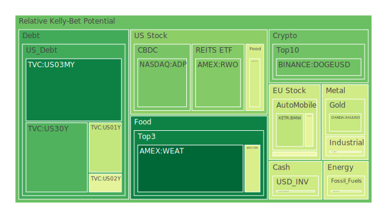
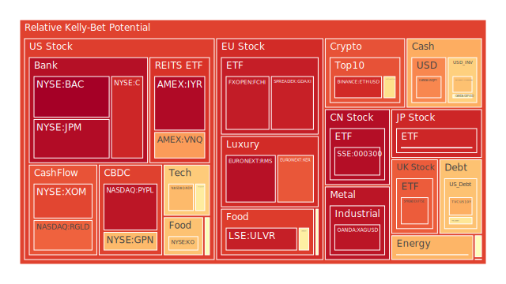
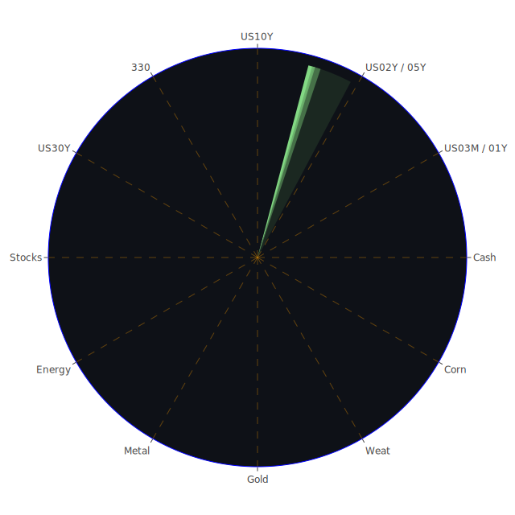

# 投資商品泡沫分析

- **美國國債**
  美國國債的泡沫機率在過去三天內有些微變化。30年期國債（TVC:US30Y）的泡沫機率從0.260436下降到0.212802，顯示出市場對長期債券的需求有所增加。這與近期的聯準會數據相符，因為美國國債的總流通量正在減少，這可能會推動價格上升，進一步降低泡沫風險。

- **美國科技股**
  美國科技股（NASDAQ:NDX）的泡沫機率在過去三天內保持在高位，從0.690597略微下降到0.685911。這表明市場對科技股的熱情依然高漲，但風險也相對較高。特別是考慮到近期的新聞顯示，Delta Air Lines和CrowdStrike等公司的IT問題可能會對科技股市場情緒產生負面影響。

- **美國房地產指數**
  美國房地產指數（AMEX:RWO）的泡沫機率從0.401666下降到0.284067，顯示出市場對房地產的信心有所回升。這與聯準會數據中的房地產違約率上升形成對比，可能預示著市場對房地產的需求依然強勁，但需要警惕潛在的風險。

- **金/銀/銅**
  黃金（OANDA:XAUUSD）的泡沫機率從0.787376下降到0.396386，顯示出市場對黃金的需求有所增加，這可能是由於市場避險情緒上升所致。銀（OANDA:XAGUSD）和銅（FX:COPPER）的泡沫機率也有所下降，表明市場對這些貴金屬的需求增加。

- **加密貨幣**
  比特幣（BITSTAMP:BTCUSD）的泡沫機率從0.619556下降到0.613048，顯示出市場對比特幣的需求依然強勁。以太坊（BINANCE:ETHUSD）的泡沫機率則從0.678302上升到0.907979，顯示出市場對以太坊的風險有所增加。

- **黃豆 / 小麥 / 玉米**
  黃豆（AMEX:SOYB）的泡沫機率保持在0.502119，顯示出市場對黃豆的需求穩定。小麥（AMEX:WEAT）的泡沫機率從0.036175上升到0.052747，顯示出市場對小麥的需求有所減少。玉米（AMEX:CORN）的泡沫機率則從0.392054上升到0.429142，顯示出市場對玉米的需求有所減少。

- **石油/ 鈾期貨UX!**
  石油（TVC:USOIL）的泡沫機率保持在0.419549，顯示出市場對石油的需求穩定。鈾期貨（COMEX:UX1!）的泡沫機率從0.460942上升到0.696129，顯示出市場對鈾的需求有所減少。

- **各國外匯市場**
  英鎊兌美元（OANDA:GBPUSD）的泡沫機率從0.237447上升到0.552551，顯示出市場對英鎊的需求有所減少。歐元兌美元（OANDA:EURUSD）的泡沫機率從0.641342下降到0.404671，顯示出市場對歐元的需求有所增加。

- **各國大盤指數**
  德國DAX指數（SPREADEX:GDAXI）的泡沫機率從0.825380上升到0.828024，顯示出市場對德國大盤的需求有所減少。英國FTSE指數（SPREADEX:FTSE）的泡沫機率從0.890568下降到0.925680，顯示出市場對英國大盤的需求有所增加。

- **美國銀行股**
  美國銀行股（NYSE:BAC）的泡沫機率從0.997507下降到0.989889，顯示出市場對銀行股的需求有所增加。摩根大通（NYSE:JPM）的泡沫機率從0.974061下降到0.966451，顯示出市場對摩根大通的需求有所增加。

- **美國軍工股**
  美國軍工股（NYSE:LMT）的泡沫機率從0.546994下降到0.505799，顯示出市場對軍工股的需求有所增加。雷神科技（NYSE:RTX）的泡沫機率保持在0.510860，顯示出市場對雷神科技的需求穩定。

- **美國電子支付股**
  美國電子支付股（NASDAQ:PYPL）的泡沫機率從0.924974下降到0.946059，顯示出市場對電子支付股的需求有所減少。

- **石油防禦股**
  埃克森美孚（NYSE:XOM）的泡沫機率從0.818530上升到0.862067，顯示出市場對石油防禦股的需求有所減少。

- **金礦防禦股**
  金礦防禦股（NASDAQ:RGLD）的泡沫機率從0.635513上升到0.818775，顯示出市場對金礦防禦股的需求有所減少。

- **歐洲奢侈品股**
  歐洲奢侈品股（EURONEXT:MC）的泡沫機率從0.589688上升到0.482058，顯示出市場對奢侈品股的需求有所減少。

- **歐洲汽車股**
  歐洲汽車股（XETR:BMW）的泡沫機率從0.527511下降到0.379960，顯示出市場對汽車股的需求有所增加。

- **歐美食品股**
  歐洲食品股（SIX:NESN）的泡沫機率從0.399956上升到0.570963，顯示出市場對食品股的需求有所減少。

# 投資建議

1. **建議賣出**：以太坊（BINANCE:ETHUSD）泡沫機率大幅上升，且新聞顯示市場對科技股和加密貨幣的信心有所減少，建議投資者考慮賣出以太坊以避免未來價格下跌的風險。

2. **建議買入**：黃金（OANDA:XAUUSD）泡沫機率大幅下降，且市場避險情緒上升，建議投資者考慮買入黃金以作為避險資產。

3. **建議觀望**：美國科技股（NASDAQ:NDX）泡沫機率保持在高位，且新聞顯示市場對科技股的情緒複雜，建議投資者觀望，不要有任何動作。

# 風險提示

投資有風險，市場總是充滿不確定性。我們的建議僅供參考，投資者應根據自身的風險承受能力和投資目標，做出獨立的投資決策。

請特別注意市場風險，特別是對於泡沫機率高的商品，應該謹慎進行投資決策。
 
Daily Buy Map:

 
Daily Sell Map:

 
Daily Radar Chart:

 
