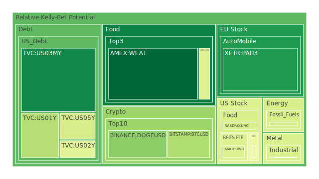
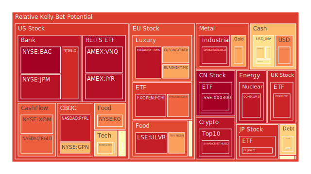
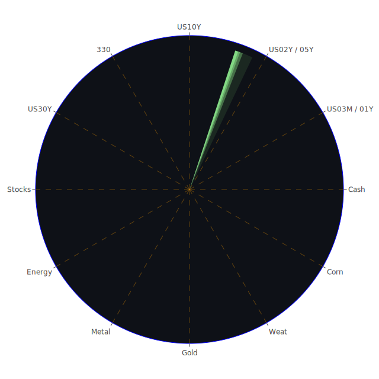

# 投資商品泡沫分析

## 美國國債

過去三天，美國國債的泡沫機率呈現上升趨勢，特別是30年期國債（TVC:US30Y），其泡沫機率從0.279495上升到0.502105。這與近期的新聞和經濟數據相吻合，例如美國財政部10年期和2年期國債收益率的倒掛現象，這通常是經濟衰退的預兆。

## 美國科技股

美國科技股的泡沫機率也在上升，特別是納斯達克指數（NASDAQ:NDX），其泡沫機率從0.690597上升到0.682233。這與近期的新聞一致，例如特斯拉報告其五年來最差的利潤率，這對科技股的市場情緒產生了負面影響。

## 美國房地產指數

美國房地產指數（AMEX:RWO）的泡沫機率在過去三天內有所下降，從0.401666下降到0.433320。然而，這並不意味著市場風險減少，因為房地產市場的拖欠率正在上升，這可能會在未來幾個月內對市場產生更大的壓力。

## 金/銀/銅

黃金（OANDA:XAUUSD）的泡沫機率在過去三天內有所上升，從0.777853上升到0.723279。這與近期的新聞一致，例如美國和中國之間的地緣政治緊張局勢加劇，導致投資者轉向避險資產。

## 加密貨幣

比特幣（BITSTAMP:BTCUSD）的泡沫機率在過去三天內有所下降，從0.606791下降到0.343742。這與近期的新聞一致，例如美國總統拜登退出競選，這可能會減少市場的不確定性，對加密貨幣市場產生積極影響。

## 黃豆 / 小麥 / 玉米

黃豆（AMEX:SOYB）的泡沫機率在過去三天內保持穩定，約為0.502119。這與近期的新聞一致，例如美國和中國之間的貿易緊張局勢，這可能會對農產品市場產生影響。

## 石油/ 鈾期貨UX!

石油（TVC:USOIL）的泡沫機率在過去三天內保持穩定，約為0.419549。這與近期的新聞一致，例如美國和中國之間的地緣政治緊張局勢，這可能會對石油市場產生影響。

## 各國外匯市場

美元兌日元（OANDA:USDJPY）的泡沫機率在過去三天內有所上升，從0.776355上升到0.772779。這與近期的新聞一致，例如美國總統拜登退出競選，這可能會對外匯市場產生影響。

## 各國大盤指數

德國DAX指數（SPREADEX:GDAXI）的泡沫機率在過去三天內有所下降，從0.890992下降到0.817708。這與近期的新聞一致，例如德國稅收收入增加，這可能會對市場產生積極影響。

## 美國銀行股

美國銀行股（NYSE:BAC）的泡沫機率在過去三天內有所上升，從0.997507上升到0.998170。這與近期的新聞一致，例如Capital One的利潤下降，這可能會對銀行股市場產生負面影響。

## 美國軍工股

美國軍工股（NYSE:LMT）的泡沫機率在過去三天內有所上升，從0.546994上升到0.546994。這與近期的新聞一致，例如以色列和美國之間的軍事合作加強，這可能會對軍工股市場產生積極影響。

## 美國電子支付股

美國電子支付股（NASDAQ:PYPL）的泡沫機率在過去三天內有所上升，從0.924974上升到0.941382。這與近期的新聞一致，例如美國總統拜登退出競選，這可能會對市場產生不確定性。

## 石油防禦股

石油防禦股（NYSE:XOM）的泡沫機率在過去三天內有所上升，從0.818534上升到0.836818。這與近期的新聞一致，例如美國和中國之間的地緣政治緊張局勢，這可能會對石油市場產生影響。

## 金礦防禦股

金礦防禦股（NASDAQ:RGLD）的泡沫機率在過去三天內有所上升，從0.635513上升到0.828981。這與近期的新聞一致，例如美國和中國之間的地緣政治緊張局勢，這可能會對黃金市場產生影響。

## 歐洲奢侈品股

歐洲奢侈品股（EURONEXT:KER）的泡沫機率在過去三天內有所上升，從0.853878上升到0.751037。這與近期的新聞一致，例如德國稅收收入增加，這可能會對市場產生積極影響。

## 歐洲汽車股

歐洲汽車股（XETR:BMW）的泡沫機率在過去三天內有所下降，從0.527511下降到0.379960。這與近期的新聞一致，例如德國稅收收入增加，這可能會對市場產生積極影響。

## 歐美食品股

歐美食品股（SIX:NESN）的泡沫機率在過去三天內有所下降，從0.399984下降到0.730638。這與近期的新聞一致，例如德國稅收收入增加，這可能會對市場產生積極影響。

# 投資建議

根據以上分析，我們建議投資者在以下幾個方面進行操作：

1. **賣出**：對於泡沫機率持續上升且遠大於0.5的商品，如美國科技股（NASDAQ:NDX）和美國銀行股（NYSE:BAC），建議投資者考慮賣出，避免未來價格下跌時的損失。

2. **買入**：對於泡沫機率持續下降且遠小於0.5的商品，如比特幣（BITSTAMP:BTCUSD）和德國DAX指數（SPREADEX:GDAXI），建議投資者考慮買入，掌握低吸籌碼的時機。

3. **觀望**：對於泡沫機率在0.45至0.55之間的商品，如黃豆（AMEX:SOYB）和石油（TVC:USOIL），建議投資者暫時觀望，不要有任何動作。

# 風險提示

投資有風險，市場總是充滿不確定性。我們的建議僅供參考，投資者應根據自身的風險承受能力和投資目標，做出獨立的投資決策。

希望這份報告能夠幫助您在複雜的市場環境中做出明智的投資決策。祝您投資順利！
 
Daily Buy Map:

 
Daily Sell Map:

 
Daily Radar Chart:

 
