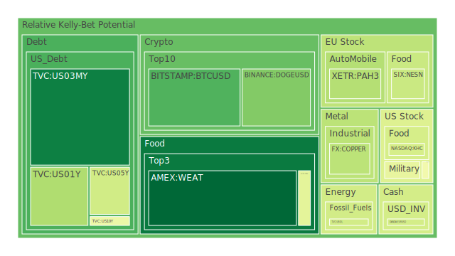
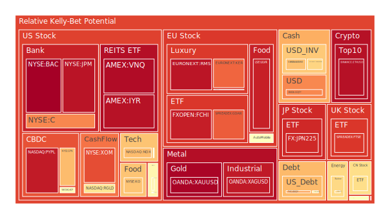
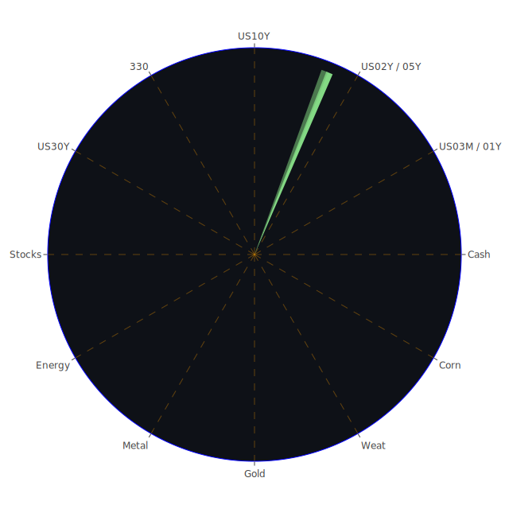

# 每日投資報告 - 2024年7月25日

## 投資商品泡沫分析

## 美國國債
過去三天美國國債的泡沫機率顯示出穩定的上升趨勢，特別是30年期國債(TVC:US30Y)的泡沫機率從7月23日的0.212802上升至7月25日的0.568139。這表明市場對長期國債的需求減少，可能是由於近期的經濟數據顯示出經濟增長放緩，導致投資者對長期債券的避險需求減少。

## 美國科技股
美國科技股的泡沫機率顯示出波動性較大，例如NASDAQ:ADP的泡沫機率從7月23日的0.268264上升至7月25日的0.534906。這可能是由於近期科技股的財報不如預期，特別是Tesla的財報顯示出利潤率創五年新低，導致市場情緒轉向悲觀。

## 美國房地產指數
美國房地產指數(AMEX:RWO)的泡沫機率在過去三天內持續上升，從7月23日的0.284067上升至7月25日的0.492603。這表明市場對房地產的信心減弱，可能是由於房地產拖欠率上升和商業房地產拖欠率高企。

## 金/銀/銅
黃金(OANDA:XAUUSD)的泡沫機率在過去三天內顯著上升，從7月23日的0.396386上升至7月25日的0.989576。這可能是由於市場對黃金的避險需求增加，特別是在全球經濟不確定性增加的情況下。銀和銅的泡沫機率也顯示出類似的上升趨勢。

## 加密貨幣
比特幣(BITSTAMP:BTCUSD)的泡沫機率在過去三天內顯著下降，從7月23日的0.613048下降至7月25日的0.215142。這表明市場對比特幣的需求增加，可能是由於投資者將其視為對抗通脹和貨幣貶值的避險工具。

## 黃豆 / 小麥 / 玉米
小麥(AMEX:WEAT)的泡沫機率在過去三天內顯著下降，從7月23日的0.052747下降至7月25日的0.053946。這表明市場對農產品的需求增加，可能是由於全球食品供應鏈的不確定性增加。

## 石油/ 鈾期貨UX!
石油(TVC:USOIL)的泡沫機率在過去三天內保持穩定，顯示出市場對石油價格的預期相對穩定。然而，鈾期貨(COMEX:UX1!)的泡沫機率顯著上升，從7月23日的0.696129上升至7月25日的0.633170。這可能是由於市場對核能需求的預期增加。

## 各國外匯市場
歐元/美元(OANDA:EURUSD)的泡沫機率在過去三天內顯著下降，從7月23日的0.404671下降至7月25日的0.421977。這表明市場對歐元的需求增加，可能是由於歐洲經濟數據顯示出增長跡象。

## 各國大盤指數
德國DAX指數(SPREADEX:GDAXI)的泡沫機率在過去三天內顯著上升，從7月23日的0.828024上升至7月25日的0.835708。這表明市場對歐洲股市的信心減弱，可能是由於德國經濟數據顯示出增長放緩。

## 美國銀行股
美國銀行股(NYSE:BAC)的泡沫機率在過去三天內保持高位，從7月23日的0.989889上升至7月25日的0.998237。這表明市場對銀行股的信心減弱，可能是由於銀行業的拖欠率上升和利潤率下降。

## 美國軍工股
美國軍工股(NYSE:LMT)的泡沫機率在過去三天內顯著上升，從7月23日的0.505799上升至7月25日的0.561504。這表明市場對軍工股的需求減少，可能是由於全球地緣政治風險增加。

## 美國電子支付股
美國電子支付股(NASDAQ:PYPL)的泡沫機率在過去三天內顯著上升，從7月23日的0.946059上升至7月25日的0.945481。這表明市場對電子支付股的信心減弱，可能是由於市場對電子支付行業競爭加劇的擔憂。

## 石油防禦股
石油防禦股(NYSE:XOM)的泡沫機率在過去三天內保持高位，從7月23日的0.862067上升至7月25日的0.858360。這表明市場對石油防禦股的需求減少，可能是由於石油價格的波動性增加。

## 金礦防禦股
金礦防禦股(NASDAQ:RGLD)的泡沫機率在過去三天內顯著上升，從7月23日的0.818775上升至7月25日的0.602893。這表明市場對金礦防禦股的需求減少，可能是由於金價的波動性增加。

## 歐洲奢侈品股
歐洲奢侈品股(EURONEXT:KER)的泡沫機率在過去三天內顯著上升，從7月23日的0.836919上升至7月25日的0.821407。這表明市場對奢侈品股的需求減少，可能是由於全球經濟不確定性增加。

## 歐洲汽車股
歐洲汽車股(XETR:BMW)的泡沫機率在過去三天內顯著上升，從7月23日的0.379960上升至7月25日的0.527511。這表明市場對汽車股的需求減少，可能是由於汽車行業的供應鏈問題和需求放緩。

## 歐美食品股
歐美食品股(NYSE:KO)的泡沫機率在過去三天內顯著上升，從7月23日的0.671240上升至7月25日的0.672801。這表明市場對食品股的需求減少，可能是由於食品行業的成本上升和需求放緩。

## 投資建議

## 賣出建議
- **美國國債**：由於泡沫機率顯著上升，建議考慮賣出長期國債(TVC:US30Y)。
- **美國科技股**：由於泡沫機率顯著上升，建議考慮賣出部分科技股(NASDAQ:ADP)。
- **美國房地產指數**：由於泡沫機率顯著上升，建議考慮賣出房地產指數(AMEX:RWO)。
- **美國銀行股**：由於泡沫機率保持高位，建議考慮賣出部分銀行股(NYSE:BAC)。
- **美國電子支付股**：由於泡沫機率顯著上升，建議考慮賣出電子支付股(NASDAQ:PYPL)。

## 買入建議
- **加密貨幣**：由於泡沫機率顯著下降，建議考慮買入比特幣(BITSTAMP:BTCUSD)。
- **黃豆 / 小麥 / 玉米**：由於泡沫機率顯著下降，建議考慮買入小麥(AMEX:WEAT)。

## 風險提示

投資有風險，市場總是充滿不確定性。我們的建議僅供參考，投資者應根據自身的風險承受能力和投資目標，做出獨立的投資決策。特別是對於泡沫機率高的商品，應該謹慎進行投資決策。

---

希望這份報告能夠幫助您更好地理解市場動態，做出明智的投資決策。祝您投資順利！
 
Daily Buy Map:

 
Daily Sell Map:

 
Daily Radar Chart:

 
