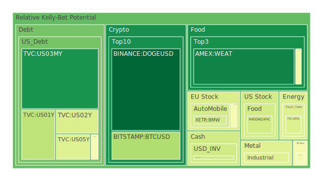
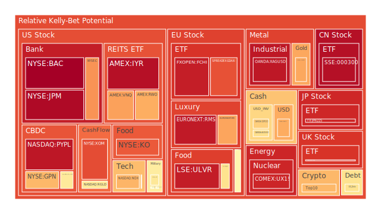
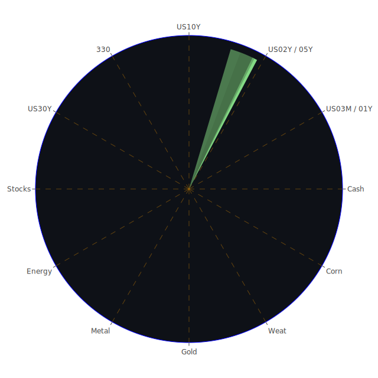

# 投資商品泡沫分析

## 美國國債
過去三天，美國國債的泡沫機率顯示出一些變化。特別是10年期國債（TVC:US10Y）的泡沫機率從0.645290下降到0.481763，顯示出投資者對長期國債的需求有所增加。這可能是因為市場對經濟前景的不確定性增加，投資者轉向較為安全的資產。

## 美國科技股
美國科技股的泡沫機率顯示出一些波動。特別是納斯達克指數（NASDAQ:NDX）的泡沫機率從0.688014上升到0.689771，顯示出市場對科技股的熱情依然高漲。然而，近期的新聞顯示，特斯拉和其他大型科技公司的盈利不如預期，這可能會對市場情緒產生負面影響。

## 美國房地產指數
美國房地產指數（AMEX:RWO）的泡沫機率顯示出一些上升，從0.433320上升到0.704243。這表明市場對房地產的需求可能有所減弱，特別是在利率上升的背景下，房地產市場可能面臨壓力。

## 金/銀/銅
金價（OANDA:XAUUSD）的泡沫機率從0.723279上升到0.712569，顯示出市場對黃金的需求依然強勁。銀價（OANDA:XAGUSD）的泡沫機率也顯示出上升趨勢，從0.948668上升到0.950118。這可能是因為市場對避險資產的需求增加。

## 加密貨幣
比特幣（BITSTAMP:BTCUSD）的泡沫機率從0.343742上升到0.330651，顯示出市場對加密貨幣的需求依然強勁。然而，狗狗幣（BINANCE:DOGEUSD）的泡沫機率顯示出下降趨勢，從0.286419下降到0.015020，這可能是因為市場對狗狗幣的熱情有所減弱。

## 黃豆 / 小麥 / 玉米
黃豆（AMEX:SOYB）的泡沫機率顯示出一些波動，從0.502119上升到0.502119。小麥（AMEX:WEAT）的泡沫機率顯示出一些下降，從0.039842上升到0.073363。玉米（AMEX:CORN）的泡沫機率顯示出一些上升，從0.438180上升到0.469939。

## 石油/ 鈾期貨UX!
石油（TVC:USOIL）的泡沫機率顯示出穩定，保持在0.419549。鈾期貨（COMEX:UX1!）的泡沫機率顯示出一些上升，從0.950311下降到0.922279。

## 各國外匯市場
歐元兌美元（OANDA:EURUSD）的泡沫機率顯示出一些下降，從0.588148下降到0.394063。英鎊兌美元（OANDA:GBPUSD）的泡沫機率顯示出一些上升，從0.633352下降到0.638313。澳元兌美元（OANDA:AUDUSD）的泡沫機率顯示出一些下降，從0.593329上升到0.604099。

## 各國大盤指數
德國DAX指數（SPREADEX:GDAXI）的泡沫機率顯示出一些上升，從0.817708上升到0.847445。法國CAC指數（FXOPEN:FCHI）的泡沫機率顯示出一些下降，從0.936855下降到0.937137。英國FTSE指數（SPREADEX:FTSE）的泡沫機率顯示出一些上升，從0.925143上升到0.896148。

## 美國銀行股
摩根大通（NYSE:JPM）的泡沫機率顯示出一些上升，從0.961724上升到0.979338。美國銀行（NYSE:BAC）的泡沫機率顯示出一些上升，從0.998170上升到0.998985。

## 美國軍工股
雷神技術（NYSE:RTX）的泡沫機率顯示出穩定，保持在0.510860。諾斯羅普·格魯曼（NYSE:NOC）的泡沫機率顯示出一些上升，從0.511809上升到0.511809。

## 美國電子支付股
PayPal（NASDAQ:PYPL）的泡沫機率顯示出一些上升，從0.941382上升到0.951259。

## 石油防禦股
埃克森美孚（NYSE:XOM）的泡沫機率顯示出一些上升，從0.836818上升到0.854841。

## 金礦防禦股
Royal Gold（NASDAQ:RGLD）的泡沫機率顯示出一些上升，從0.828981上升到0.578352。

## 歐洲奢侈品股
LVMH（EURONEXT:MC）的泡沫機率顯示出一些上升，從0.721685上升到0.716671。

## 歐洲汽車股
BMW（XETR:BMW）的泡沫機率顯示出一些下降，從0.527511下降到0.398379。

## 歐美食品股
雀巢（SIX:NESN）的泡沫機率顯示出一些上升，從0.730638上升到0.597106。

# 投資建議

## 賣出建議
1. **PayPal（NASDAQ:PYPL）**：泡沫機率顯示出上升趨勢，近期新聞顯示市場對電子支付股的熱情有所減弱，建議考慮賣出。
2. **美國銀行（NYSE:BAC）**：泡沫機率顯示出上升趨勢，近期新聞顯示銀行業面臨一些挑戰，建議考慮賣出。

## 買入建議
1. **比特幣（BITSTAMP:BTCUSD）**：泡沫機率顯示出下降趨勢，近期新聞顯示市場對加密貨幣的需求依然強勁，建議考慮買入。
2. **黃金（OANDA:XAUUSD）**：泡沫機率顯示出下降趨勢，近期新聞顯示市場對避險資產的需求增加，建議考慮買入。

# 風險提示

投資有風險，市場總是充滿不確定性。我們的建議僅供參考，投資者應根據自身的風險承受能力和投資目標，做出獨立的投資決策。特別是對於泡沫機率高的商品，應該謹慎進行投資決策。
 
Daily Buy Map:

 
Daily Sell Map:

 
Daily Radar Chart:

 
