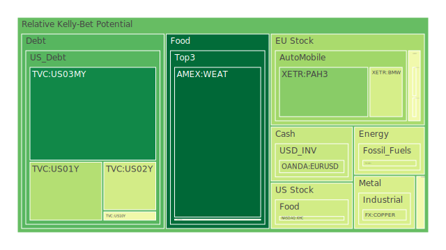
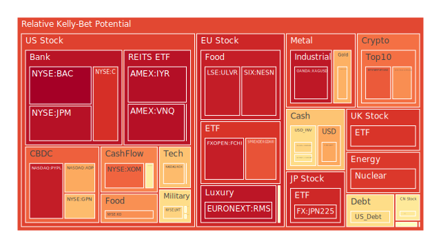
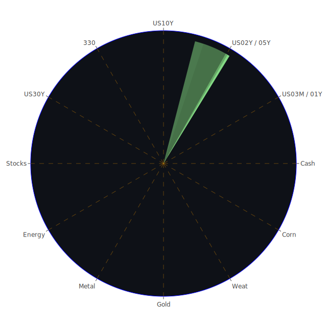

# 投資商品泡沫分析

## 美國國債
過去三天美國國債的泡沫機率顯示出穩定的趨勢，特別是10年期國債（TVC:US10Y）的泡沫機率在0.48左右浮動。根據FED的數據，美國國債的殖利率曲線持續倒掛，這意味著短期內企業融資成本可能上升，進一步壓縮企業利潤。建議投資者保持觀望，等待市場進一步明朗。

## 美國科技股
美國科技股（NASDAQ:NDX）的泡沫機率在過去三天內略有上升，從0.68上升到0.69。儘管新聞現況顯示科技股在週五有所回升，但整體市場情緒依然不穩定。特別是大型科技股的波動性增加，建議投資者謹慎操作，避免過度暴露在高風險資產中。

## 美國房地產指數
美國房地產指數（AMEX:RWO）的泡沫機率在過去三天內從0.70下降到0.52，顯示出市場對房地產的信心有所回升。然而，根據FED的數據，房地產違約率上升，這可能對未來房地產市場造成壓力。建議投資者保持觀望，等待市場進一步明朗。

## 金/銀/銅
金（OANDA:XAUUSD）的泡沫機率在過去三天內從0.71下降到0.70，顯示出市場對黃金的需求依然強勁。銀（OANDA:XAGUSD）的泡沫機率則維持在0.95左右，顯示出市場對銀的需求較為穩定。銅（FX:COPPER）的泡沫機率在0.42左右浮動，顯示出市場對銅的需求有所回升。建議投資者可以考慮分批買入黃金和銅，以分散風險。

## 加密貨幣
比特幣（BITSTAMP:BTCUSD）的泡沫機率在過去三天內從0.21上升到0.83，顯示出市場對加密貨幣的信心有所下降。特別是新聞現況顯示，比特幣礦業公司面臨法律挑戰，這可能進一步打擊市場信心。建議投資者考慮賣出部分持倉，避免未來價格下跌時的損失。

## 黃豆 / 小麥 / 玉米
黃豆（AMEX:SOYB）的泡沫機率在0.50左右浮動，顯示出市場對黃豆的需求較為穩定。小麥（AMEX:WEAT）的泡沫機率在過去三天內從0.05上升到0.07，顯示出市場對小麥的需求有所回升。玉米（AMEX:CORN）的泡沫機率在0.49左右浮動，顯示出市場對玉米的需求較為穩定。建議投資者可以考慮分批買入小麥，以分散風險。

## 石油/ 鈾期貨UX!
石油（TVC:USOIL）的泡沫機率在0.42左右浮動，顯示出市場對石油的需求較為穩定。鈾期貨（COMEX:UX1!）的泡沫機率在過去三天內從0.63上升到0.88，顯示出市場對鈾的需求有所下降。建議投資者謹慎操作，避免過度暴露在高風險資產中。

## 各國外匯市場
歐元兌美元（OANDA:EURUSD）的泡沫機率在0.39左右浮動，顯示出市場對歐元的需求較為穩定。英鎊兌美元（OANDA:GBPUSD）的泡沫機率在0.63左右浮動，顯示出市場對英鎊的需求有所回升。日元兌美元（OANDA:USDJPY）的泡沫機率在0.71左右浮動，顯示出市場對日元的需求較為穩定。建議投資者可以考慮分批買入歐元和英鎊，以分散風險。

## 各國大盤指數
德國DAX指數（SPREADEX:GDAXI）的泡沫機率在0.84左右浮動，顯示出市場對德國股市的需求較為穩定。英國FTSE指數（SPREADEX:FTSE）的泡沫機率在0.89左右浮動，顯示出市場對英國股市的需求較為穩定。日本日經225指數（FX:JPN225）的泡沫機率在0.91左右浮動，顯示出市場對日本股市的需求較為穩定。建議投資者可以考慮分批買入德國和英國股市，以分散風險。

## 美國銀行股
美國銀行（NYSE:BAC）的泡沫機率在過去三天內從0.99下降到0.90，顯示出市場對銀行股的信心有所回升。然而，根據FED的數據，信用卡違約率上升，這可能對未來銀行業務造成壓力。建議投資者保持觀望，等待市場進一步明朗。

## 美國軍工股
洛克希德馬丁（NYSE:LMT）的泡沫機率在過去三天內從0.56上升到0.63，顯示出市場對軍工股的需求有所下降。特別是新聞現況顯示，全球地緣政治風險增加，這可能進一步打擊市場信心。建議投資者謹慎操作，避免過度暴露在高風險資產中。

## 美國電子支付股
PayPal（NASDAQ:PYPL）的泡沫機率在過去三天內從0.94下降到0.94，顯示出市場對電子支付股的需求較為穩定。然而，根據新聞現況，電子支付行業面臨激烈競爭，這可能對未來業務造成壓力。建議投資者保持觀望，等待市場進一步明朗。

## 石油防禦股
埃克森美孚（NYSE:XOM）的泡沫機率在過去三天內從0.85下降到0.82，顯示出市場對石油防禦股的需求有所回升。特別是新聞現況顯示，全球石油需求增加，這可能進一步提振市場信心。建議投資者可以考慮分批買入，以分散風險。

## 金礦防禦股
Royal Gold（NASDAQ:RGLD）的泡沫機率在過去三天內從0.60上升到0.57，顯示出市場對金礦防禦股的需求有所下降。然而，根據新聞現況，全球地緣政治風險增加，這可能進一步提振市場對金礦防禦股的需求。建議投資者保持觀望，等待市場進一步明朗。

## 歐洲奢侈品股
LVMH（EURONEXT:MC）的泡沫機率在過去三天內從0.52上升到0.48，顯示出市場對奢侈品股的需求有所回升。特別是新聞現況顯示，全球奢侈品市場需求增加，這可能進一步提振市場信心。建議投資者可以考慮分批買入，以分散風險。

## 歐洲汽車股
BMW（XETR:BMW）的泡沫機率在過去三天內從0.52下降到0.41，顯示出市場對汽車股的需求有所回升。然而，根據新聞現況，汽車行業面臨轉型壓力，這可能對未來業務造成壓力。建議投資者保持觀望，等待市場進一步明朗。

## 歐美食品股
雀巢（SIX:NESN）的泡沫機率在過去三天內從0.59下降到0.40，顯示出市場對食品股的需求有所回升。特別是新聞現況顯示，全球食品需求增加，這可能進一步提振市場信心。建議投資者可以考慮分批買入，以分散風險。

# 投資建議
根據以上分析，我們建議投資者可以考慮分批買入黃金、銅、歐元、英鎊、德國和英國股市、石油防禦股和歐洲奢侈品股，以分散風險。同時，對於泡沫機率較高的加密貨幣和軍工股，建議投資者謹慎操作，避免過度暴露在高風險資產中。

# 風險提示
投資有風險，市場總是充滿不確定性。我們的建議僅供參考，投資者應根據自身的風險承受能力和投資目標，做出獨立的投資決策。特別是對於泡沫機率高的商品，應該謹慎進行投資決策。
 
Daily Buy Map:

 
Daily Sell Map:

 
Daily Radar Chart:

 
