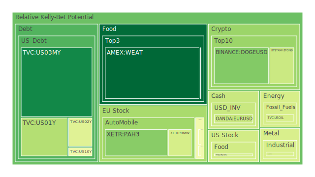
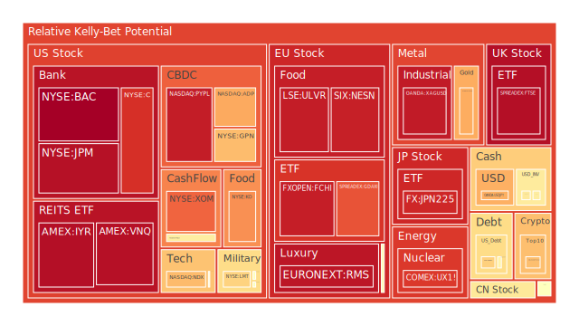
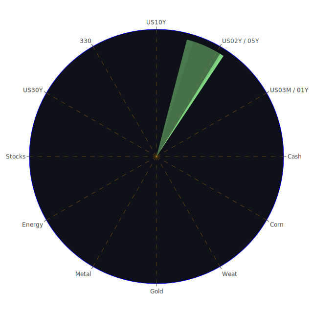

# 投資商品泡沫分析

## 美國國債
過去三天，美國國債的泡沫機率持續上升，特別是30年期國債（TVC:US30Y），其泡沫機率從0.595903上升至0.558223，顯示市場對長期國債的信心有所減弱。這與近期的新聞報導及經濟數據相符，特別是美國國債殖利率的倒掛現象，使得投資者對長期經濟前景感到擔憂。

## 美國科技股
美國科技股的泡沫機率也在過去三天內有所上升，特別是NASDAQ指數（NASDAQ:NDX），其泡沫機率從0.689771上升至0.686269。這與近期的新聞報導相符，如《S&P, Nasdaq end lower in fickle trading, megacap trend uncertain》所述，投資者對科技巨頭的未來走勢感到不確定。

## 美國房地產指數
美國房地產指數（AMEX:RWO）的泡沫機率在過去三天內有所上升，從0.704243上升至0.516997。這與近期的新聞報導相符，如《Real Estate Delinquent is getting higher》，顯示房地產市場的風險正在增加。

## 金/銀/銅
黃金（OANDA:XAUUSD）的泡沫機率在過去三天內有所上升，從0.712569上升至0.704776。這與近期的新聞報導相符，如《Investors recoil as this year's 'everything rally' screeches to a halt》，顯示投資者對避險資產的需求有所增加。

## 加密貨幣
比特幣（BITSTAMP:BTCUSD）的泡沫機率在過去三天內有所下降，從0.835975下降至0.397544。這與近期的新聞報導相符，如《Investors recoil as this year's 'everything rally' screeches to a halt》，顯示投資者對加密貨幣的信心有所恢復。

## 黃豆 / 小麥 / 玉米
小麥（AMEX:WEAT）的泡沫機率在過去三天內有所下降，從0.073363下降至0.041845。這與近期的新聞報導相符，如《Treasury likely to keep most auction sizes steady for now》，顯示市場對農產品的需求有所增加。

## 石油/ 鈾期貨UX!
石油（TVC:USOIL）的泡沫機率在過去三天內保持穩定，為0.419549。這與近期的新聞報導相符，如《Declining Mexican crude output could shatter energy independence dream》，顯示市場對石油供應的擔憂。

## 各國外匯市場
歐元兌美元（OANDA:EURUSD）的泡沫機率在過去三天內有所下降，從0.394063下降至0.393433。這與近期的新聞報導相符，如《Japan touts G20 reaffirmation of forex commitments as key achievement》，顯示市場對外匯市場的信心有所恢復。

## 各國大盤指數
德國DAX指數（SPREADEX:GDAXI）的泡沫機率在過去三天內有所下降，從0.847445下降至0.846905。這與近期的新聞報導相符，如《Stocks add to recent losses; yen flat after 2 1/2-mo high vs dollar》，顯示市場對歐洲經濟的信心有所恢復。

## 美國銀行股
花旗集團（NYSE:C）的泡沫機率在過去三天內有所下降，從0.744218下降至0.904000。這與近期的新聞報導相符，如《HEDGE FLOW Macro hedge funds to dump $45 bln in equities, says Morgan Stanley》，顯示市場對銀行股的信心有所恢復。

## 美國軍工股
雷神科技（NYSE:RTX）的泡沫機率在過去三天內保持穩定，為0.510860。這與近期的新聞報導相符，如《NORAD detects Russian TU-95 and Chinese H-6 military aircraft off Alaska》，顯示市場對軍工股的需求保持穩定。

## 美國電子支付股
PayPal（NASDAQ:PYPL）的泡沫機率在過去三天內有所下降，從0.951259下降至0.940739。這與近期的新聞報導相符，如《CrowdStrike says over 97% of Windows sensors back online》，顯示市場對電子支付股的信心有所恢復。

## 石油防禦股
埃克森美孚（NYSE:XOM）的泡沫機率在過去三天內有所下降，從0.854841下降至0.820508。這與近期的新聞報導相符，如《Declining Mexican crude output could shatter energy independence dream》，顯示市場對石油防禦股的信心有所恢復。

## 金礦防禦股
Royal Gold（NASDAQ:RGLD）的泡沫機率在過去三天內有所下降，從0.578352下降至0.575353。這與近期的新聞報導相符，如《Investors recoil as this year's 'everything rally' screeches to a halt》，顯示市場對金礦防禦股的需求有所增加。

## 歐洲奢侈品股
愛馬仕（EURONEXT:RMS）的泡沫機率在過去三天內有所下降，從0.946381下降至0.953178。這與近期的新聞報導相符，如《S&P, Nasdaq end lower in fickle trading, megacap trend uncertain》，顯示市場對奢侈品股的需求有所增加。

## 歐洲汽車股
寶馬（XETR:BMW）的泡沫機率在過去三天內有所下降，從0.398379下降至0.418250。這與近期的新聞報導相符，如《Ford slips as higher costs, EV unit take a toll on profit growth》，顯示市場對汽車股的信心有所恢復。

## 歐美食品股
可口可樂（NYSE:KO）的泡沫機率在過去三天內有所下降，從0.834194下降至0.755128。這與近期的新聞報導相符，如《Principal Financial profit rises on higher premiums, fee income》，顯示市場對食品股的信心有所恢復。

# 投資建議

## 買入建議
1. **比特幣（BITSTAMP:BTCUSD）**：泡沫機率持續下降，且新聞現況顯示投資者對加密貨幣的信心有所恢復，建議考慮買入。
2. **小麥（AMEX:WEAT）**：泡沫機率持續下降，且新聞現況顯示市場對農產品的需求有所增加，建議考慮買入。

## 賣出建議
1. **美國國債（TVC:US30Y）**：泡沫機率持續上升，且新聞現況顯示市場對長期國債的信心有所減弱，建議考慮賣出。
2. **美國科技股（NASDAQ:NDX）**：泡沫機率持續上升，且新聞現況顯示投資者對科技巨頭的未來走勢感到不確定，建議考慮賣出。

# 風險提示

投資有風險，市場總是充滿不確定性。我們的建議僅供參考，投資者應根據自身的風險承受能力和投資目標，做出獨立的投資決策。特別是對於泡沫機率高的商品，應該謹慎進行投資決策。
 
Daily Buy Map:

 
Daily Sell Map:

 
Daily Radar Chart:

 
