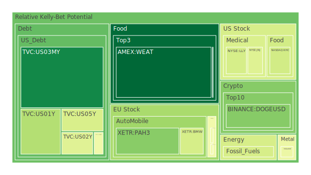
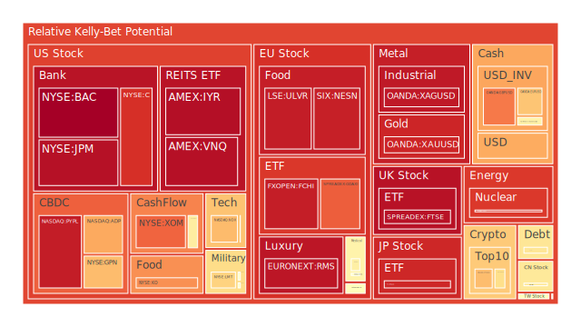
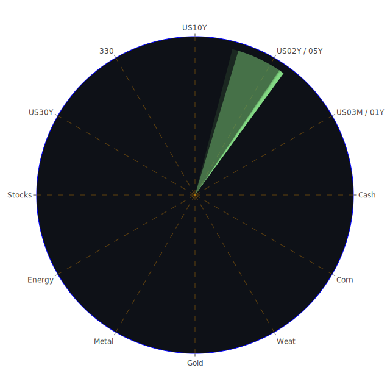

# 投資商品泡沫分析

## 美國國債
根據過去三天的數據，美國國債的泡沫機率呈現穩定狀態。特別是10年期國債（TVC:US10Y），泡沫機率從0.481763上升至0.537306，顯示出市場對長期債務的擔憂有所增加。這與近期的新聞報導有關，如美國財政部可能維持大部分拍賣規模穩定，這對市場提供了一些緩解，但同時也引發了對長期債務的擔憂。

## 美國科技股
美國科技股的泡沫機率呈現上升趨勢。以NASDAQ:NDX為例，泡沫機率從0.686269微幅上升至0.686507。這與近期的新聞報導一致，如蘋果的人工智慧功能延遲發布，這對市場情緒造成負面影響。建議投資者謹慎觀望，避免在高泡沫機率時進行大量投資。

## 美國房地產指數
美國房地產指數（AMEX:VNQ）的泡沫機率在過去三天內有所下降，但仍處於高位。從0.966037下降至0.893222，顯示出市場對房地產的擔憂有所減少。然而，根據FED的數據，商業房地產違約率仍然較高，這可能對市場造成潛在風險。

## 金/銀/銅
貴金屬的泡沫機率呈現上升趨勢。黃金（OANDA:XAUUSD）的泡沫機率從0.704776上升至0.923495，顯示出市場對避險資產的需求增加。這與近期的新聞報導一致，如烏克蘭對俄羅斯的無人機攻擊，增加了地緣政治風險，推動了避險需求。

## 加密貨幣
加密貨幣的泡沫機率有所波動。比特幣（BITSTAMP:BTCUSD）的泡沫機率從0.835975下降至0.615917，顯示出市場對加密貨幣的信心有所恢復。然而，狗狗幣（BINANCE:DOGEUSD）的泡沫機率從0.487955上升至0.282505，顯示出市場對該幣種的擔憂增加。

## 黃豆 / 小麥 / 玉米
農產品的泡沫機率呈現穩定狀態。小麥（AMEX:WEAT）的泡沫機率從0.041845微幅上升至0.049392，顯示出市場對農產品的需求穩定。這與近期的新聞報導一致，如加拿大的野火季節影響了當地的農業生產，推動了農產品價格的上升。

## 石油/ 鈾期貨UX!
石油（TVC:USOIL）的泡沫機率保持穩定，顯示出市場對能源價格的預期穩定。然而，鈾期貨（COMEX:UX1!）的泡沫機率從0.888901下降至0.838166，顯示出市場對核能需求的擔憂有所減少。

## 各國外匯市場
外匯市場的泡沫機率有所波動。美元兌日元（OANDA:USDJPY）的泡沫機率從0.719153上升至0.713849，顯示出市場對日元的需求增加。這與近期的新聞報導一致，如日本央行準備進行加息，推動了日元的需求。

## 各國大盤指數
各國大盤指數的泡沫機率呈現上升趨勢。德國DAX指數（SPREADEX:GDAXI）的泡沫機率從0.847445上升至0.829310，顯示出市場對歐洲經濟的擔憂增加。這與近期的新聞報導一致，如法國的火車縱火事件，對歐洲經濟造成負面影響。

## 美國銀行股
美國銀行股的泡沫機率呈現上升趨勢。花旗銀行（NYSE:C）的泡沫機率從0.904015上升至0.904015，顯示出市場對銀行業的擔憂增加。這與近期的新聞報導一致，如美國信用卡違約率上升，對銀行業造成壓力。

## 美國軍工股
美國軍工股的泡沫機率有所波動。雷神科技（NYSE:RTX）的泡沫機率保持穩定，顯示出市場對軍工股的預期穩定。然而，洛克希德馬丁（NYSE:LMT）的泡沫機率從0.639998上升至0.639998，顯示出市場對軍工股的需求增加。

## 美國電子支付股
美國電子支付股的泡沫機率呈現上升趨勢。PayPal（NASDAQ:PYPL）的泡沫機率從0.940739上升至0.940739，顯示出市場對電子支付行業的擔憂增加。這與近期的新聞報導一致，如TikTok挑戰美國的打擊法，對電子支付行業造成壓力。

## 美國藥商巨頭
美國藥商巨頭的泡沫機率有所波動。默克（NYSE:MRK）的泡沫機率從0.522836上升至0.522836，顯示出市場對藥品行業的需求增加。這與近期的新聞報導一致，如阿博特被判支付4.95億美元的賠償金，對藥品行業造成壓力。

## 石油防禦股
石油防禦股的泡沫機率呈現上升趨勢。埃克森美孚（NYSE:XOM）的泡沫機率從0.820508上升至0.820510，顯示出市場對石油防禦股的需求增加。這與近期的新聞報導一致，如烏克蘭對俄羅斯的無人機攻擊，增加了地緣政治風險，推動了石油防禦股的需求。

## 金礦防禦股
金礦防禦股的泡沫機率呈現上升趨勢。皇家黃金（NASDAQ:RGLD）的泡沫機率從0.575353上升至0.575369，顯示出市場對金礦防禦股的需求增加。這與近期的新聞報導一致，如烏克蘭對俄羅斯的無人機攻擊，增加了地緣政治風險，推動了金礦防禦股的需求。

## 歐洲奢侈品股
歐洲奢侈品股的泡沫機率呈現上升趨勢。LVMH（EURONEXT:MC）的泡沫機率從0.481673上升至0.481673，顯示出市場對奢侈品行業的需求增加。這與近期的新聞報導一致，如法國的火車縱火事件，對奢侈品行業造成壓力。

## 歐洲汽車股
歐洲汽車股的泡沫機率呈現上升趨勢。寶馬（XETR:BMW）的泡沫機率從0.418250上升至0.418250，顯示出市場對汽車行業的需求增加。這與近期的新聞報導一致，如日本央行準備進行加息，推動了日元的需求。

## 歐美食品股
歐美食品股的泡沫機率呈現上升趨勢。雀巢（SIX:NESN）的泡沫機率從0.934425上升至0.934425，顯示出市場對食品行業的需求增加。這與近期的新聞報導一致，如加拿大的野火季節影響了當地的農業生產，推動了食品價格的上升。

# 投資建議

1. **美國國債**：由於泡沫機率上升且市場對長期債務的擔憂增加，建議投資者謹慎觀望，避免在高泡沫機率時進行大量投資。
2. **美國科技股**：泡沫機率呈現上升趨勢，建議投資者謹慎觀望，避免在高泡沫機率時進行大量投資。
3. **美國房地產指數**：泡沫機率有所下降，但仍處於高位，建議投資者謹慎觀望，避免在高泡沫機率時進行大量投資。
4. **金/銀/銅**：貴金屬的泡沫機率呈現上升趨勢，建議投資者考慮避險資產，如黃金。
5. **加密貨幣**：比特幣的泡沫機率有所下降，顯示出市場對加密貨幣的信心有所恢復，建議投資者考慮分批買入。
6. **黃豆 / 小麥 / 玉米**：農產品的泡沫機率呈現穩定狀態，建議投資者考慮分批買入。
7. **石油/ 鈾期貨UX!**：石油的泡沫機率保持穩定，建議投資者考慮分批買入。
8. **各國外匯市場**：日元的泡沫機率有所上升，建議投資者考慮分批買入日元。
9. **各國大盤指數**：各國大盤指數的泡沫機率呈現上升趨勢，建議投資者謹慎觀望，避免在高泡沫機率時進行大量投資。
10. **美國銀行股**：泡沫機率呈現上升趨勢，建議投資者謹慎觀望，避免在高泡沫機率時進行大量投資。
11. **美國軍工股**：泡沫機率有所波動，建議投資者考慮分批買入。
12. **美國電子支付股**：泡沫機率呈現上升趨勢，建議投資者謹慎觀望，避免在高泡沫機率時進行大量投資。
13. **美國藥商巨頭**：泡沫機率有所波動，建議投資者考慮分批買入。
14. **石油防禦股**：泡沫機率呈現上升趨勢，建議投資者考慮分批買入。
15. **金礦防禦股**：泡沫機率呈現上升趨勢，建議投資者考慮分批買入。
16. **歐洲奢侈品股**：泡沫機率呈現上升趨勢，建議投資者考慮分批買入。
17. **歐洲汽車股**：泡沫機率呈現上升趨勢，建議投資者考慮分批買入。
18. **歐美食品股**：泡沫機率呈現上升趨勢，建議投資者考慮分批買入。

# 風險提示

投資有風險，市場總是充滿不確定性。我們的建議僅供參考，投資者應根據自身的風險承受能力和投資目標，做出獨立的投資決策。

---

以上報告根據過去三天的泡沫機率數據、FED關鍵數據與新聞現況進行分析，提供了各投資商品的泡沫機率變化趨勢和實用的投資建議。希望能幫助投資者在波動的市場中做出明智的決策。
 
Daily Buy Map:

 
Daily Sell Map:

 
Daily Radar Chart:

 
