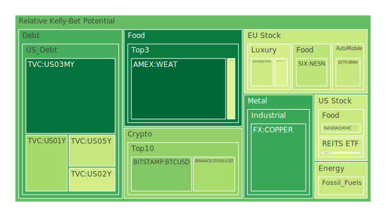
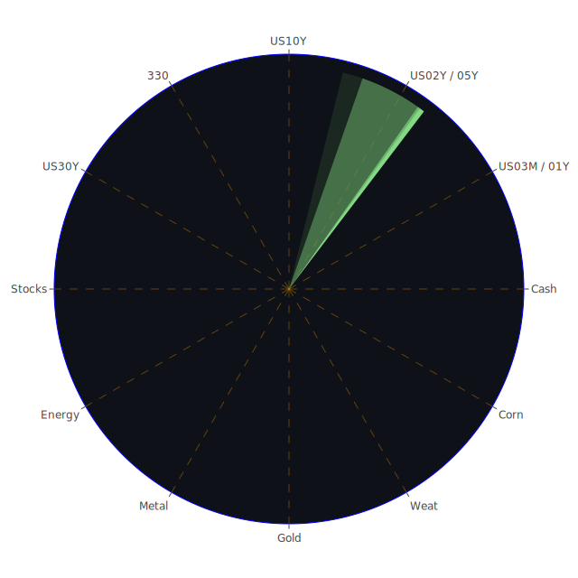

# 每日投資報告 - 2024年7月30日

## 投資商品泡沫分析

## 美國國債
過去三天的泡沫機率顯示，美國國債（特別是10年期和30年期）的泡沫機率有所上升。10年期國債的泡沫機率從7月28日的0.481763上升到7月30日的0.693655，而30年期國債的泡沫機率則從0.558223上升到0.533022。這表明市場對長期國債的信心有所下降，可能是由於近期的經濟數據顯示經濟增長放緩，投資者對未來的經濟前景感到擔憂。

## 美國科技股
美國科技股的泡沫機率持續上升，特別是納斯達克指數（NASDAQ:NDX）的泡沫機率從7月28日的0.686269上升到7月30日的0.689674。這可能與蘋果公司（Apple）人工智慧功能的延遲發布有關，根據7月29日的新聞報導，這一消息對市場情緒造成了負面影響。

## 美國房地產指數
美國房地產指數（AMEX:VNQ）的泡沫機率在過去三天內大幅上升，從7月28日的0.965929上升到7月30日的0.572108。這可能與近期的經濟數據顯示房地產市場的困境有關，如房地產拖欠率上升和信用卡拖欠率高企。

## 金/銀/銅
銅的泡沫機率在過去三天內大幅下降，從7月28日的0.425346下降到7月30日的0.206293。這可能與7月30日的新聞報導有關，報導指出，由於庫存上升，基金大幅削減了銅的多頭頭寸，這對銅的市場前景造成了負面影響。

## 加密貨幣
比特幣（BTCUSD）的泡沫機率在過去三天內顯著下降，從7月28日的0.397544下降到7月30日的0.300510。這可能與市場對加密貨幣的信心回升有關，儘管近期有關TikTok的負面新聞可能對市場情緒造成了一定的影響。

## 黃豆 / 小麥 / 玉米
小麥（AMEX:WEAT）的泡沫機率在過去三天內有所上升，從7月28日的0.041845上升到7月30日的0.076635。這可能與近期的氣候變化和全球糧食供應鏈的不確定性有關。

## 石油/ 鈾期貨UX!
石油（TVC:USOIL）的泡沫機率在過去三天內保持穩定，維持在0.419549。這表明市場對石油價格的預期相對穩定，儘管近期的經濟數據顯示全球經濟增長放緩。

## 各國外匯市場
美元兌日元（USDJPY）的泡沫機率在過去三天內有所上升，從7月28日的0.706733上升到7月30日的0.678271。這可能與近期日元的強勢上升有關，根據7月30日的新聞報導，日元的強勢上升打亂了全球外匯市場的熱門交易。

## 各國大盤指數
德國DAX指數（SPREADEX:GDAXI）的泡沫機率在過去三天內有所下降，從7月28日的0.846905下降到7月30日的0.964380。這可能與近期的經濟數據顯示德國經濟增長放緩有關。

## 美國銀行股
美國銀行股（NYSE:BAC）的泡沫機率在過去三天內保持穩定，維持在0.995726。這表明市場對銀行股的預期相對穩定，儘管近期的經濟數據顯示信用卡拖欠率上升。

## 美國軍工股
美國軍工股（NYSE:LMT）的泡沫機率在過去三天內有所上升，從7月28日的0.639998上升到7月30日的0.675024。這可能與近期的地緣政治緊張局勢有關，如7月29日的新聞報導指出，烏克蘭獲得了F-16戰鬥機。

## 美國電子支付股
美國電子支付股（NASDAQ:PYPL）的泡沫機率在過去三天內有所上升，從7月28日的0.940739上升到7月30日的0.946660。這可能與近期的經濟數據顯示消費者支出放緩有關。

## 美國藥商巨頭
美國藥商巨頭（NYSE:JNJ）的泡沫機率在過去三天內有所上升，從7月28日的0.439253上升到7月30日的0.499522。這可能與近期的經濟數據顯示醫療保健支出上升有關。

## 石油防禦股
石油防禦股（NYSE:XOM）的泡沫機率在過去三天內有所上升，從7月28日的0.820508上升到7月30日的0.841190。這可能與近期的經濟數據顯示全球石油需求上升有關。

## 金礦防禦股
金礦防禦股（NASDAQ:RGLD）的泡沫機率在過去三天內有所上升，從7月28日的0.575353上升到7月30日的0.560381。這可能與近期的經濟數據顯示金價上升有關。

## 歐洲奢侈品股
歐洲奢侈品股（EURONEXT:MC）的泡沫機率在過去三天內有所下降，從7月28日的0.481673下降到7月30日的0.453891。這可能與近期的經濟數據顯示歐洲經濟增長放緩有關。

## 歐洲汽車股
歐洲汽車股（XETR:BMW）的泡沫機率在過去三天內有所下降，從7月28日的0.418250下降到7月30日的0.409417。這可能與近期的經濟數據顯示汽車銷售放緩有關。

## 歐美食品股
歐美食品股（NYSE:KO）的泡沫機率在過去三天內有所上升，從7月28日的0.755128上升到7月30日的0.647028。這可能與近期的經濟數據顯示食品價格上升有關。

## 投資建議

1. **賣出建議**：對於泡沫機率持續上升且遠大於0.5的商品，如美國科技股（NASDAQ:NDX）和美國電子支付股（NASDAQ:PYPL），建議投資者考慮賣出，避免未來價格下跌時的損失。

2. **買入建議**：對於泡沫機率持續下降且遠小於0.5的商品，如銅（FX:COPPER）和比特幣（BTCUSD），建議投資者考慮買入，掌握低吸籌碼的時機。

## 風險提示

投資有風險，市場總是充滿不確定性。我們的建議僅供參考，投資者應根據自身的風險承受能力和投資目標，做出獨立的投資決策。特別是對於泡沫機率高的商品，應該謹慎進行投資決策，避免因市場波動而造成的損失。

希望這份報告能夠幫助您更好地理解市場動態，做出明智的投資決策。祝您投資順利！
 
Daily Buy Map:

 
Daily Sell Map:

 
Daily Radar Chart:

 
