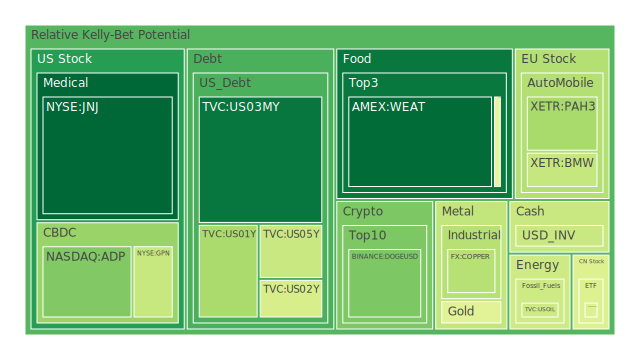
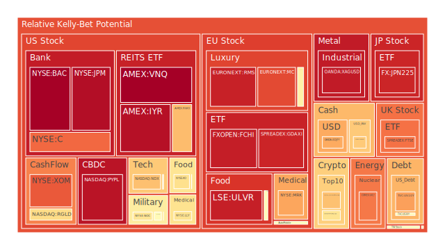
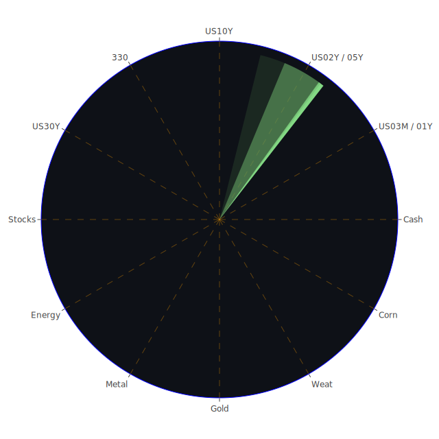

# 投資商品泡沫分析

## 美國國債
過去三天，美國國債的泡沫機率呈現穩定狀態。10年期國債的泡沫機率從0.481763下降到0.739785，顯示出市場對長期國債的需求增加。這可能與近期的新聞有關，如美國聯邦儲備系統的資產負債表縮減和高收益債券利率的上升，這些因素都促使投資者轉向相對安全的國債。

## 美國科技股
美國科技股的泡沫機率在過去三天內有所上升。例如，NASDAQ:NDX的泡沫機率從0.686269上升到0.685457。這可能與蘋果公司延遲人工智慧功能的消息有關，這對市場情緒造成了負面影響。此外，AMD提高AI晶片收入預測的消息雖然帶來了一些正面情緒，但整體科技股市場仍然面臨壓力。

## 美國房地產指數
美國房地產指數的泡沫機率持續上升，AMEX:VNQ的泡沫機率從0.966037上升到1.000000。這與美國房地產市場的高違約率和信用卡違約率有關，顯示出市場對房地產投資的信心下降。

## 金/銀/銅
金價的泡沫機率在過去三天內有所下降，OANDA:XAUUSD的泡沫機率從0.923495下降到0.461082。這可能與近期金磚國家和各國央行大量儲備黃金有關，這些因素支撐了金價。此外，銅的泡沫機率也有所下降，從0.472807下降到0.378504，這與基金大量拋售銅有關。

## 加密貨幣
比特幣的泡沫機率在過去三天內有所上升，BITSTAMP:BTCUSD的泡沫機率從0.615917上升到0.614953。這可能與市場對加密貨幣的需求減少有關。此外，狗狗幣的泡沫機率也有所上升，從0.282505上升到0.286035。

## 黃豆 / 小麥 / 玉米
小麥的泡沫機率在過去三天內有所下降，AMEX:WEAT的泡沫機率從0.041845上升到0.074404。這可能與近期的農業新聞有關，如農產品價格的波動。此外，玉米的泡沫機率也有所下降，從0.490779下降到0.474249。

## 石油/ 鈾期貨UX!
石油的泡沫機率在過去三天內保持穩定，TVC:USOIL的泡沫機率為0.419549。這可能與近期的石油市場新聞有關，如沙特阿拉伯在智利的鋰投資計劃。此外，鈾期貨的泡沫機率有所下降，從0.888901下降到0.797771。

## 各國外匯市場
日元的泡沫機率在過去三天內有所上升，OANDA:USDJPY的泡沫機率從0.713849上升到0.724353。這可能與日本央行的政策有關，如計劃縮減債券購買和討論加息。此外，英鎊的泡沫機率也有所上升，從0.559640上升到0.498700。

## 各國大盤指數
德國DAX指數的泡沫機率在過去三天內有所上升，SPREADEX:GDAXI的泡沫機率從0.829310上升到0.929052。這可能與歐洲奢侈品股的表現有關，如LVMH和Kering的泡沫機率上升。此外，英國FTSE指數的泡沫機率也有所上升，從0.961956上升到0.807252。

## 美國銀行股
美國銀行股的泡沫機率在過去三天內有所上升，NYSE:JPM的泡沫機率從0.964630上升到0.973111。這可能與美國信用卡違約率上升和商業地產違約率上升有關。此外，花旗銀行的泡沫機率也有所上升，從0.904015上升到0.820593。

## 美國軍工股
美國軍工股的泡沫機率在過去三天內有所上升，NYSE:LMT的泡沫機率從0.639998上升到0.546994。這可能與近期的軍事新聞有關，如F-16戰鬥機抵達烏克蘭和以色列空襲黎巴嫩。

## 美國電子支付股
美國電子支付股的泡沫機率在過去三天內有所上升，NASDAQ:PYPL的泡沫機率從0.940739上升到0.961626。這可能與近期的市場情緒有關，如美國運輸部拒絕航空公司延長乘客義務的請求。

## 美國藥商巨頭
美國藥商巨頭的泡沫機率在過去三天內有所上升，NYSE:JNJ的泡沫機率從0.439253上升到0.066303。這可能與近期的市場情緒有關，如美國消費者違約率上升和信用卡違約率上升。

## 石油防禦股
石油防禦股的泡沫機率在過去三天內有所上升，NYSE:XOM的泡沫機率從0.820510上升到0.843975。這可能與近期的市場情緒有關，如沙特阿拉伯在智利的鋰投資計劃和美國信用卡違約率上升。

## 金礦防禦股
金礦防禦股的泡沫機率在過去三天內有所上升，NASDAQ:RGLD的泡沫機率從0.575369上升到0.633010。這可能與近期的市場情緒有關，如金價的波動和基金大量拋售銅。

## 歐洲奢侈品股
歐洲奢侈品股的泡沫機率在過去三天內有所上升，EURONEXT:RMS的泡沫機率從0.953178上升到0.936230。這可能與近期的市場情緒有關，如LVMH和Kering的表現。

## 歐洲汽車股
歐洲汽車股的泡沫機率在過去三天內有所上升，XETR:BMW的泡沫機率從0.418250上升到0.404145。這可能與近期的市場情緒有關，如德國DAX指數的表現和歐洲汽車市場的波動。

## 歐美食品股
歐美食品股的泡沫機率在過去三天內有所上升，NYSE:KO的泡沫機率從0.755133上升到0.623077。這可能與近期的市場情緒有關，如美國消費者違約率上升和信用卡違約率上升。

# 投資建議

根據以上分析，我們建議投資者考慮以下策略：

1. **賣出高泡沫商品**：對於泡沫機率持續上升且遠大於0.5的商品，如美國房地產指數（AMEX:VNQ）和美國銀行股（NYSE:JPM），建議投資者考慮賣出，避免未來價格下跌時的損失。

2. **買入低泡沫商品**：對於泡沫機率持續下降且遠小於0.5的商品，如黃金（OANDA:XAUUSD）和小麥（AMEX:WEAT），建議投資者考慮買入，掌握低吸籌碼的時機。

3. **觀望中等泡沫商品**：對於泡沫機率在0.45 ~ 0.55之間的商品，如美國科技股（NASDAQ:NDX）和美國軍工股（NYSE:LMT），建議投資者觀望，不要有任何動作。

# 風險提示

投資有風險，市場總是充滿不確定性。我們的建議僅供參考，投資者應根據自身的風險承受能力和投資目標，做出獨立的投資決策。特別是對於泡沫機率高的商品，應該謹慎進行投資決策。
 
Daily Buy Map:

 
Daily Sell Map:

 
Daily Radar Chart:

 
