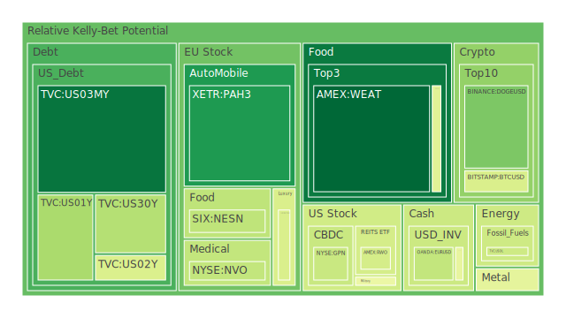
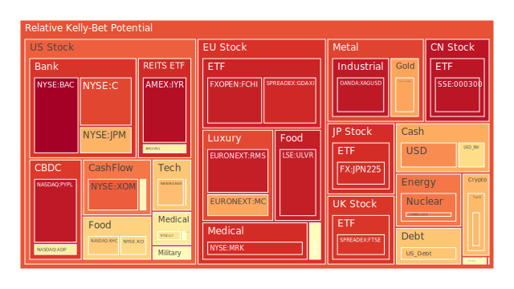
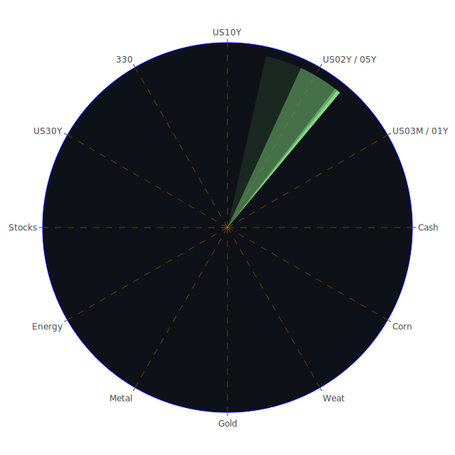

# 投資商品泡沫分析

## 美國國債
過去三天的泡沫機率顯示，美國國債的泡沫機率相對穩定，特別是短期國債（1年期和2年期）的泡沫機率分別在0.355645和0.431315左右。這表明市場對美國國債的信心依然較高，儘管長期國債（30年期）的泡沫機率在過去三天內有所波動，但整體仍維持在0.373978左右。根據FED的數據，美國國債的收益率曲線依然倒掛，這可能會對企業的融資成本產生影響，但對於保守型投資者來說，美國國債仍是相對安全的投資選擇。

## 美國科技股
美國科技股的泡沫機率顯示出一定的波動，特別是NASDAQ:NDX的泡沫機率在過去三天內穩定在0.686331左右。根據新聞報導，Meta和Qualcomm等科技巨頭的財報表現強勁，這可能會對市場情緒產生正面影響。然而，需注意的是，Arm的股票因AI增長放緩而大跌，這可能預示著科技股市場的潛在風險。

## 美國房地產指數
美國房地產指數（AMEX:VNQ）的泡沫機率在過去三天內持續上升，從0.573949上升至1.000000。這表明市場對房地產的信心正在減弱，特別是在商業地產違約率上升的背景下。根據FED的數據，商業地產違約率處於較高水平，這可能進一步加劇市場的擔憂。

## 金/銀/銅
金（XAUUSD）的泡沫機率在過去三天內有所上升，從0.730568上升至0.851579。這可能與市場對避險資產的需求增加有關。相對而言，銅（COPPER）的泡沫機率在過去三天內有所下降，從0.206293下降至0.164440。根據新聞報導，基金削減了銅的多頭頭寸，這可能進一步壓低銅價。

## 加密貨幣
比特幣（BTCUSD）的泡沫機率在過去三天內有所下降，從0.614953下降至0.440506。這可能表明市場對加密貨幣的信心有所恢復。然而，需注意的是，狗狗幣（DOGEUSD）的泡沫機率在過去三天內保持穩定，這表明市場對這類小型加密貨幣的態度依然謹慎。

## 黃豆 / 小麥 / 玉米
小麥（WEAT）的泡沫機率在過去三天內持續下降，從0.076635下降至0.067046。這表明市場對農產品的需求依然強勁。相對而言，玉米（CORN）的泡沫機率在過去三天內有所波動，但整體保持在0.458706左右。

## 石油/ 鈾期貨UX!
石油（USOIL）的泡沫機率在過去三天內保持穩定，這表明市場對石油價格的預期相對穩定。然而，鈾期貨（UX1!）的泡沫機率在過去三天內有所上升，這可能與市場對能源需求的預期變化有關。

## 各國外匯市場
美元兌日元（USDJPY）的泡沫機率在過去三天內有所上升，這可能與日本和中國貨幣政策的分歧有關。根據新聞報導，日元的波動性增加，這可能對外匯市場產生影響。

## 各國大盤指數
歐洲大盤指數（FTSE、GDAXI）的泡沫機率在過去三天內有所上升，這表明市場對歐洲經濟的信心有所減弱。根據新聞報導，日本和歐洲的經濟數據表現不佳，這可能進一步壓低市場情緒。

## 美國銀行股
美國銀行股（JPM、BAC）的泡沫機率在過去三天內有所上升，這可能與市場對銀行業的擔憂有關。根據FED的數據，信用卡違約率和商業地產違約率處於較高水平，這可能進一步加劇市場對銀行業的擔憂。

## 美國軍工股
美國軍工股（LMT、NOC）的泡沫機率在過去三天內有所波動，但整體保持在0.546994左右。根據新聞報導，中東地區的緊張局勢可能會對軍工股產生正面影響。

## 美國電子支付股
美國電子支付股（PYPL）的泡沫機率在過去三天內有所上升，這可能與市場對電子支付行業的擔憂有關。根據新聞報導，市場對電子支付行業的競爭加劇表示擔憂，這可能進一步壓低股價。

## 美國藥商巨頭
美國藥商巨頭（JNJ、MRK）的泡沫機率在過去三天內有所波動，但整體保持在0.525258左右。根據新聞報導，藥品價格上漲和市場對藥品需求增加可能會對藥商股產生正面影響。

## 石油防禦股
石油防禦股（XOM）的泡沫機率在過去三天內有所上升，這可能與市場對能源需求的預期變化有關。根據新聞報導，市場對石油價格的預期相對穩定，這可能進一步支撐石油防禦股的股價。

## 金礦防禦股
金礦防禦股（RGLD）的泡沫機率在過去三天內有所波動，但整體保持在0.552533左右。根據新聞報導，市場對避險資產的需求增加可能會對金礦防禦股產生正面影響。

## 歐洲奢侈品股
歐洲奢侈品股（KER、RMS）的泡沫機率在過去三天內有所上升，這可能與市場對奢侈品需求的擔憂有關。根據新聞報導，市場對奢侈品需求的預期有所減弱，這可能進一步壓低奢侈品股的股價。

## 歐洲汽車股
歐洲汽車股（BMW、MBG）的泡沫機率在過去三天內有所波動，但整體保持在0.527511左右。根據新聞報導，市場對汽車行業的需求預期相對穩定，這可能進一步支撐汽車股的股價。

## 歐美食品股
歐美食品股（NESN、KO）的泡沫機率在過去三天內有所上升，這可能與市場對食品行業的需求變化有關。根據新聞報導，市場對食品價格上漲的擔憂可能會對食品股產生影響。

# 投資建議

1. **美國國債**：由於收益率曲線倒掛，建議保守型投資者可以考慮持有短期國債，避免長期國債的波動風險。

2. **美國科技股**：儘管部分科技股表現強勁，但需注意市場的潛在風險，建議謹慎投資。

3. **美國房地產指數**：由於商業地產違約率上升，建議投資者謹慎對待房地產投資，避免過度曝險。

4. **金/銀/銅**：金價上漲顯示市場對避險資產的需求增加，建議投資者可以考慮適當配置黃金以分散風險。

5. **加密貨幣**：比特幣的泡沫機率下降，顯示市場對加密貨幣的信心有所恢復，建議投資者可以考慮適當配置。

6. **黃豆 / 小麥 / 玉米**：農產品的需求依然強勁，建議投資者可以考慮適當配置農產品以分散風險。

7. **石油/ 鈾期貨UX!**：石油價格穩定，建議投資者可以考慮適當配置石油期貨以分散風險。

8. **各國外匯市場**：日元波動性增加，建議投資者謹慎對待外匯市場的投資，避免過度曝險。

9. **各國大盤指數**：歐洲經濟數據不佳，建議投資者謹慎對待歐洲大盤指數的投資，避免過度曝險。

10. **美國銀行股**：由於信用卡違約率和商業地產違約率上升，建議投資者謹慎對待銀行股的投資，避免過度曝險。

11. **美國軍工股**：中東地區的緊張局勢可能會對軍工股產生正面影響，建議投資者可以考慮適當配置。

12. **美國電子支付股**：市場對電子支付行業的競爭加劇表示擔憂，建議投資者謹慎對待電子支付股的投資，避免過度曝險。

13. **美國藥商巨頭**：藥品價格上漲和市場對藥品需求增加可能會對藥商股產生正面影響，建議投資者可以考慮適當配置。

14. **石油防禦股**：市場對石油價格的預期相對穩定，建議投資者可以考慮適當配置石油防禦股以分散風險。

15. **金礦防禦股**：市場對避險資產的需求增加可能會對金礦防禦股產生正面影響，建議投資者可以考慮適當配置。

16. **歐洲奢侈品股**：市場對奢侈品需求的預期有所減弱，建議投資者謹慎對待奢侈品股的投資，避免過度曝險。

17. **歐洲汽車股**：市場對汽車行業的需求預期相對穩定，建議投資者可以考慮適當配置汽車股以分散風險。

18. **歐美食品股**：市場對食品價格上漲的擔憂可能會對食品股產生影響，建議投資者謹慎對待食品股的投資，避免過度曝險。

# 風險提示

投資有風險，市場總是充滿不確定性。我們的建議僅供參考，投資者應根據自身的風險承受能力和投資目標，做出獨立的投資決策。特別是對於泡沫機率高的商品，應該謹慎進行投資決策，避免未來價格下跌時的損失。
 
Daily Buy Map:

 
Daily Sell Map:

 
Daily Radar Chart:

 
