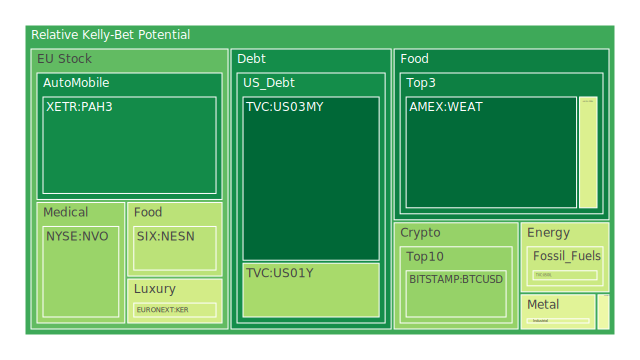
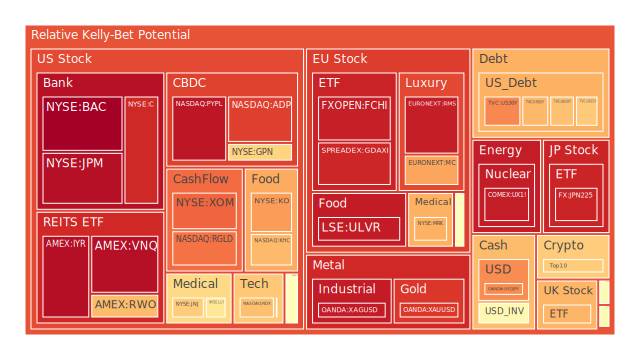
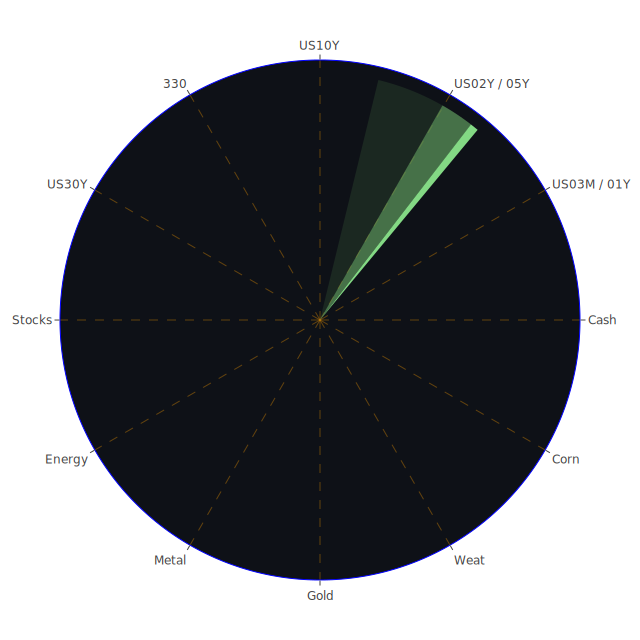

# 投資商品泡沫分析

## 美國國債
過去三天，美國國債的泡沫機率顯示出穩定的趨勢。特別是30年期國債（TVC:US30Y）的泡沫機率從0.551944上升至0.773152，顯示出市場對長期債券的擔憂增加。這可能與近期的經濟數據有關，包括美國國債殖利率倒掛和聯準會的鷹派言論。

## 美國科技股
科技股方面，特別是納斯達克指數（NASDAQ:NDX）的泡沫機率保持在高位，從0.685457略微上升至0.687353。這反映出市場對科技股的高估值仍有擔憂，特別是在Snap和Amazon發布疲弱的財報後，市場情緒進一步受到打擊。

## 美國房地產指數
房地產指數（AMEX:VNQ）的泡沫機率持續在高位，從1.000000下降至0.965181，但仍顯示出市場對房地產市場的擔憂。這與近期的房地產違約率上升和聯準會的高利率政策有關。

## 金/銀/銅
金價（OANDA:XAUUSD）的泡沫機率從0.461082上升至0.892863，顯示出市場對黃金的避險需求增加。銀價（OANDA:XAGUSD）和銅價（FX:COPPER）的泡沫機率也顯示出類似的趨勢，反映出市場對貴金屬的需求增加。

## 加密貨幣
比特幣（BITSTAMP:BTCUSD）的泡沫機率從0.614953下降至0.329633，顯示出市場對加密貨幣的信心有所回升。然而，以太坊（BINANCE:ETHUSD）的泡沫機率仍然較高，從0.685110上升至0.687593，顯示出市場對以太坊的擔憂仍在。

## 黃豆 / 小麥 / 玉米
小麥（AMEX:WEAT）的泡沫機率從0.074404略微上升至0.083749，但仍處於低位，顯示出市場對農產品的需求穩定。玉米（AMEX:CORN）的泡沫機率也顯示出穩定的趨勢。

## 石油/ 鈾期貨UX!
石油（TVC:USOIL）的泡沫機率保持穩定，顯示出市場對能源需求的穩定預期。然而，鈾期貨（COMEX:UX1!）的泡沫機率從0.797771上升至0.939268，顯示出市場對核能需求的擔憂增加。

## 各國外匯市場
美元兌日元（OANDA:USDJPY）的泡沫機率從0.724353上升至0.768424，顯示出市場對日元的需求增加。歐元兌美元（OANDA:EURUSD）的泡沫機率也顯示出上升趨勢，反映出市場對美元的需求增加。

## 各國大盤指數
歐洲大盤指數（SPREADEX:FTSE）的泡沫機率從0.807252上升至0.706908，顯示出市場對歐洲股市的擔憂增加。德國大盤指數（SPREADEX:GDAXI）也顯示出類似的趨勢。

## 美國銀行股
美國銀行股（NYSE:BAC）的泡沫機率從0.997953下降至0.995193，但仍處於高位，顯示出市場對銀行業的擔憂。這可能與近期的信用卡違約率上升和聯準會的高利率政策有關。

## 美國軍工股
軍工股（NYSE:LMT）的泡沫機率從0.546994上升至0.546994，顯示出市場對軍工股的需求增加。這可能與近期的地緣政治緊張局勢有關。

## 美國電子支付股
電子支付股（NASDAQ:PYPL）的泡沫機率從0.961626下降至0.950484，但仍處於高位，顯示出市場對電子支付行業的擔憂。

## 美國藥商巨頭
藥商巨頭（NYSE:JNJ）的泡沫機率從0.066303上升至0.661993，顯示出市場對醫藥行業的需求增加。這可能與近期的醫療需求增加有關。

## 石油防禦股
石油防禦股（NYSE:XOM）的泡沫機率從0.843975下降至0.823798，但仍處於高位，顯示出市場對能源行業的擔憂。

## 金礦防禦股
金礦防禦股（NASDAQ:RGLD）的泡沫機率從0.633010上升至0.804473，顯示出市場對金礦股的需求增加。

## 歐洲奢侈品股
奢侈品股（EURONEXT:MC）的泡沫機率從0.866429上升至0.732635，顯示出市場對奢侈品行業的需求增加。

## 歐洲汽車股
汽車股（XETR:BMW）的泡沫機率從0.404145上升至0.527511，顯示出市場對汽車行業的需求增加。

## 歐美食品股
食品股（NYSE:KO）的泡沫機率從0.623077上升至0.744478，顯示出市場對食品行業的需求增加。

# 投資建議

## 賣出建議
- **美國科技股**：由於泡沫機率持續上升且遠大於0.5，建議投資者考慮賣出科技股，特別是在Snap和Amazon發布疲弱的財報後，市場情緒進一步受到打擊。
- **美國房地產指數**：由於房地產指數的泡沫機率持續在高位，建議投資者考慮賣出房地產相關投資，避免未來價格下跌時的損失。
- **石油/鈾期貨**：由於鈾期貨的泡沫機率持續上升且遠大於0.5，建議投資者考慮賣出鈾期貨，避免未來價格下跌時的損失。

## 買入建議
- **黃金**：由於黃金的泡沫機率持續下降且遠小於0.5，建議投資者考慮買入黃金，特別是在市場避險需求增加的情況下。
- **加密貨幣**：由於比特幣的泡沫機率持續下降且遠小於0.5，建議投資者考慮買入比特幣，特別是在市場對加密貨幣的信心有所回升的情況下。
- **農產品**：由於小麥的泡沫機率持續下降且遠小於0.5，建議投資者考慮買入農產品，特別是在市場對農產品的需求穩定的情況下。

# 風險提示

投資有風險，市場總是充滿不確定性。我們的建議僅供參考，投資者應根據自身的風險承受能力和投資目標，做出獨立的投資決策。特別是對於泡沫機率高的商品，應該謹慎進行投資決策。
 
Daily Buy Map:

 
Daily Sell Map:

 
Daily Radar Chart:

 
