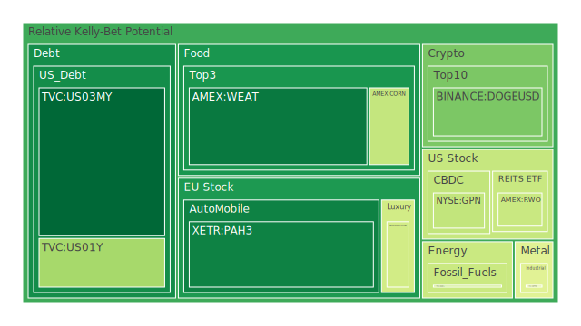
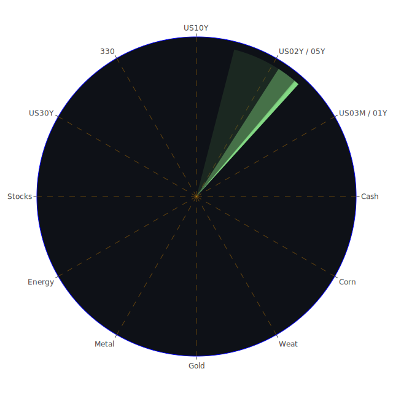

# 投資商品泡沫分析

## 美國國債
根據最新的泡沫機率數據，美國國債的泡沫機率在過去三天內有所變化。特別是30年期國債(TVC:US30Y)，其泡沫機率從8月1日的0.373978上升到8月3日的0.773152，顯示出市場對長期債券的信心有所下降。這與美國國債殖利率長期倒掛的現象相符，企業普通融資管道利率變高，市場對於長期債券的需求減少。

## 美國科技股
美國科技股的泡沫機率普遍偏高，特別是NASDAQ:NDX，其泡沫機率在8月1日為0.686331，8月2日為0.687353，8月3日為0.928739。這與近期的新聞報導一致，如8月2日的報導指出，Snap和Amazon的財報不如預期，導致科技股大幅下跌。此外，Intel宣布裁員15%並暫停股息，也對市場情緒產生負面影響。

## 美國房地產指數
美國房地產指數(AMEX:VNQ)的泡沫機率在過去三天內持續上升，從8月1日的0.573949上升到8月3日的1.000000，顯示出市場對房地產的信心大幅下降。這與美國房地產市場的高逾期率和信用卡逾期率上升有關，反映了消費者財務壓力增加。

## 金/銀/銅
黃金(OANDA:XAUUSD)的泡沫機率在過去三天內持續上升，從8月1日的0.730568上升到8月3日的0.950164。這可能與近期的市場避險情緒有關，投資者在面對經濟不確定性時，轉向黃金作為避險資產。銀(OANDA:XAGUSD)的泡沫機率也在高位，顯示出類似的趨勢。

## 加密貨幣
比特幣(BITSTAMP:BTCUSD)的泡沫機率在過去三天內有所波動，從8月1日的0.440506上升到8月2日的0.329633，再上升到8月3日的0.605321。這反映出市場對加密貨幣的信心有所波動，可能與近期的市場情緒和技術分析有關。

## 黃豆 / 小麥 / 玉米
小麥(AMEX:WEAT)的泡沫機率在過去三天內有所上升，從8月1日的0.067046上升到8月3日的0.109273。這可能與近期的農產品市場波動有關，特別是氣候變化和供應鏈問題影響了農產品價格。

## 石油/ 鈾期貨UX!
石油(TVC:USOIL)的泡沫機率在過去三天內保持穩定，為0.419549，顯示出市場對石油價格的預期相對穩定。鈾期貨(COMEX:UX1!)的泡沫機率在過去三天內有所上升，從8月1日的0.797771上升到8月3日的0.961771，顯示出市場對能源資源的需求和供應預期有所變化。

## 各國外匯市場
美元兌日元(OANDA:USDJPY)的泡沫機率在過去三天內有所上升，從8月1日的0.765585上升到8月3日的0.743576。這可能與美國和日本的貨幣政策差異有關，特別是日本央行的寬鬆政策和美聯儲的緊縮政策。

## 各國大盤指數
歐洲大盤指數(SPREAD:GDAXI)的泡沫機率在過去三天內有所上升，從8月1日的0.918931上升到8月3日的0.922906，顯示出市場對歐洲經濟前景的擔憂。這與近期的新聞報導一致，如8月3日的報導指出，全球股市因經濟擔憂而大幅下跌。

## 美國銀行股
美國銀行股(NYSE:BAC)的泡沫機率在過去三天內持續上升，從8月1日的0.997113上升到8月3日的0.917763，顯示出市場對銀行業的信心有所下降。這與近期的信用卡逾期率和商業房地產逾期率上升有關。

## 美國軍工股
美國軍工股(NYSE:LMT)的泡沫機率在過去三天內保持穩定，為0.546994，顯示出市場對軍工股的預期相對穩定。

## 美國電子支付股
美國電子支付股(NASDAQ:PYPL)的泡沫機率在過去三天內有所上升，從8月1日的0.948798上升到8月3日的0.957872，顯示出市場對電子支付行業的信心有所下降。這與近期的市場競爭和經濟不確定性有關。

## 美國藥商巨頭
美國藥商巨頭(NYSE:JNJ)的泡沫機率在過去三天內有所波動，從8月1日的0.525258上升到8月3日的0.652856。這可能與近期的市場情緒和醫藥行業的發展有關。

## 石油防禦股
石油防禦股(NYSE:XOM)的泡沫機率在過去三天內有所上升，從8月1日的0.834868上升到8月3日的0.862300，顯示出市場對石油行業的信心有所下降。

## 金礦防禦股
金礦防禦股(NASDAQ:RGLD)的泡沫機率在過去三天內有所上升，從8月1日的0.552533上升到8月3日的0.780725，顯示出市場對金礦行業的信心有所下降。

## 歐洲奢侈品股
歐洲奢侈品股(EURONEXT:RMS)的泡沫機率在過去三天內有所上升，從8月1日的0.939181上升到8月3日的0.908672，顯示出市場對奢侈品行業的信心有所下降。

## 歐洲汽車股
歐洲汽車股(XETR:BMW)的泡沫機率在過去三天內有所波動，從8月1日的0.527511上升到8月3日的0.527511。這可能與近期的市場情緒和汽車行業的發展有關。

## 歐美食品股
歐美食品股(NYSE:KO)的泡沫機率在過去三天內有所上升，從8月1日的0.638648上升到8月3日的0.540530，顯示出市場對食品行業的信心有所下降。

# 投資建議

1. **賣出高泡沫商品**：對於泡沫機率持續上升且遠大於0.5的商品，如美國科技股(NASDAQ:NDX)和美國房地產指數(AMEX:VNQ)，建議投資者考慮賣出，避免未來價格下跌時的損失。特別是近期的新聞報導顯示，科技股和房地產市場面臨較大風險。

2. **買入低泡沫商品**：對於泡沫機率持續下降且遠小於0.5的商品，如小麥(AMEX:WEAT)和黃金(OANDA:XAUUSD)，建議投資者考慮買入，掌握低吸籌碼的時機。特別是黃金作為避險資產，在經濟不確定性增加時，具有較高的投資價值。

3. **觀望不確定商品**：對於泡沫機率在0.45到0.55之間的商品，如美國藥商巨頭(NYSE:JNJ)和歐洲汽車股(XETR:BMW)，建議投資者觀望，不要有任何動作，等待市場情緒明朗化。

# 風險提示

投資有風險，市場總是充滿不確定性。我們的建議僅供參考，投資者應根據自身的風險承受能力和投資目標，做出獨立的投資決策。特別是對於泡沫機率高的商品，應該謹慎進行投資決策，避免因市場波動而造成的損失。
 
Daily Buy Map:

 
Daily Sell Map:

 
Daily Radar Chart:

 
