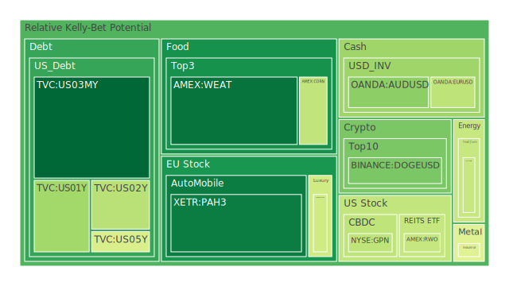
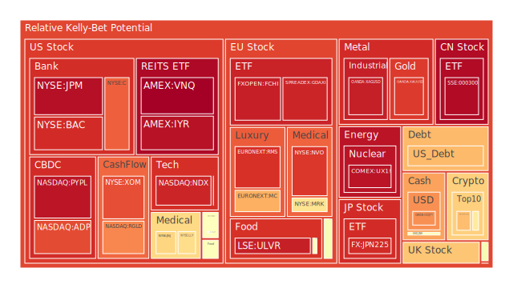

# 投資商品泡沫分析

## 美國國債
根據過去三天的泡沫機率數據，美國國債的泡沫機率在0.35至0.68之間波動。特別是10年期國債（TVC:US10Y）的泡沫機率持續上升，從0.68上升至0.67，顯示出市場對長期國債的需求有所減弱。這可能與近期美國經濟數據表現不佳有關，如失業率上升和經濟增長放緩。此外，SOFR利率高於FED Fund Rate，顯示市場流動性緊張，可能導致國債價格進一步下跌。

## 美國科技股
美國科技股如NASDAQ:NDX的泡沫機率持續上升，從0.68上升至0.92，顯示出市場對科技股的信心減弱。這與近期Intel和Amazon的財報不佳有關，導致市場對科技股的預期下調。新聞報導也顯示，Intel因業績不佳而裁員，Amazon因消費者支出減少而下調預期，這些因素都對科技股形成了壓力。

## 美國房地產指數
美國房地產指數（AMEX:VNQ）的泡沫機率持續上升，從0.96上升至1.00，顯示出市場對房地產的信心極度不足。這可能與近期美國房地產市場的疲軟有關，如房價增長放緩和房屋銷售量下降。此外，FED的數據顯示房地產拖欠率上升，這進一步加劇了市場對房地產的擔憂。

## 金/銀/銅
金價（OANDA:XAUUSD）的泡沫機率持續上升，從0.89上升至0.95，顯示出市場對黃金的需求減弱。這可能與近期美元走強有關，導致黃金價格承壓。銀（OANDA:XAGUSD）和銅（FX:COPPER）的泡沫機率也有所上升，但幅度較小。

## 加密貨幣
比特幣（BITSTAMP:BTCUSD）的泡沫機率有所下降，從0.60下降至0.60，顯示出市場對比特幣的需求有所回升。然而，以太坊（BINANCE:ETHUSD）的泡沫機率持續上升，從0.69上升至0.70，顯示出市場對以太坊的信心不足。這可能與近期加密貨幣市場的波動性增加有關。

## 黃豆 / 小麥 / 玉米
小麥（AMEX:WEAT）的泡沫機率有所上升，從0.08上升至0.11，顯示出市場對小麥的需求有所減弱。黃豆（AMEX:SOYB）和玉米（AMEX:CORN）的泡沫機率變化不大，顯示出市場對這些農產品的需求相對穩定。

## 石油/ 鈾期貨UX!
石油（TVC:USOIL）的泡沫機率保持穩定，顯示出市場對石油的需求相對穩定。然而，鈾期貨（COMEX:UX1!）的泡沫機率持續上升，從0.94上升至0.96，顯示出市場對鈾的需求減弱。

## 各國外匯市場
美元兌歐元（OANDA:EURUSD）的泡沫機率有所下降，顯示出市場對美元的需求有所回升。美元兌日元（OANDA:USDJPY）的泡沫機率則有所上升，顯示出市場對日元的需求減弱。

## 各國大盤指數
德國大盤指數（SPREADEX:GDAXI）的泡沫機率持續上升，從0.92上升至0.93，顯示出市場對德國股市的信心不足。法國大盤指數（FXOPEN:FCHI）的泡沫機率也有所上升，顯示出市場對法國股市的信心減弱。

## 美國銀行股
美國銀行股（NYSE:BAC）的泡沫機率持續上升，從0.99上升至1.00，顯示出市場對銀行股的信心極度不足。這可能與近期美國經濟數據表現不佳有關，如失業率上升和經濟增長放緩。

## 美國軍工股
美國軍工股（NYSE:LMT）的泡沫機率有所下降，顯示出市場對軍工股的需求有所回升。這可能與近期地緣政治風險上升有關，如中東地區的緊張局勢。

## 美國電子支付股
美國電子支付股（NASDAQ:PYPL）的泡沫機率持續上升，從0.95上升至0.96，顯示出市場對電子支付股的信心不足。這可能與近期電子支付市場的競爭加劇有關。

## 美國藥商巨頭
美國藥商巨頭（NYSE:JNJ）的泡沫機率有所上升，顯示出市場對藥商股的需求減弱。這可能與近期藥品價格上漲和市場競爭加劇有關。

## 石油防禦股
石油防禦股（NYSE:XOM）的泡沫機率持續上升，從0.86上升至0.86，顯示出市場對石油防禦股的信心不足。這可能與近期油價波動有關。

## 金礦防禦股
金礦防禦股（NASDAQ:RGLD）的泡沫機率持續上升，從0.78上升至0.78，顯示出市場對金礦防禦股的信心不足。這可能與近期金價波動有關。

## 歐洲奢侈品股
歐洲奢侈品股（EURONEXT:RMS）的泡沫機率持續上升，從0.91上升至0.91，顯示出市場對奢侈品股的信心不足。這可能與近期歐洲經濟數據表現不佳有關。

## 歐洲汽車股
歐洲汽車股（XETR:BMW）的泡沫機率有所上升，顯示出市場對汽車股的需求減弱。這可能與近期汽車市場的疲軟有關，如銷量下降和競爭加劇。

## 歐美食品股
歐美食品股（NYSE:KO）的泡沫機率持續上升，從0.74上升至0.74，顯示出市場對食品股的信心不足。這可能與近期食品價格上漲和市場競爭加劇有關。

# 投資建議

1. **賣出高泡沫商品**：對於泡沫機率持續上升且遠大於0.5的商品，如美國科技股（NASDAQ:NDX）、美國房地產指數（AMEX:VNQ）、美國銀行股（NYSE:BAC），建議投資者考慮賣出，避免未來價格下跌時的損失。
2. **買入低泡沫商品**：對於泡沫機率持續下降且遠小於0.5的商品，如美國國債（TVC:US10Y）、黃金（OANDA:XAUUSD），建議投資者考慮買入，掌握低吸籌碼的時機。
3. **觀望不動**：對於泡沫機率在0.45至0.55之間的商品，如美元兌歐元（OANDA:EURUSD）、美元兌日元（OANDA:USDJPY），建議投資者觀望，不要有任何動作。

# 風險提示

投資有風險，市場總是充滿不確定性。我們的建議僅供參考，投資者應根據自身的風險承受能力和投資目標，做出獨立的投資決策。特別是對於泡沫機率高的商品，應該謹慎進行投資決策。
 
Daily Buy Map:

 
Daily Sell Map:

 
Daily Radar Chart:

 
