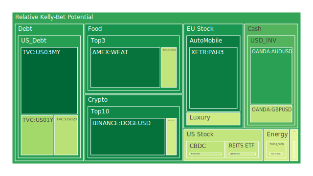
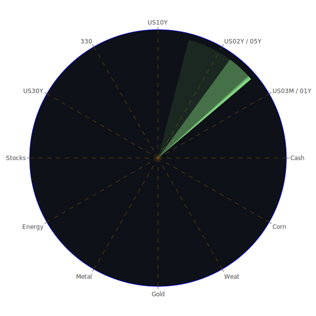

# 投資商品泡沫分析

## 美國國債
過去三天，美國國債的泡沫機率顯示出穩定的趨勢。特別是短期國債（如1年期和2年期），其泡沫機率在0.35至0.40之間波動，顯示出相對穩定的投資環境。然而，長期國債（如30年期）的泡沫機率則顯示出較高的風險，達到0.77。這可能與近期的經濟數據有關，如美國國債殖利率長期倒掛，導致企業普通融資管道利率變高，企業可能會被逼迫去把股價衝高來降低綜合融資成本。

## 美國科技股
美國科技股的泡沫機率顯示出高風險，特別是NASDAQ指數，其泡沫機率高達0.93。近期新聞顯示，Intel和Amazon的財報不佳，導致科技股大幅下跌，這進一步加劇了市場對科技股的擔憂。建議投資者在此時謹慎操作，避免進一步損失。

## 美國房地產指數
美國房地產指數（如AMEX:RWO和AMEX:VNQ）的泡沫機率也顯示出高風險，分別達到0.96和1.00。這可能與近期的房地產市場數據有關，如房地產違約率上升和抵押貸款利率高企。建議投資者在此時避免進一步投資房地產相關資產。

## 金/銀/銅
黃金（XAUUSD）的泡沫機率顯示出相對穩定，約為0.77。然而，白銀（XAGUSD）和銅（COPPER）的泡沫機率則顯示出較高風險，分別達到0.94和0.48。這可能與近期的商品市場波動有關，如石油價格上漲和美元走強。建議投資者在此時謹慎操作，特別是對於白銀和銅的投資。

## 加密貨幣
比特幣（BTCUSD）和以太坊（ETHUSD）的泡沫機率顯示出高風險，分別達到0.60和0.44。近期新聞顯示，加密貨幣市場波動劇烈，特別是受到全球經濟不確定性的影響。建議投資者在此時謹慎操作，避免進一步損失。

## 黃豆 / 小麥 / 玉米
黃豆（SOYB）、小麥（WEAT）和玉米（CORN）的泡沫機率顯示出相對穩定，分別約為0.50、0.11和0.41。這可能與近期的農產品市場數據有關，如供應鏈問題和氣候變化影響。建議投資者在此時考慮分批買入，特別是對於泡沫機率較低的小麥。

## 石油/ 鈾期貨UX!
石油（USOIL）的泡沫機率顯示出相對穩定，約為0.44。然而，鈾期貨（UX1!）的泡沫機率則顯示出高風險，達到0.96。這可能與近期的能源市場波動有關，如石油價格上漲和鈾供應緊張。建議投資者在此時謹慎操作，特別是對於鈾期貨的投資。

## 各國外匯市場
美元兌日元（USDJPY）和歐元兌美元（EURUSD）的泡沫機率顯示出高風險，分別達到0.74和0.67。這可能與近期的外匯市場波動有關，如美元走強和全球經濟不確定性。建議投資者在此時謹慎操作，避免進一步損失。

## 各國大盤指數
各國大盤指數（如FTSE、GDAXI和NDX）的泡沫機率顯示出高風險，分別達到0.67、0.95和0.93。這可能與近期的全球經濟數據有關，如經濟增長放緩和企業財報不佳。建議投資者在此時謹慎操作，避免進一步損失。

## 美國銀行股
美國銀行股（如JPM和BAC）的泡沫機率顯示出高風險，分別達到0.97和0.92。這可能與近期的金融市場波動有關，如利率上升和貸款違約率上升。建議投資者在此時謹慎操作，避免進一步損失。

## 美國軍工股
美國軍工股（如LMT和NOC）的泡沫機率顯示出相對穩定，約為0.55和0.50。這可能與近期的國防預算增加和地緣政治緊張有關。建議投資者在此時考慮分批買入，特別是對於泡沫機率較低的軍工股。

## 美國電子支付股
美國電子支付股（如PYPL）的泡沫機率顯示出高風險，達到0.96。這可能與近期的金融科技市場波動有關，如競爭加劇和監管風險增加。建議投資者在此時謹慎操作，避免進一步損失。

## 美國藥商巨頭
美國藥商巨頭（如MRK和JNJ）的泡沫機率顯示出高風險，分別達到0.62和0.65。這可能與近期的醫藥市場波動有關，如藥品價格上漲和監管風險增加。建議投資者在此時謹慎操作，避免進一步損失。

## 石油防禦股
石油防禦股（如XOM）的泡沫機率顯示出高風險，達到0.86。這可能與近期的能源市場波動有關，如石油價格上漲和供應緊張。建議投資者在此時謹慎操作，避免進一步損失。

## 金礦防禦股
金礦防禦股（如RGLD）的泡沫機率顯示出高風險，達到0.78。這可能與近期的商品市場波動有關，如黃金價格上漲和美元走強。建議投資者在此時謹慎操作，避免進一步損失。

## 歐洲奢侈品股
歐洲奢侈品股（如RMS）的泡沫機率顯示出高風險，達到0.91。這可能與近期的消費市場波動有關，如經濟增長放緩和消費者信心下降。建議投資者在此時謹慎操作，避免進一步損失。

## 歐洲汽車股
歐洲汽車股（如BMW和MBG）的泡沫機率顯示出相對穩定，約為0.52和0.52。這可能與近期的汽車市場數據有關，如銷售增長和新車型推出。建議投資者在此時考慮分批買入，特別是對於泡沫機率較低的汽車股。

## 歐美食品股
歐美食品股（如KO和KHC）的泡沫機率顯示出高風險，分別達到0.54和0.50。這可能與近期的食品市場波動有關，如原材料價格上漲和供應鏈問題。建議投資者在此時謹慎操作，避免進一步損失。

# 投資建議
1. **賣出高風險資產**：對於泡沫機率持續上升且遠大於0.5的商品，如美國科技股、房地產指數和銀行股，建議投資者考慮賣出，避免未來價格下跌時的損失。
2. **買入低風險資產**：對於泡沫機率持續下降且遠小於0.5的商品，如小麥和軍工股，建議投資者考慮分批買入，掌握低吸籌碼的時機。
3. **觀望中等風險資產**：對於泡沫機率在0.45至0.55之間的商品，如部分汽車股和食品股，建議投資者觀望，不要有任何動作。

# 風險提示
投資有風險，市場總是充滿不確定性。我們的建議僅供參考，投資者應根據自身的風險承受能力和投資目標，做出獨立的投資決策。特別是對於泡沫機率高的商品，應該謹慎進行投資決策。
 
Daily Buy Map:

 
Daily Sell Map:

 
Daily Radar Chart:

 
