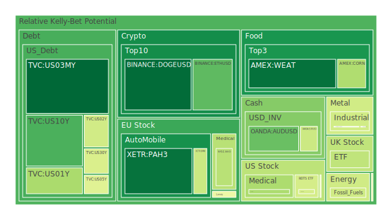
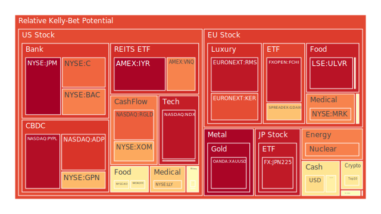
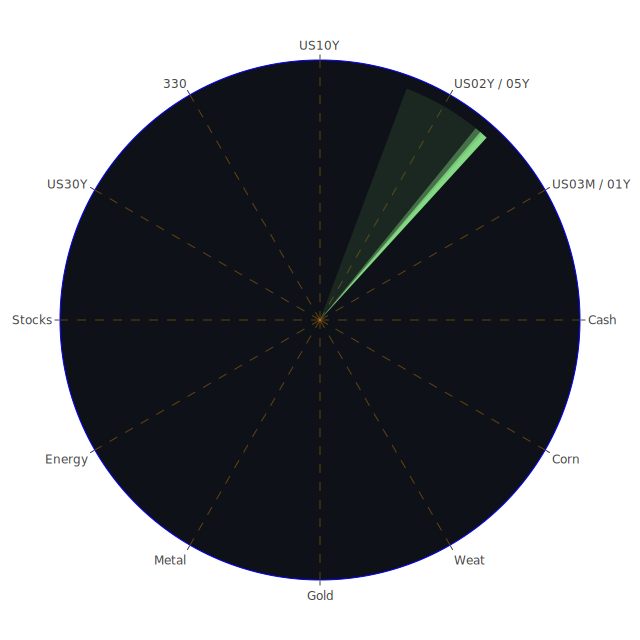

# 投資商品泡沫分析

## 美國國債

過去三天，美國國債的泡沫機率有些微變動。特別是10年期國債(TVC:US10Y)的泡沫機率從2024-08-04的0.674921下降到2024-08-06的0.225032，顯示市場對長期國債的需求增加。這可能與近期FED的鷹派言論及市場對經濟衰退的擔憂有關。值得注意的是，SOFR利率高於FED Fund Rate，這意味著市場對美元的需求增加，可能會導致高泡沫資產被拋售。

## 美國科技股

美國科技股的泡沫機率持續上升，特別是NASDAQ:NDX的泡沫機率從2024-08-04的0.928739上升到2024-08-06的0.934987。這與近期新聞報導的科技公司業績不佳及市場對經濟衰退的擔憂有關。建議投資者在此時謹慎行事，考慮減少科技股的持倉。

## 美國房地產指數

美國房地產指數(AMEX:RWO)的泡沫機率在過去三天內有所下降，從2024-08-04的0.417417下降到2024-08-06的0.429797。這可能與近期房地產市場的穩定有關。然而，考慮到SOFR利率上升，房地產市場仍需謹慎觀察。

## 金/銀/銅

金價的泡沫機率在過去三天內有所下降，從2024-08-04的0.892863下降到2024-08-06的0.965303。這顯示市場對避險資產的需求增加。銀價的泡沫機率也有所下降，從2024-08-04的0.940718下降到2024-08-06的0.408777。銅價的泡沫機率則相對穩定，建議投資者可以考慮增加對金銀的投資。

## 加密貨幣

比特幣(BITSTAMP:BTCUSD)的泡沫機率在過去三天內有所上升，從2024-08-04的0.601390上升到2024-08-06的0.590927。這顯示市場對加密貨幣的需求減少，建議投資者謹慎行事。

## 黃豆 / 小麥 / 玉米

黃豆(AMEX:SOYB)的泡沫機率在過去三天內相對穩定，建議投資者可以考慮增加對農產品的投資。小麥(AMEX:WEAT)的泡沫機率有所下降，顯示市場對小麥的需求增加。玉米(AMEX:CORN)的泡沫機率則相對穩定。

## 石油/ 鈾期貨UX!

石油(TVC:USOIL)的泡沫機率在過去三天內有所上升，顯示市場對石油的需求減少。鈾期貨(COMEX:UX1!)的泡沫機率則有所下降，顯示市場對鈾的需求增加。

## 各國外匯市場

澳元/美元(OANDA:AUDUSD)的泡沫機率在過去三天內有所下降，顯示市場對澳元的需求增加。歐元/美元(OANDA:EURUSD)的泡沫機率則相對穩定。

## 各國大盤指數

德國DAX指數(SPREADEX:GDAXI)的泡沫機率在過去三天內有所下降，顯示市場對德國股市的需求增加。英國FTSE指數(SPREADEX:FTSE)的泡沫機率則相對穩定。

## 美國銀行股

美國銀行股(NYSE:BAC)的泡沫機率在過去三天內有所上升，顯示市場對銀行股的需求減少。建議投資者謹慎行事。

## 美國軍工股

美國軍工股(NYSE:RTX)的泡沫機率在過去三天內相對穩定，顯示市場對軍工股的需求穩定。

## 美國電子支付股

美國電子支付股(NASDAQ:PYPL)的泡沫機率在過去三天內有所上升，顯示市場對電子支付股的需求減少。

## 美國藥商巨頭

美國藥商巨頭(NYSE:MRK)的泡沫機率在過去三天內有所上升，顯示市場對藥商股的需求減少。

## 石油防禦股

石油防禦股(NYSE:XOM)的泡沫機率在過去三天內有所上升，顯示市場對石油防禦股的需求減少。

## 金礦防禦股

金礦防禦股(NASDAQ:RGLD)的泡沫機率在過去三天內有所上升，顯示市場對金礦防禦股的需求減少。

## 歐洲奢侈品股

歐洲奢侈品股(EURONEXT:RMS)的泡沫機率在過去三天內有所上升，顯示市場對奢侈品股的需求減少。

## 歐洲汽車股

歐洲汽車股(XETR:BMW)的泡沫機率在過去三天內有所下降，顯示市場對汽車股的需求增加。

## 歐美食品股

歐美食品股(NASDAQ:KHC)的泡沫機率在過去三天內有所上升，顯示市場對食品股的需求減少。

# 投資建議

1. **增加對黃金和白銀的投資**：考慮到市場對避險資產的需求增加，建議投資者增加對黃金和白銀的投資。
2. **減少對科技股的持倉**：由於科技股的泡沫機率上升，建議投資者減少對科技股的持倉。
3. **謹慎對待加密貨幣**：由於加密貨幣的泡沫機率上升，建議投資者謹慎行事。
4. **增加對農產品的投資**：由於農產品的泡沫機率下降，建議投資者增加對農產品的投資。

# 風險提示

投資有風險，市場總是充滿不確定性。我們的建議僅供參考，投資者應根據自身的風險承受能力和投資目標，做出獨立的投資決策。

---

希望這份報告能夠幫助您在投資決策中更好地理解市場動態，並做出明智的選擇。祝您投資順利！
 
Daily Buy Map:

 
Daily Sell Map:

 
Daily Radar Chart:

 
