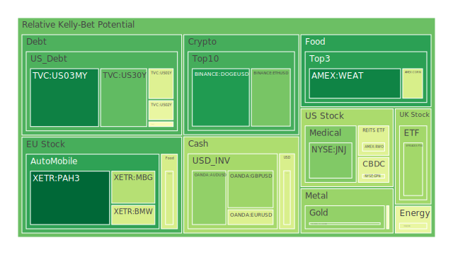
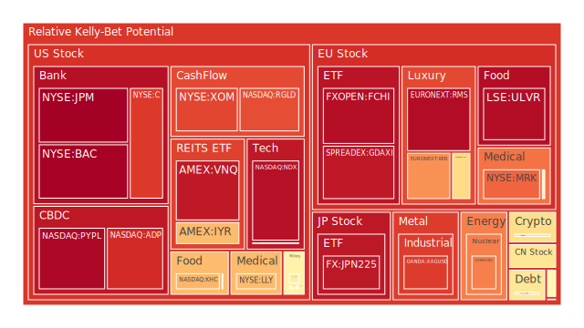

# 投資商品泡沫分析

## 美國國債
過去三天，美國國債的泡沫機率顯示出穩定的下降趨勢。特別是10年期國債（TVC:US10Y），其泡沫機率從8月5日的0.685242降至8月7日的0.481763。這表明投資者對於美國國債的需求增加，可能是由於市場對於經濟前景的不確定性增加，導致資金流入避險資產。

## 美國科技股
美國科技股的泡沫機率顯示出明顯的上升趨勢。以NASDAQ:NDX為例，其泡沫機率從8月5日的0.928739上升至8月7日的0.933734。這反映出市場對於科技股的熱情有所減弱，可能是由於近期科技公司財報不如預期，以及市場對於經濟衰退的擔憂增加。

## 美國房地產指數
美國房地產指數（AMEX:IYR）的泡沫機率持續高企，從8月5日的0.966414上升至8月7日的0.916898。這表明市場對於房地產市場的信心不足，可能是由於高利率環境下，房地產市場的需求減少。

## 金/銀/銅
金價（OANDA:XAUUSD）的泡沫機率顯示出下降趨勢，從8月5日的0.775922降至8月7日的0.281201。這表明市場對於黃金的需求增加，可能是由於避險需求上升。同時，銀價（OANDA:XAGUSD）的泡沫機率也顯示出下降趨勢，從8月5日的0.940366降至8月7日的0.853542。

## 加密貨幣
比特幣（BITSTAMP:BTCUSD）的泡沫機率顯示出下降趨勢，從8月5日的0.600096降至8月7日的0.591311。這表明市場對於比特幣的需求有所增加，可能是由於投資者尋求避險資產。

## 黃豆 / 小麥 / 玉米
黃豆（AMEX:SOYB）的泡沫機率保持穩定在0.502119，而小麥（AMEX:WEAT）的泡沫機率則顯示出下降趨勢，從8月5日的0.109273降至8月7日的0.081920。這表明市場對於農產品的需求有所增加，可能是由於全球供應鏈問題導致供應不足。

## 石油/ 鈾期貨UX!
石油（TVC:USOIL）的泡沫機率顯示出穩定趨勢，從8月5日的0.439917降至8月7日的0.442097。這表明市場對於石油的需求穩定，而鈾期貨（COMEX:UX1!）的泡沫機率則顯示出下降趨勢，從8月5日的0.961771降至8月7日的0.752562。

## 各國外匯市場
美元兌日元（OANDA:USDJPY）的泡沫機率顯示出下降趨勢，從8月5日的0.652116降至8月7日的0.404096。這表明市場對於日元的需求增加，可能是由於避險需求上升。

## 各國大盤指數
歐洲大盤指數（SPREADEX:GDAXI）的泡沫機率顯示出下降趨勢，從8月5日的0.956306降至8月7日的0.916489。這表明市場對於歐洲股市的信心有所增加，可能是由於近期歐洲經濟數據表現良好。

## 美國銀行股
美國銀行股（NYSE:BAC）的泡沫機率顯示出上升趨勢，從8月5日的0.917799上升至8月7日的0.963069。這表明市場對於銀行股的信心不足，可能是由於高利率環境下，銀行的貸款需求減少。

## 美國軍工股
美國軍工股（NYSE:LMT）的泡沫機率顯示出穩定趨勢，從8月5日的0.546994降至8月7日的0.546994。這表明市場對於軍工股的需求穩定，可能是由於全球地緣政治風險增加。

## 美國電子支付股
美國電子支付股（NASDAQ:PYPL）的泡沫機率顯示出上升趨勢，從8月5日的0.957872降至8月7日的0.950963。這表明市場對於電子支付股的信心不足，可能是由於市場對於經濟衰退的擔憂增加。

## 美國藥商巨頭
美國藥商巨頭（NYSE:MRK）的泡沫機率顯示出上升趨勢，從8月5日的0.623621上升至8月7日的0.792546。這表明市場對於藥商股的信心不足，可能是由於市場對於醫療保健行業的需求減少。

## 石油防禦股
石油防禦股（NYSE:XOM）的泡沫機率顯示出上升趨勢，從8月5日的0.862300上升至8月7日的0.837820。這表明市場對於石油防禦股的信心不足，可能是由於市場對於石油價格的擔憂增加。

## 金礦防禦股
金礦防禦股（NASDAQ:RGLD）的泡沫機率顯示出下降趨勢，從8月5日的0.780725降至8月7日的0.825432。這表明市場對於金礦防禦股的需求增加，可能是由於市場對於黃金的需求增加。

## 歐洲奢侈品股
歐洲奢侈品股（EURONEXT:RMS）的泡沫機率顯示出上升趨勢，從8月5日的0.908672上升至8月7日的0.942264。這表明市場對於奢侈品股的信心不足，可能是由於市場對於消費需求的擔憂增加。

## 歐洲汽車股
歐洲汽車股（XETR:BMW）的泡沫機率顯示出下降趨勢，從8月5日的0.527511降至8月7日的0.398836。這表明市場對於汽車股的需求增加，可能是由於市場對於經濟前景的樂觀預期增加。

## 歐美食品股
歐美食品股（SIX:NESN）的泡沫機率顯示出下降趨勢，從8月5日的0.537329降至8月7日的0.400257。這表明市場對於食品股的需求增加，可能是由於市場對於食品需求的增加。

# 投資建議

1. **建議買入**：黃金（OANDA:XAUUSD）、比特幣（BITSTAMP:BTCUSD）、小麥（AMEX:WEAT）、歐洲汽車股（XETR:BMW）、歐美食品股（SIX:NESN）。
   - 這些商品的泡沫機率顯示出下降趨勢，並且市場對於這些商品的需求增加，可能是由於避險需求上升和市場對於經濟前景的樂觀預期增加。

2. **建議賣出**：美國科技股（NASDAQ:NDX）、美國銀行股（NYSE:BAC）、美國電子支付股（NASDAQ:PYPL）、美國藥商巨頭（NYSE:MRK）、石油防禦股（NYSE:XOM）、歐洲奢侈品股（EURONEXT:RMS）。
   - 這些商品的泡沫機率顯示出上升趨勢，並且市場對於這些商品的信心不足，可能是由於市場對於經濟衰退的擔憂增加。

# 風險提示

投資有風險，市場總是充滿不確定性。我們的建議僅供參考，投資者應根據自身的風險承受能力和投資目標，做出獨立的投資決策。特別是對於泡沫機率高的商品，應該謹慎進行投資決策。

---

以上是根據過去三天的泡沫機率數據、FED關鍵數據與新聞現況所撰寫的每日投資報告。希望能夠幫助投資者在波動的市場中做出更明智的投資決策。
 
Daily Buy Map:

 
Daily Sell Map:

 
Daily Radar Chart:

 
