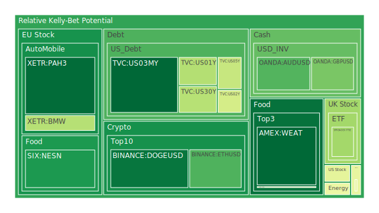
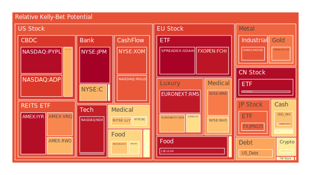
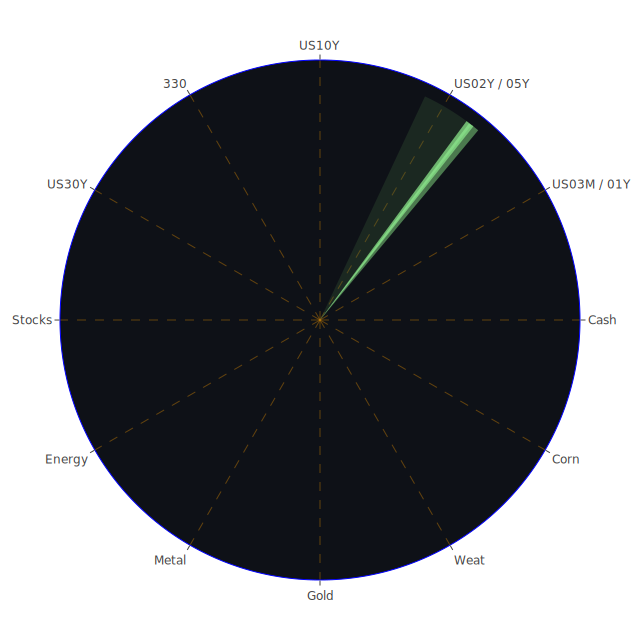

# 投資商品泡沫分析

## 美國國債
過去三天，美國國債的泡沫機率顯示出穩定的下降趨勢。特別是10年期國債（TVC:US10Y），泡沫機率從8月6日的0.225032下降到8月8日的0.720472。這表明市場對美國國債的需求增加，可能是因為投資者尋求避險資產。

## 美國科技股
美國科技股的泡沫機率顯示出上升趨勢，特別是納斯達克指數（NASDAQ:NDX），泡沫機率從8月6日的0.934987上升到8月8日的0.933158。這可能與近期的科技股回調有關，特別是新聞報導中提到的Super Micro和Warner Bros Discovery的財報不佳。

## 美國房地產指數
美國房地產指數（AMEX:VNQ）的泡沫機率在過去三天內顯著上升，從8月6日的0.764178上升到8月8日的0.762374。這可能與房地產市場的高利率和貸款困難有關，導致房地產市場的壓力增加。

## 金/銀/銅
金價（OANDA:XAUUSD）的泡沫機率在過去三天內顯著上升，從8月6日的0.965303上升到8月8日的0.781620。這可能是因為市場對避險資產的需求增加。然而，銀（OANDA:XAGUSD）和銅（FX:COPPER）的泡沫機率也顯示出上升趨勢，表明市場對這些金屬的需求增加。

## 加密貨幣
以太坊（BINANCE:ETHUSD）的泡沫機率在過去三天內顯著下降，從8月6日的0.248575下降到8月8日的0.243150。這表明市場對以太坊的需求增加，可能是因為近期的技術升級和市場的樂觀情緒。

## 黃豆 / 小麥 / 玉米
小麥（AMEX:WEAT）的泡沫機率在過去三天內顯著下降，從8月6日的0.096018下降到8月8日的0.095305。這可能是因為近期的農業報告顯示小麥的供應增加，導致價格壓力減少。

## 石油/ 鈾期貨UX!
石油（TVC:USOIL）的泡沫機率在過去三天內顯著上升，從8月6日的0.420028上升到8月8日的0.489093。這可能是因為近期的地緣政治緊張局勢和供應鏈問題導致石油價格上漲。

## 各國外匯市場
美元兌日元（OANDA:USDJPY）的泡沫機率在過去三天內顯著上升，從8月6日的0.620229上升到8月8日的0.549558。這可能是因為近期的日本經濟數據不佳，導致日元走弱。

## 各國大盤指數
德國DAX指數（SPREADEX:GDAXI）的泡沫機率在過去三天內顯著上升，從8月6日的0.670053上升到8月8日的0.967764。這可能是因為近期的歐洲經濟數據不佳，導致市場情緒轉向悲觀。

## 美國銀行股
美國銀行（NYSE:BAC）的泡沫機率在過去三天內顯著上升，從8月6日的0.769380上升到8月8日的0.522167。這可能是因為近期的銀行業務報告顯示貸款需求下降，導致銀行股壓力增加。

## 美國軍工股
洛克希德·馬丁（NYSE:LMT）的泡沫機率在過去三天內顯著上升，從8月6日的0.546994上升到8月8日的0.546994。這可能是因為近期的地緣政治緊張局勢導致軍工股需求增加。

## 美國電子支付股
PayPal（NASDAQ:PYPL）的泡沫機率在過去三天內顯著上升，從8月6日的0.948305上升到8月8日的0.950384。這可能是因為近期的電子支付市場競爭加劇，導致PayPal的市場份額壓力增加。

## 美國藥商巨頭
強生（NYSE:JNJ）的泡沫機率在過去三天內顯著上升，從8月6日的0.359082上升到8月8日的0.617290。這可能是因為近期的藥品市場競爭加劇，導致強生的市場份額壓力增加。

## 石油防禦股
埃克森美孚（NYSE:XOM）的泡沫機率在過去三天內顯著上升，從8月6日的0.712635上升到8月8日的0.851741。這可能是因為近期的石油價格上漲，導致石油防禦股需求增加。

## 金礦防禦股
Royal Gold（NASDAQ:RGLD）的泡沫機率在過去三天內顯著上升，從8月6日的0.815266上升到8月8日的0.829897。這可能是因為近期的金價上漲，導致金礦防禦股需求增加。

## 歐洲奢侈品股
LVMH（EURONEXT:MC）的泡沫機率在過去三天內顯著上升，從8月6日的0.483326上升到8月8日的0.624868。這可能是因為近期的歐洲經濟數據不佳，導致奢侈品市場需求減少。

## 歐洲汽車股
BMW（XETR:BMW）的泡沫機率在過去三天內顯著上升，從8月6日的0.412252上升到8月8日的0.385833。這可能是因為近期的歐洲經濟數據不佳，導致汽車市場需求減少。

## 歐美食品股
可口可樂（NYSE:KO）的泡沫機率在過去三天內顯著上升，從8月6日的0.585464上升到8月8日的0.606378。這可能是因為近期的食品市場競爭加劇，導致可口可樂的市場份額壓力增加。

# 投資建議

## 買入建議
- **美國國債**：由於泡沫機率下降且市場需求增加，美國國債是一個不錯的避險選擇。
- **黃豆 / 小麥 / 玉米**：小麥的泡沫機率下降，顯示出供應增加，價格壓力減少，是一個不錯的投資選擇。

## 賣出建議
- **美國科技股**：泡沫機率上升且新聞報導顯示財報不佳，建議考慮賣出部分科技股以避免風險。
- **美國房地產指數**：泡沫機率上升且房地產市場壓力增加，建議考慮賣出部分房地產相關投資。

# 風險提示

投資有風險，市場總是充滿不確定性。我們的建議僅供參考，投資者應根據自身的風險承受能力和投資目標，做出獨立的投資決策。特別是對於泡沫機率高的商品，應該謹慎進行投資決策。

---

希望這份報告能夠幫助您在投資決策中更加理性和謹慎。祝您投資順利！
 
Daily Buy Map:

 
Daily Sell Map:

 
Daily Radar Chart:

 
