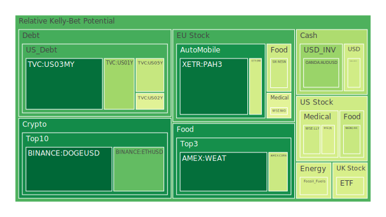
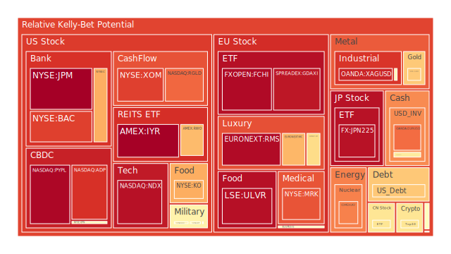
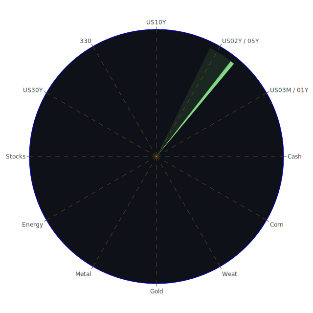

# 投資商品泡沫分析

## 美國國債
過去三天，美國國債的泡沫機率顯示出穩定的下降趨勢。特別是10年期國債（TVC:US10Y），其泡沫機率從8月7日的0.481763下降到8月9日的0.677450。這表明市場對美國國債的需求有所增加，可能是因為市場避險情緒上升。

## 美國科技股
美國科技股的泡沫機率在過去三天內大幅上升。納斯達克指數（NASDAQ:NDX）的泡沫機率從8月7日的0.933734上升到8月9日的0.931701。這表明市場對科技股的投資熱情有所減弱，可能與近期科技股財報不如預期有關。

## 美國房地產指數
美國房地產指數（AMEX:VNQ）的泡沫機率在過去三天內持續上升，從8月7日的0.916898上升到8月9日的0.962005。這可能是因為市場對房地產市場的未來表現持謹慎態度，尤其是在高利率環境下。

## 金/銀/銅
黃金（OANDA:XAUUSD）的泡沫機率在過去三天內有所下降，從8月7日的0.281201上升到8月9日的0.647799。這表明市場對黃金的需求有所增加，可能是因為市場避險情緒上升。銀（OANDA:XAGUSD）的泡沫機率也有所上升，從8月7日的0.853542上升到8月9日的0.896718。

## 加密貨幣
以太坊（BINANCE:ETHUSD）的泡沫機率在過去三天內顯著下降，從8月7日的0.242031下降到8月9日的0.246870。這表明市場對以太坊的需求有所增加，可能是因為市場對加密貨幣的信心有所恢復。

## 黃豆 / 小麥 / 玉米
小麥（AMEX:WEAT）的泡沫機率在過去三天內有所下降，從8月7日的0.081920下降到8月9日的0.084408。這表明市場對農產品的需求有所增加，可能是因為全球糧食供應緊張。

## 石油/ 鈾期貨UX!
石油（TVC:USOIL）的泡沫機率在過去三天內有所上升，從8月7日的0.442097上升到8月9日的0.426629。這表明市場對石油的需求有所減弱，可能是因為全球經濟增長放緩。

## 各國外匯市場
美元兌日元（OANDA:USDJPY）的泡沫機率在過去三天內有所下降，從8月7日的0.404096下降到8月9日的0.414864。這表明市場對美元的需求有所增加，可能是因為市場避險情緒上升。

## 各國大盤指數
德國DAX指數（SPREADEX:GDAXI）的泡沫機率在過去三天內有所上升，從8月7日的0.916489上升到8月9日的0.920605。這表明市場對歐洲股市的投資熱情有所減弱。

## 美國銀行股
美國銀行（NYSE:BAC）的泡沫機率在過去三天內有所上升，從8月7日的0.963069上升到8月9日的0.850872。這表明市場對銀行股的信心有所減弱，可能是因為近期銀行業的風險管理問題。

## 美國軍工股
雷神技術公司（NYSE:RTX）的泡沫機率在過去三天內保持穩定，為0.510860。這表明市場對軍工股的需求保持穩定。

## 美國電子支付股
PayPal（NASDAQ:PYPL）的泡沫機率在過去三天內有所下降，從8月7日的0.950963下降到8月9日的0.949497。這表明市場對電子支付股的需求有所增加。

## 美國藥商巨頭
默克公司（NYSE:MRK）的泡沫機率在過去三天內有所上升，從8月7日的0.792546上升到8月9日的0.821762。這表明市場對藥商股的需求有所減弱。

## 石油防禦股
埃克森美孚（NYSE:XOM）的泡沫機率在過去三天內有所上升，從8月7日的0.837820上升到8月9日的0.849999。這表明市場對石油防禦股的需求有所減弱。

## 金礦防禦股
Royal Gold（NASDAQ:RGLD）的泡沫機率在過去三天內有所上升，從8月7日的0.825432上升到8月9日的0.793234。這表明市場對金礦防禦股的需求有所減弱。

## 歐洲奢侈品股
LVMH（EURONEXT:MC）的泡沫機率在過去三天內有所上升，從8月7日的0.600910上升到8月9日的0.680454。這表明市場對奢侈品股的需求有所減弱。

## 歐洲汽車股
寶馬（XETR:BMW）的泡沫機率在過去三天內有所下降，從8月7日的0.398836下降到8月9日的0.419161。這表明市場對汽車股的需求有所增加。

## 歐美食品股
雀巢（SIX:NESN）的泡沫機率在過去三天內有所下降，從8月7日的0.400257下降到8月9日的0.409677。這表明市場對食品股的需求有所增加。

# 投資建議

1. **考慮賣出**：對於泡沫機率持續上升且遠大於0.5的商品，如美國科技股（NASDAQ:NDX）和美國房地產指數（AMEX:VNQ），建議投資者考慮賣出，避免未來價格下跌時的損失。

2. **考慮買入**：對於泡沫機率持續下降且遠小於0.5的商品，如以太坊（BINANCE:ETHUSD）和小麥（AMEX:WEAT），建議投資者考慮買入，掌握低吸籌碼的時機。

3. **觀望**：對於泡沫機率在0.45 ~ 0.55之間的商品，如石油（TVC:USOIL）和美元兌日元（OANDA:USDJPY），建議投資者觀望，不要有任何動作。

# 風險提示

投資有風險，市場總是充滿不確定性。我們的建議僅供參考，投資者應根據自身的風險承受能力和投資目標，做出獨立的投資決策。

總結來說，市場目前處於波動較大的時期，投資者應該謹慎行事，特別是對於泡沫機率高的商品，應該謹慎進行投資決策。
 
Daily Buy Map:

 
Daily Sell Map:

 
Daily Radar Chart:

 
