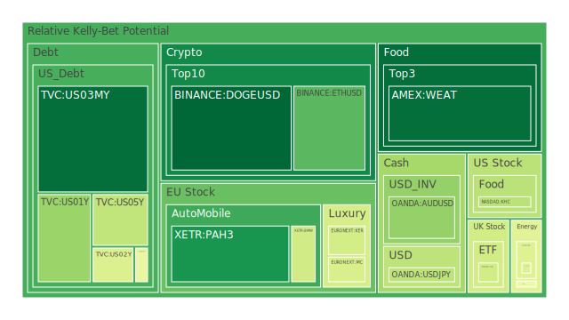
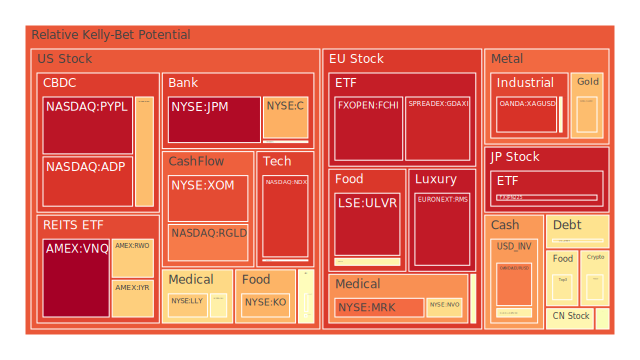
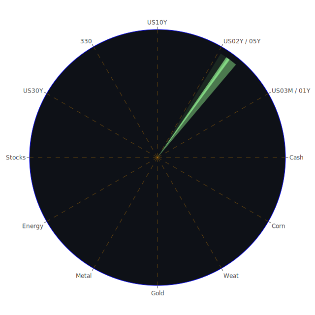

# 投資商品泡沫分析

## 美國國債
過去三天，美國國債的泡沫機率相對穩定，特別是短期國債（如1年期和2年期），其泡沫機率在0.33至0.45之間波動。這意味著市場對美國國債的需求依然穩定，儘管美國國債殖利率長期倒掛，這可能會導致企業普通融資管道利率變高。考慮到近期新聞報導中提到的美國經濟不確定性增加，建議投資者可以持續觀望，不要有任何動作。

## 美國科技股
美國科技股的泡沫機率持續上升，特別是NASDAQ指數（NDX），其泡沫機率已達到0.892。根據新聞報導，科技股因為財報不佳和市場需求疲軟而下跌，這進一步支持了泡沫機率上升的趨勢。建議投資者考慮賣出部分科技股，避免未來價格下跌時的損失。

## 美國房地產指數
美國房地產指數（VNQ）的泡沫機率持續上升，從0.762上升至0.990。這與新聞中提到的房地產市場需求疲軟和高利率環境有關。建議投資者考慮賣出房地產相關投資，避免風險。

## 金/銀/銅
金價的泡沫機率在0.68至0.78之間波動，銀價的泡沫機率則在0.89以上。這反映了市場對避險資產的需求增加，特別是在經濟不確定性增加的情況下。建議投資者可以考慮適量買入金銀作為避險資產。

## 加密貨幣
比特幣（BTCUSD）和以太坊（ETHUSD）的泡沫機率分別為0.589和0.242。儘管比特幣的泡沫機率較高，但以太坊的泡沫機率顯著下降，這可能與近期加密貨幣市場的波動有關。建議投資者可以考慮分批買入以太坊，因其泡沫機率較低，風險相對較小。

## 黃豆 / 小麥 / 玉米
黃豆（SOYB）的泡沫機率穩定在0.502，小麥（WEAT）的泡沫機率則在0.086至0.095之間波動，玉米（CORN）的泡沫機率在0.404至0.596之間波動。這些農產品的泡沫機率相對較低，顯示出市場對這些商品的需求依然穩定。建議投資者可以考慮分批買入這些農產品。

## 石油/ 鈾期貨UX!
石油（USOIL）的泡沫機率在0.426至0.454之間波動，鈾期貨（UX1!）的泡沫機率則在0.490至0.756之間波動。近期新聞報導中提到的地緣政治風險增加，可能會推高這些商品的價格。建議投資者可以考慮分批買入石油和鈾期貨。

## 各國外匯市場
美元兌日元（USDJPY）的泡沫機率在0.391至0.414之間波動，歐元兌美元（EURUSD）的泡沫機率則在0.786左右。這反映了市場對美元的需求增加，特別是在經濟不確定性增加的情況下。建議投資者可以考慮持有美元資產。

## 各國大盤指數
英國富時指數（FTSE）、德國DAX指數（GDAXI）和法國CAC指數（FCHI）的泡沫機率均在0.92以上，顯示出這些市場存在較高的風險。建議投資者謹慎操作，避免在這些市場中進行大規模投資。

## 美國銀行股
美國銀行股（BAC）的泡沫機率在0.850以上，顯示出市場對銀行股的需求減少。考慮到近期新聞中提到的銀行風險管理問題，建議投資者考慮賣出銀行股。

## 美國軍工股
洛克希德馬丁（LMT）和諾斯羅普·格魯曼（NOC）的泡沫機率在0.546至0.560之間波動，顯示出市場對軍工股的需求依然穩定。建議投資者可以持有軍工股，作為防禦性投資。

## 美國電子支付股
PayPal（PYPL）的泡沫機率在0.950以上，顯示出市場對電子支付股的需求減少。建議投資者考慮賣出電子支付股，避免風險。

## 美國藥商巨頭
強生（JNJ）和默克（MRK）的泡沫機率在0.574至0.811之間波動，顯示出市場對藥商巨頭的需求依然穩定。建議投資者可以持有藥商巨頭的股票，作為防禦性投資。

## 石油防禦股
埃克森美孚（XOM）的泡沫機率在0.849以上，顯示出市場對石油防禦股的需求減少。建議投資者考慮賣出石油防禦股，避免風險。

## 金礦防禦股
皇家黃金（RGLD）的泡沫機率在0.788以上，顯示出市場對金礦防禦股的需求減少。建議投資者考慮賣出金礦防禦股，避免風險。

## 歐洲奢侈品股
LVMH（MC）和愛馬仕（RMS）的泡沫機率在0.680以上，顯示出市場對奢侈品股的需求減少。建議投資者考慮賣出奢侈品股，避免風險。

## 歐洲汽車股
寶馬（BMW）和戴姆勒（MBG）的泡沫機率在0.419至0.524之間波動，顯示出市場對汽車股的需求依然穩定。建議投資者可以持有汽車股，作為防禦性投資。

## 歐美食品股
雀巢（NESN）和可口可樂（KO）的泡沫機率在0.409至0.704之間波動，顯示出市場對食品股的需求依然穩定。建議投資者可以持有食品股，作為防禦性投資。

# 投資建議
1. **賣出**：美國科技股、房地產指數、電子支付股、石油防禦股、金礦防禦股、奢侈品股。
2. **持有**：美國國債、軍工股、藥商巨頭、汽車股、食品股。
3. **買入**：黃金、銀、以太坊、農產品（黃豆、小麥、玉米）、石油、鈾期貨。

# 風險提示
投資有風險，市場總是充滿不確定性。我們的建議僅供參考，投資者應根據自身的風險承受能力和投資目標，做出獨立的投資決策。特別是對於泡沫機率高的商品，應該謹慎進行投資決策。
 
Daily Buy Map:

 
Daily Sell Map:

 
Daily Radar Chart:

 
