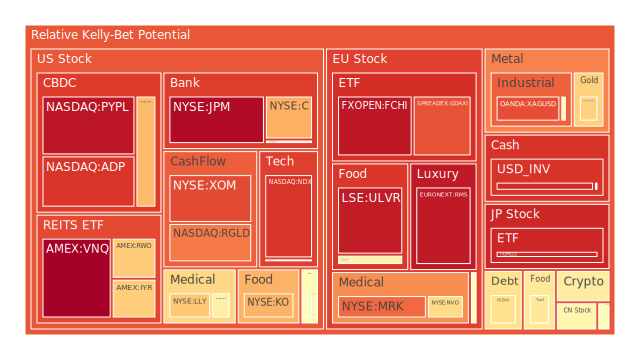
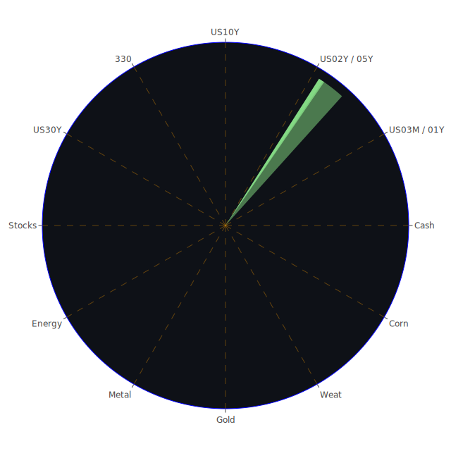

# 投資商品泡沫分析

## 美國國債
過去三天，美國國債的泡沫機率變化不大，10年期國債殖利率持續在3.94%左右徘徊。根據最新的FED數據，SOFR交易量上升，顯示市場對短期美元需求增加。這可能會對高泡沫資產造成壓力，建議投資者謹慎觀望。

## 美國科技股
美國科技股的泡沫機率持續高企，NASDAQ:NDX的泡沫機率在0.892到0.931之間波動。近期新聞顯示，科技公司如Warner Bros. Discovery和Paramount Global面臨業務困境，這進一步加劇了市場對科技股的擔憂。建議投資者考慮減持科技股，避免未來可能的價格下跌。

## 美國房地產指數
AMEX:VNQ的泡沫機率在0.990左右，顯示房地產市場風險較高。儘管房貸利率下降，但房地產市場的整體情況仍然不樂觀。建議投資者謹慎對待房地產投資，避免過度暴露於高風險資產。

## 金/銀/銅
金價（OANDA:XAUUSD）的泡沫機率在0.647到0.687之間，顯示金價相對穩定。銀價（OANDA:XAGUSD）的泡沫機率則高達0.852，顯示銀價風險較高。銅價（FX:COPPER）的泡沫機率在0.535左右，顯示銅價風險中等。建議投資者可以考慮增加金的配置，減少銀的配置。

## 加密貨幣
比特幣（BITSTAMP:BTCUSD）的泡沫機率在0.584到0.589之間，顯示風險中等。狗狗幣（BINANCE:DOGEUSD）的泡沫機率則持續下降，顯示風險較低。以太坊（BINANCE:ETHUSD）的泡沫機率在0.501左右，風險中等。建議投資者可以考慮增加狗狗幣的配置，減少比特幣和以太坊的配置。

## 黃豆 / 小麥 / 玉米
黃豆（AMEX:SOYB）和小麥（AMEX:WEAT）的泡沫機率相對穩定，分別在0.502和0.086左右。玉米（AMEX:CORN）的泡沫機率在0.596左右，顯示風險較高。建議投資者可以考慮增加黃豆和小麥的配置，減少玉米的配置。

## 石油/ 鈾期貨UX!
石油（TVC:USOIL）的泡沫機率在0.426左右，顯示風險中等。鈾期貨（COMEX:UX1!）的泡沫機率在0.490左右，顯示風險較高。近期油價穩定，但鈾期貨風險較高，建議投資者謹慎對待鈾期貨投資。

## 各國外匯市場
美元兌日元（OANDA:USDJPY）的泡沫機率在0.414到0.489之間，顯示風險中等。澳元兌美元（OANDA:AUDUSD）的泡沫機率在0.348左右，顯示風險較低。歐元兌美元（OANDA:EURUSD）的泡沫機率則高達0.911，顯示風險較高。建議投資者可以考慮增加澳元的配置，減少歐元的配置。

## 各國大盤指數
德國DAX指數（SPREADEX:GDAXI）的泡沫機率在0.846到0.920之間，顯示風險較高。英國FTSE指數（SPREADEX:FTSE）的泡沫機率在0.444左右，顯示風險較低。建議投資者可以考慮增加英國FTSE指數的配置，減少德國DAX指數的配置。

## 美國銀行股
美國銀行股（NYSE:BAC）的泡沫機率在0.522到0.850之間，顯示風險較高。近期新聞顯示，銀行業面臨風險管理和反洗錢方面的挑戰，建議投資者謹慎對待銀行股投資。

## 美國軍工股
美國軍工股（NYSE:LMT）的泡沫機率在0.546左右，顯示風險中等。近期新聞顯示，美國軍工企業面臨訂單增長的挑戰，建議投資者謹慎對待軍工股投資。

## 美國電子支付股
電子支付股（NASDAQ:PYPL）的泡沫機率在0.950左右，顯示風險較高。近期新聞顯示，電子支付行業面臨競爭加劇和監管挑戰，建議投資者減少電子支付股的配置。

## 美國藥商巨頭
美國藥商巨頭（NYSE:MRK）的泡沫機率在0.811左右，顯示風險較高。近期新聞顯示，藥品價格和監管風險增加，建議投資者謹慎對待藥商股投資。

## 石油防禦股
石油防禦股（NYSE:XOM）的泡沫機率在0.858左右，顯示風險較高。近期油價波動較大，建議投資者減少石油防禦股的配置。

## 金礦防禦股
金礦防禦股（NASDAQ:RGLD）的泡沫機率在0.788左右，顯示風險較高。近期金價波動較大，建議投資者減少金礦防禦股的配置。

## 歐洲奢侈品股
歐洲奢侈品股（EURONEXT:RMS）的泡沫機率在0.940左右，顯示風險較高。近期新聞顯示，奢侈品市場需求減弱，建議投資者減少奢侈品股的配置。

## 歐洲汽車股
歐洲汽車股（XETR:BMW）的泡沫機率在0.424左右，顯示風險中等。近期新聞顯示，汽車市場需求穩定，建議投資者可以考慮增加汽車股的配置。

## 歐美食品股
歐美食品股（NYSE:KO）的泡沫機率在0.704左右，顯示風險較高。近期新聞顯示，食品行業面臨成本上升和需求減弱的挑戰，建議投資者減少食品股的配置。

# 投資建議
1. **增加配置**：黃金、澳元、英國FTSE指數、歐洲汽車股。
2. **減少配置**：美國科技股、房地產指數、電子支付股、藥商巨頭、石油防禦股、金礦防禦股、歐洲奢侈品股、食品股。

# 風險提示
投資有風險，市場總是充滿不確定性。我們的建議僅供參考，投資者應根據自身的風險承受能力和投資目標，做出獨立的投資決策。特別是對於泡沫機率高的商品，應該謹慎進行投資決策。

希望這份報告能夠幫助您在複雜的市場環境中做出明智的投資決策。祝您投資順利！
 
Daily Buy Map:

 
Daily Sell Map:

 
Daily Radar Chart:

 
