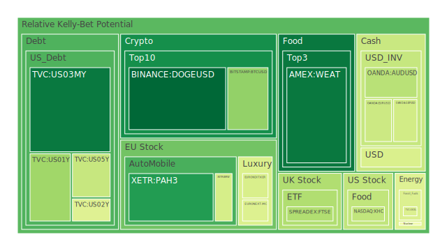
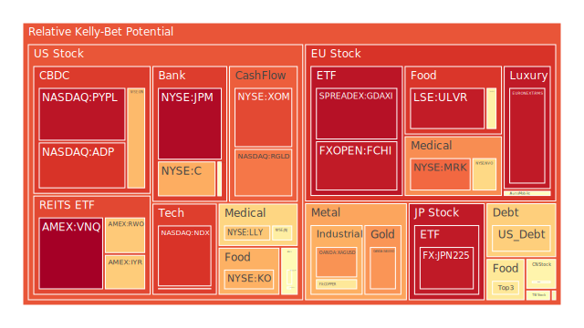
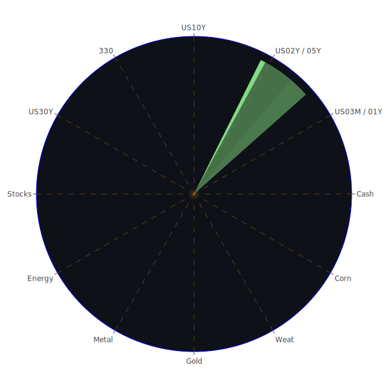

# 投資商品泡沫分析

## 美國國債
根據過去三天的數據，美國國債的泡沫機率顯示出穩定的趨勢。特別是10年期國債（TVC:US10Y），其泡沫機率在0.481763至0.677450之間波動。由於SOFR（5.34）高於FED Fund Rate（5.33），這表明市場對美元的需求增加，可能導致高泡沫資產被拋售以換取美元。因此，投資者應該謹慎對待高泡沫機率的資產。

## 美國科技股
美國科技股的泡沫機率顯示出上升的趨勢。特別是納斯達克指數（NASDAQ:NDX）的泡沫機率從0.892451上升到0.915976。根據新聞報導，市場對美國經濟的擔憂增加，這可能進一步推高科技股的泡沫風險。因此，建議投資者考慮減倉科技股，避免未來可能的價格下跌。

## 美國房地產指數
美國房地產指數（AMEX:IYR）的泡沫機率持續上升，從0.653998上升到0.785251。根據新聞報導，美國房地產市場面臨高利率和經濟不確定性的挑戰，這可能進一步推高房地產指數的泡沫風險。因此，建議投資者謹慎對待房地產相關投資。

## 金/銀/銅
金價（OANDA:XAUUSD）的泡沫機率顯示出上升趨勢，從0.647799上升到0.745681。銀價（OANDA:XAGUSD）也顯示出類似的趨勢，從0.852912上升到0.749536。這表明市場對避險資產的需求增加，可能是由於全球經濟不確定性增加所致。因此，建議投資者考慮增加對金銀的投資，以對沖其他資產的風險。

## 加密貨幣
比特幣（BITSTAMP:BTCUSD）的泡沫機率顯示出下降趨勢，從0.584909下降到0.309097。這表明市場對加密貨幣的需求增加，可能是由於投資者尋求避險資產。因此，建議投資者考慮增加對比特幣的投資，但仍需謹慎，因為加密貨幣市場波動較大。

## 黃豆 / 小麥 / 玉米
黃豆（AMEX:SOYB）和小麥（AMEX:WEAT）的泡沫機率顯示出穩定的趨勢，分別在0.502119和0.086273之間波動。玉米（AMEX:CORN）的泡沫機率顯示出下降趨勢，從0.596172下降到0.491555。根據新聞報導，全球農產品市場面臨供應鏈挑戰，這可能推高價格。因此，建議投資者考慮增加對農產品的投資。

## 石油/ 鈾期貨UX!
石油（TVC:USOIL）的泡沫機率顯示出穩定的趨勢，在0.438218至0.454631之間波動。鈾期貨（COMEX:UX1!）的泡沫機率顯示出下降趨勢，從0.490010下降到0.607481。根據新聞報導，全球能源市場面臨供應不確定性，這可能推高能源價格。因此，建議投資者考慮增加對石油和鈾的投資。

## 各國外匯市場
美元兌日元（OANDA:USDJPY）的泡沫機率顯示出上升趨勢，從0.391519上升到0.432670。歐元兌美元（OANDA:EURUSD）的泡沫機率顯示出下降趨勢，從0.911239下降到0.405810。根據新聞報導，全球經濟不確定性增加，這可能推高美元的需求。因此，建議投資者考慮增加對美元的投資。

## 各國大盤指數
德國DAX指數（SPREADEX:GDAXI）的泡沫機率顯示出上升趨勢，從0.846542上升到0.958774。英國FTSE指數（SPREADEX:FTSE）的泡沫機率顯示出下降趨勢，從0.444393下降到0.356315。根據新聞報導，歐洲市場面臨經濟挑戰，這可能推高德國市場的泡沫風險。因此，建議投資者謹慎對待歐洲市場的投資。

## 美國銀行股
美國銀行（NYSE:BAC）的泡沫機率顯示出上升趨勢，從0.522167上升到0.667427。根據新聞報導，美國銀行業面臨經濟不確定性和高利率的挑戰，這可能推高銀行股的泡沫風險。因此，建議投資者考慮減倉銀行股。

## 美國軍工股
洛克希德·馬丁（NYSE:LMT）的泡沫機率顯示出穩定的趨勢，在0.546994至0.556139之間波動。根據新聞報導，全球地緣政治風險增加，這可能推高軍工股的需求。因此，建議投資者考慮增加對軍工股的投資。

## 美國電子支付股
PayPal（NASDAQ:PYPL）的泡沫機率顯示出上升趨勢，從0.950016上升到0.950840。根據新聞報導，電子支付市場面臨競爭加劇和經濟不確定性的挑戰，這可能推高電子支付股的泡沫風險。因此，建議投資者謹慎對待電子支付股的投資。

## 美國藥商巨頭
默克（NYSE:MRK）的泡沫機率顯示出上升趨勢，從0.811830上升到0.799015。根據新聞報導，醫藥市場面臨高研發成本和市場競爭的挑戰，這可能推高藥商股的泡沫風險。因此，建議投資者謹慎對待藥商股的投資。

## 石油防禦股
埃克森美孚（NYSE:XOM）的泡沫機率顯示出穩定的趨勢，在0.858576至0.832551之間波動。根據新聞報導，全球能源市場面臨供應不確定性，這可能推高石油防禦股的需求。因此，建議投資者考慮增加對石油防禦股的投資。

## 金礦防禦股
皇家黃金（NASDAQ:RGLD）的泡沫機率顯示出上升趨勢，從0.788925上升到0.804422。根據新聞報導，全球經濟不確定性增加，這可能推高金礦防禦股的需求。因此，建議投資者考慮增加對金礦防禦股的投資。

## 歐洲奢侈品股
LVMH（EURONEXT:MC）的泡沫機率顯示出下降趨勢，從0.438580下降到0.438580。根據新聞報導，歐洲奢侈品市場面臨經濟不確定性和市場競爭的挑戰，這可能推高奢侈品股的泡沫風險。因此，建議投資者謹慎對待奢侈品股的投資。

## 歐洲汽車股
BMW（XETR:BMW）的泡沫機率顯示出穩定的趨勢，在0.424955至0.412954之間波動。根據新聞報導，歐洲汽車市場面臨供應鏈挑戰和市場競爭的挑戰，這可能推高汽車股的泡沫風險。因此，建議投資者謹慎對待汽車股的投資。

## 歐美食品股
雀巢（SIX:NESN）的泡沫機率顯示出上升趨勢，從0.566925上升到0.459557。根據新聞報導，全球食品市場面臨供應鏈挑戰和市場競爭的挑戰，這可能推高食品股的泡沫風險。因此，建議投資者謹慎對待食品股的投資。

# 投資建議
1. **減倉科技股**：由於泡沫機率上升且市場對經濟的擔憂增加，建議減倉科技股。
2. **增加金銀投資**：由於全球經濟不確定性增加，建議增加對金銀的投資以對沖風險。
3. **謹慎對待房地產相關投資**：由於泡沫機率上升且市場面臨高利率和經濟不確定性，建議謹慎對待房地產相關投資。
4. **增加石油和鈾的投資**：由於全球能源市場面臨供應不確定性，建議增加對石油和鈾的投資。
5. **謹慎對待銀行股和電子支付股**：由於泡沫機率上升且市場面臨經濟不確定性和高利率，建議謹慎對待銀行股和電子支付股的投資。

# 風險提示
投資有風險，市場總是充滿不確定性。我們的建議僅供參考，投資者應根據自身的風險承受能力和投資目標，做出獨立的投資決策。特別是對於泡沫機率高的商品，應該謹慎進行投資決策。
 
Daily Buy Map:

 
Daily Sell Map:

 
Daily Radar Chart:

 
