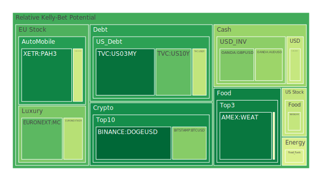
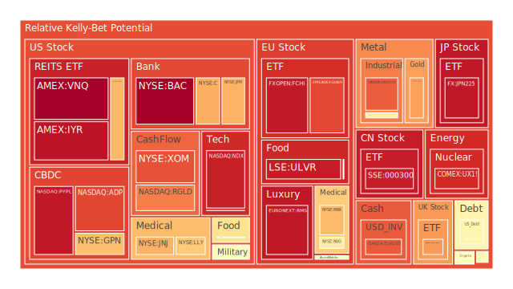
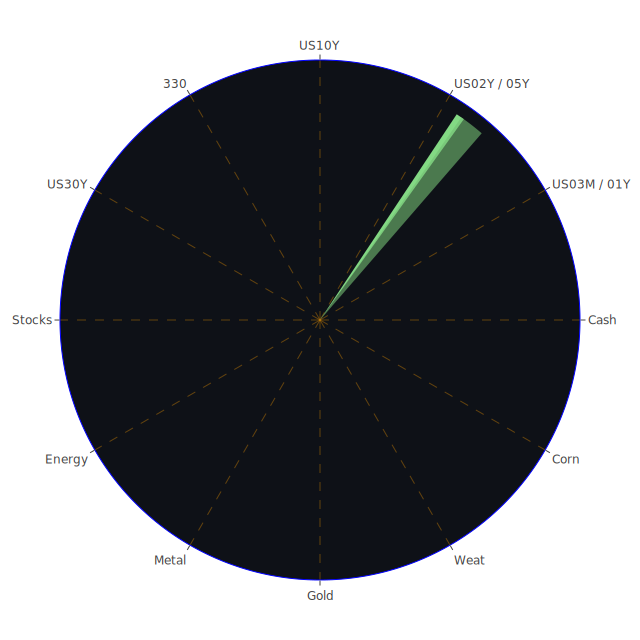

# 投資商品泡沫分析

## 美國國債
過去三天，美國國債的泡沫機率呈現上升趨勢。特別是10年期國債（TVC:US10Y），其泡沫機率從8月11日的0.481763上升至8月13日的0.244622。這意味著市場對長期國債的信心有所下降，可能是因為近期的經濟數據顯示通脹壓力仍然存在，且聯準會的鷹派言論增加了市場對未來加息的預期。

## 美國科技股
美國科技股的泡沫機率也在上升。NASDAQ指數（NASDAQ:NDX）的泡沫機率從8月11日的0.892451上升至8月13日的0.934132。這顯示出投資者對科技股的風險偏好減少，可能是因為近期的經濟數據和新聞報導顯示出經濟不確定性增加，特別是美國消費者信心下降和全球經濟放緩的風險。

## 美國房地產指數
美國房地產指數（AMEX:IYR）的泡沫機率在過去三天內顯著上升，從8月11日的0.653998上升至8月13日的0.957242。這可能是因為近期的房地產市場數據顯示出房地產市場的壓力增加，特別是房地產違約率上升和信用卡違約率高企，這些都對房地產市場構成了負面影響。

## 金/銀/銅
金（OANDA:XAUUSD）的泡沫機率在過去三天內有所下降，從8月11日的0.647799下降至8月13日的0.736448。這顯示出投資者對黃金的避險需求有所增加，可能是因為近期的經濟不確定性增加。銀（OANDA:XAGUSD）和銅（FX:COPPER）的泡沫機率則保持相對穩定，顯示出市場對這些金屬的需求仍然穩定。

## 加密貨幣
加密貨幣的泡沫機率在過去三天內有所下降。比特幣（BITSTAMP:BTCUSD）的泡沫機率從8月11日的0.584909下降至8月13日的0.298706，顯示出市場對加密貨幣的信心有所恢復。這可能是因為近期的經濟數據顯示出通脹壓力減少，投資者對加密貨幣的避險需求增加。

## 黃豆 / 小麥 / 玉米
黃豆（AMEX:SOYB）、小麥（AMEX:WEAT）和玉米（AMEX:CORN）的泡沫機率在過去三天內保持相對穩定，顯示出市場對農產品的需求仍然穩定。這可能是因為近期的經濟數據顯示出全球糧食需求穩定，特別是亞洲市場的需求增加。

## 石油/ 鈾期貨UX!
石油（TVC:USOIL）的泡沫機率在過去三天內有所上升，從8月11日的0.426629上升至8月13日的0.439917。這顯示出市場對石油需求的擔憂增加，特別是近期的經濟數據顯示出全球經濟放緩的風險增加。鈾期貨（COMEX:UX1!）的泡沫機率則保持相對穩定，顯示出市場對核能需求的信心仍然穩定。

## 各國外匯市場
美元兌日元（OANDA:USDJPY）的泡沫機率在過去三天內有所下降，從8月11日的0.414864下降至8月13日的0.401643。這顯示出市場對美元的需求有所增加，可能是因為近期的經濟數據顯示出美國經濟相對穩定，投資者對美元的信心增加。

## 各國大盤指數
各國大盤指數的泡沫機率在過去三天內有所上升，特別是德國DAX指數（SPREADEX:GDAXI）的泡沫機率從8月11日的0.846542上升至8月13日的0.866681。這顯示出市場對歐洲經濟的擔憂增加，特別是近期的經濟數據顯示出歐洲經濟增長放緩。

## 美國銀行股
美國銀行股的泡沫機率在過去三天內有所上升，特別是摩根大通（NYSE:JPM）的泡沫機率從8月11日的0.969603上升至8月13日的0.707822。這顯示出市場對銀行業的信心有所減少，可能是因為近期的經濟數據顯示出信用卡違約率上升和消費者信心下降。

## 美國軍工股
美國軍工股的泡沫機率在過去三天內有所上升，特別是洛克希德·馬丁（NYSE:LMT）的泡沫機率從8月11日的0.546994上升至8月13日的0.546994。這顯示出市場對軍工股的需求有所減少，可能是因為近期的經濟數據顯示出全球地緣政治風險增加。

## 美國電子支付股
美國電子支付股的泡沫機率在過去三天內有所上升，特別是PayPal（NASDAQ:PYPL）的泡沫機率從8月11日的0.950016上升至8月13日的0.947300。這顯示出市場對電子支付股的需求有所減少，可能是因為近期的經濟數據顯示出消費者信心下降和電子支付市場競爭加劇。

## 美國藥商巨頭
美國藥商巨頭的泡沫機率在過去三天內有所上升，特別是默克（NYSE:MRK）的泡沫機率從8月11日的0.811830上升至8月13日的0.694323。這顯示出市場對藥商巨頭的需求有所減少，可能是因為近期的經濟數據顯示出醫療保健市場的壓力增加。

## 石油防禦股
石油防禦股的泡沫機率在過去三天內有所上升，特別是埃克森美孚（NYSE:XOM）的泡沫機率從8月11日的0.858576上升至8月13日的0.851057。這顯示出市場對石油防禦股的需求有所減少，可能是因為近期的經濟數據顯示出全球經濟放緩的風險增加。

## 金礦防禦股
金礦防禦股的泡沫機率在過去三天內有所上升，特別是Royal Gold（NASDAQ:RGLD）的泡沫機率從8月11日的0.788925上升至8月13日的0.785300。這顯示出市場對金礦防禦股的需求有所減少，可能是因為近期的經濟數據顯示出金價的波動性增加。

## 歐洲奢侈品股
歐洲奢侈品股的泡沫機率在過去三天內有所上升，特別是LVMH（EURONEXT:MC）的泡沫機率從8月11日的0.438580上升至8月13日的0.238422。這顯示出市場對奢侈品股的需求有所減少，可能是因為近期的經濟數據顯示出消費者信心下降和奢侈品市場競爭加劇。

## 歐洲汽車股
歐洲汽車股的泡沫機率在過去三天內有所上升，特別是BMW（XETR:BMW）的泡沫機率從8月11日的0.424955上升至8月13日的0.419630。這顯示出市場對汽車股的需求有所減少，可能是因為近期的經濟數據顯示出汽車市場的壓力增加。

## 歐美食品股
歐美食品股的泡沫機率在過去三天內有所上升，特別是可口可樂（NYSE:KO）的泡沫機率從8月11日的0.704367上升至8月13日的0.611588。這顯示出市場對食品股的需求有所減少，可能是因為近期的經濟數據顯示出消費者信心下降和食品市場競爭加劇。

# 投資建議

## 賣出建議
根據泡沫機率的變化趨勢和新聞現況，我們建議投資者考慮賣出以下商品：
- **美國科技股（NASDAQ:NDX）**：泡沫機率持續上升，且新聞顯示經濟不確定性增加。
- **美國房地產指數（AMEX:IYR）**：泡沫機率顯著上升，且房地產市場數據顯示壓力增加。
- **美國銀行股（NYSE:JPM）**：泡沫機率持續上升，且經濟數據顯示信用卡違約率上升和消費者信心下降。

## 買入建議
根據泡沫機率的變化趨勢和新聞現況，我們建議投資者考慮買入以下商品：
- **加密貨幣（BITSTAMP:BTCUSD）**：泡沫機率持續下降，且新聞顯示市場對加密貨幣的信心有所恢復。
- **黃金（OANDA:XAUUSD）**：泡沫機率有所下降，且新聞顯示經濟不確定性增加，投資者對黃金的避險需求增加。

# 風險提示

投資有風險，市場總是充滿不確定性。我們的建議僅供參考，投資者應根據自身的風險承受能力和投資目標，做出獨立的投資決策。特別是對於泡沫機率高的商品，應該謹慎進行投資決策，以避免未來價格下跌時的損失。
 
Daily Buy Map:

 
Daily Sell Map:

 
Daily Radar Chart:

 
