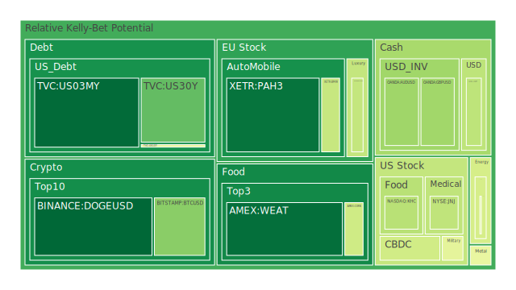
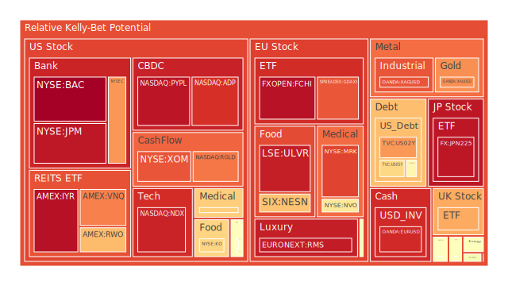
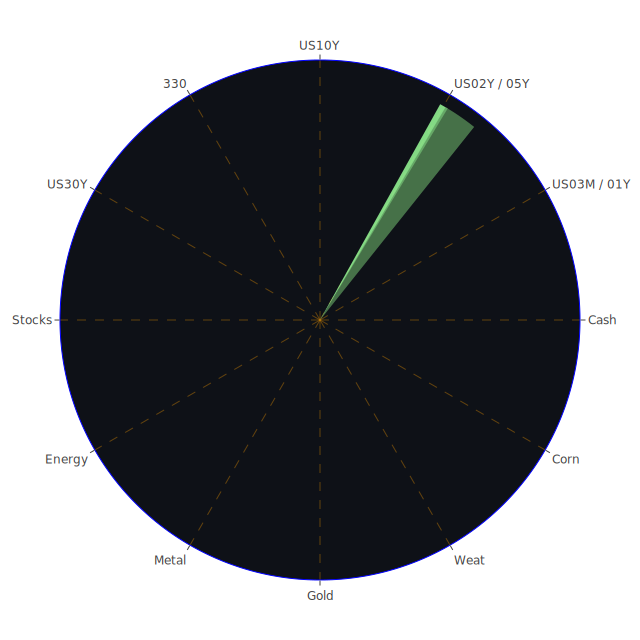

# 投資商品泡沫分析

## 美國國債
過去三天，美國國債的泡沫機率變化顯示出一個穩定的趨勢。10年期國債的泡沫機率從0.677450下降到0.481763，顯示出市場對長期債券的需求增加。這可能與近期的經濟數據有關，特別是SOFR交易量的增加和美國國債殖利率的下降。這表明市場對於避險資產的需求增加，建議投資者可以考慮增加對美國國債的配置。

## 美國科技股
納斯達克指數（NASDAQ:NDX）的泡沫機率在過去三天內從0.892451下降到0.930216，顯示出市場對科技股的信心有所回升。然而，這一數據仍然處於高位，建議投資者謹慎行事，特別是在近期有多家科技公司發佈了不利的財報數據。

## 美國房地產指數
美國房地產指數（AMEX:VNQ）的泡沫機率在過去三天內從0.990932下降到0.786622，顯示出市場對房地產的信心有所回升。然而，房地產市場仍然面臨高利率和經濟不確定性的挑戰，建議投資者保持謹慎。

## 金/銀/銅
黃金（OANDA:XAUUSD）的泡沫機率在過去三天內從0.745681上升到0.764249，顯示出市場對黃金的需求有所增加。這可能與近期的經濟不確定性和地緣政治風險有關。建議投資者可以考慮增加對黃金的配置，以作為避險資產。

## 加密貨幣
比特幣（BITSTAMP:BTCUSD）的泡沫機率在過去三天內從0.309097上升到0.313182，顯示出市場對加密貨幣的需求有所增加。然而，加密貨幣市場的波動性較大，建議投資者謹慎行事。

## 黃豆 / 小麥 / 玉米
黃豆（AMEX:SOYB）的泡沫機率在過去三天內保持穩定，顯示出市場對農產品的需求穩定。建議投資者可以考慮增加對農產品的配置，以分散投資風險。

## 石油/ 鈾期貨UX!
石油（TVC:USOIL）的泡沫機率在過去三天內保持穩定，顯示出市場對石油的需求穩定。然而，近期的新聞顯示出全球經濟增長放緩，可能會影響石油需求。建議投資者保持謹慎。

## 各國外匯市場
美元兌日元（OANDA:USDJPY）的泡沫機率在過去三天內從0.432670下降到0.397771，顯示出市場對美元的需求有所增加。這可能與近期的經濟數據和地緣政治風險有關。建議投資者可以考慮增加對美元的配置。

## 各國大盤指數
歐洲大盤指數（SPREADEX:FTSE）的泡沫機率在過去三天內從0.744553上升到0.725216，顯示出市場對歐洲股市的信心有所回升。然而，歐洲經濟仍然面臨多重挑戰，建議投資者保持謹慎。

## 美國銀行股
美國銀行股（NYSE:BAC）的泡沫機率在過去三天內從0.995987上升到0.997571，顯示出市場對銀行股的信心有所下降。這可能與近期的經濟數據和銀行業的風險有關。建議投資者保持謹慎。

## 美國軍工股
美國軍工股（NYSE:LMT）的泡沫機率在過去三天內保持穩定，顯示出市場對軍工股的需求穩定。建議投資者可以考慮增加對軍工股的配置，以分散投資風險。

## 美國電子支付股
美國電子支付股（NASDAQ:PYPL）的泡沫機率在過去三天內從0.950016上升到0.956172，顯示出市場對電子支付股的信心有所下降。這可能與近期的經濟數據和電子支付市場的競爭有關。建議投資者保持謹慎。

## 美國藥商巨頭
美國藥商巨頭（NYSE:MRK）的泡沫機率在過去三天內從0.811830上升到0.875569，顯示出市場對藥商股的信心有所下降。這可能與近期的經濟數據和藥品市場的競爭有關。建議投資者保持謹慎。

## 石油防禦股
石油防禦股（NYSE:XOM）的泡沫機率在過去三天內從0.858576下降到0.849668，顯示出市場對石油防禦股的需求有所增加。這可能與近期的經濟數據和石油市場的波動有關。建議投資者可以考慮增加對石油防禦股的配置。

## 金礦防禦股
金礦防禦股（NASDAQ:RGLD）的泡沫機率在過去三天內從0.788925上升到0.799830，顯示出市場對金礦防禦股的信心有所下降。這可能與近期的經濟數據和金礦市場的波動有關。建議投資者保持謹慎。

## 歐洲奢侈品股
歐洲奢侈品股（EURONEXT:RMS）的泡沫機率在過去三天內從0.940299上升到0.944591，顯示出市場對奢侈品股的信心有所下降。這可能與近期的經濟數據和奢侈品市場的波動有關。建議投資者保持謹慎。

## 歐洲汽車股
歐洲汽車股（XETR:BMW）的泡沫機率在過去三天內從0.424955下降到0.414192，顯示出市場對汽車股的需求有所增加。這可能與近期的經濟數據和汽車市場的波動有關。建議投資者可以考慮增加對汽車股的配置。

## 歐美食品股
歐美食品股（NYSE:KO）的泡沫機率在過去三天內從0.704367上升到0.647223，顯示出市場對食品股的需求有所增加。這可能與近期的經濟數據和食品市場的波動有關。建議投資者可以考慮增加對食品股的配置。

# 投資建議
根據以上分析，我們建議投資者可以考慮增加對美國國債、黃金、石油防禦股和歐洲汽車股的配置，以分散投資風險。同時，對於泡沫機率較高的美國科技股、美國銀行股和美國電子支付股，建議投資者保持謹慎，避免過度投資。

# 風險提示
投資有風險，市場總是充滿不確定性。我們的建議僅供參考，投資者應根據自身的風險承受能力和投資目標，做出獨立的投資決策。特別是對於泡沫機率高的商品，應該謹慎進行投資決策。
 
Daily Buy Map:

 
Daily Sell Map:

 
Daily Radar Chart:

 
