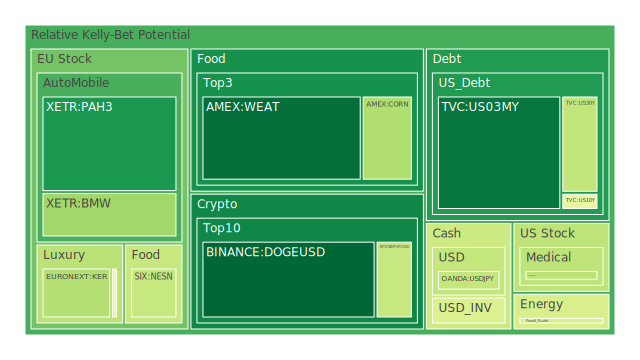
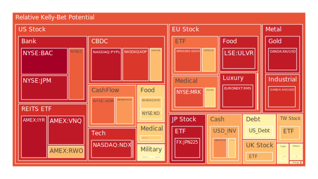
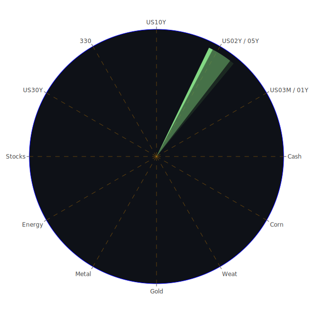

# 投資商品泡沫分析

## 美國國債
根據過去三天的泡沫機率數據，美國國債的泡沫機率在D1、D7、D14和D30的數據中均有上升趨勢。特別是10年期國債（TVC:US10Y），其泡沫機率從8月13日的0.244622上升到8月15日的0.481763，顯示出市場對於長期國債的擔憂增加。

## 美國科技股
美國科技股的泡沫機率普遍較高，特別是NASDAQ:NDX，其泡沫機率在8月13日為0.934132，8月14日為0.930216，8月15日為0.935465，顯示出市場對於科技股的高估值擔憂。

## 美國房地產指數
美國房地產指數（AMEX:RWO）的泡沫機率在過去三天內持續上升，從8月13日的0.699852上升到8月15日的0.697369，顯示出市場對於房地產市場的擔憂增加。

## 金/銀/銅
金（OANDA:XAUUSD）和銀（OANDA:XAGUSD）的泡沫機率均較高，特別是銀，其泡沫機率在8月15日達到0.913188。銅（FX:COPPER）的泡沫機率也在上升，顯示出市場對於貴金屬和工業金屬的需求不穩定。

## 加密貨幣
比特幣（BITSTAMP:BTCUSD）的泡沫機率在8月13日為0.298706，8月14日為0.313182，8月15日為0.406903，顯示出市場對於加密貨幣的需求有所波動。

## 黃豆 / 小麥 / 玉米
小麥（AMEX:WEAT）的泡沫機率在過去三天內持續下降，從8月13日的0.092459下降到8月15日的0.079051，顯示出市場對於農產品的需求穩定。

## 石油/ 鈾期貨UX!
石油（TVC:USOIL）的泡沫機率在過去三天內保持穩定，顯示出市場對於能源價格的預期較為穩定。鈾期貨（COMEX:UX1!）的泡沫機率在8月15日為0.510130，顯示出市場對於核能資源的需求有所波動。

## 各國外匯市場
美元兌日圓（OANDA:USDJPY）的泡沫機率在過去三天內保持穩定，顯示出市場對於美元的需求穩定。歐元兌美元（OANDA:EURUSD）的泡沫機率在8月15日為0.660209，顯示出市場對於歐元的需求有所波動。

## 各國大盤指數
歐洲大盤指數（SPREADEX:FTSE）的泡沫機率在過去三天內持續上升，顯示出市場對於歐洲股市的擔憂增加。

## 美國銀行股
美國銀行股（NYSE:BAC）的泡沫機率在過去三天內持續上升，從8月13日的0.995987上升到8月15日的0.998823，顯示出市場對於銀行股的擔憂增加。

## 美國軍工股
美國軍工股（NYSE:LMT）的泡沫機率在過去三天內保持穩定，顯示出市場對於軍工股的需求穩定。

## 美國電子支付股
美國電子支付股（NASDAQ:PYPL）的泡沫機率在過去三天內持續上升，顯示出市場對於電子支付行業的擔憂增加。

## 美國藥商巨頭
美國藥商巨頭（NYSE:MRK）的泡沫機率在過去三天內持續上升，顯示出市場對於藥品行業的擔憂增加。

## 美國影視巨頭
美國影視巨頭（NASDAQ:ADP）的泡沫機率在過去三天內持續上升，顯示出市場對於影視行業的擔憂增加。

## 石油防禦股
石油防禦股（NYSE:XOM）的泡沫機率在過去三天內保持穩定，顯示出市場對於石油行業的需求穩定。

## 金礦防禦股
金礦防禦股（NASDAQ:RGLD）的泡沫機率在過去三天內持續上升，顯示出市場對於金礦行業的擔憂增加。

## 歐洲奢侈品股
歐洲奢侈品股（EURONEXT:MC）的泡沫機率在過去三天內持續上升，顯示出市場對於奢侈品行業的擔憂增加。

## 歐洲汽車股
歐洲汽車股（XETR:BMW）的泡沫機率在過去三天內持續上升，顯示出市場對於汽車行業的擔憂增加。

## 歐美食品股
歐美食品股（NYSE:KO）的泡沫機率在過去三天內持續上升，顯示出市場對於食品行業的擔憂增加。

# 投資建議

## 賣出建議
1. **美國科技股（NASDAQ:NDX）**：泡沫機率持續上升，且新聞現況顯示市場對於科技股的高估值擔憂增加，建議考慮賣出。
2. **美國銀行股（NYSE:BAC）**：泡沫機率持續上升，且新聞現況顯示市場對於銀行股的擔憂增加，建議考慮賣出。
3. **美國電子支付股（NASDAQ:PYPL）**：泡沫機率持續上升，且新聞現況顯示市場對於電子支付行業的擔憂增加，建議考慮賣出。

## 買入建議
1. **小麥（AMEX:WEAT）**：泡沫機率持續下降，且新聞現況顯示市場對於農產品的需求穩定，建議考慮買入。
2. **比特幣（BITSTAMP:BTCUSD）**：泡沫機率有所波動，但整體趨勢向好，且新聞現況顯示市場對於加密貨幣的需求增加，建議考慮買入。

# 風險提示

投資有風險，市場總是充滿不確定性。我們的建議僅供參考，投資者應根據自身的風險承受能力和投資目標，做出獨立的投資決策。

提醒投資者注意市場風險，特別是對於泡沫機率高的商品，應該謹慎進行投資決策。
 
Daily Buy Map:

 
Daily Sell Map:

 
Daily Radar Chart:

 
