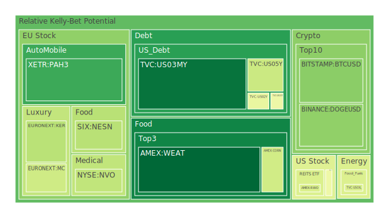
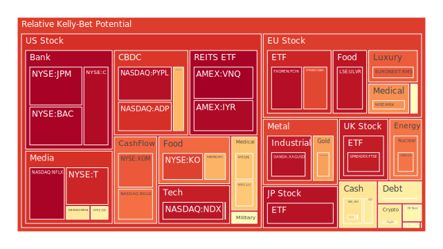
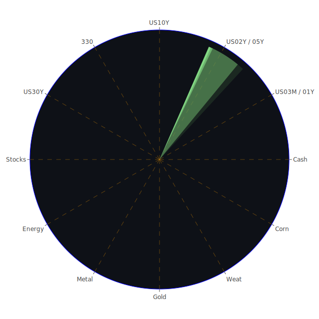

# 投資商品泡沫分析

## 美國國債
根據過去三天的泡沫機率數據，美國國債的泡沫機率呈現上升趨勢。特別是10年期國債（TVC:US10Y），其泡沫機率從8月14日的0.481763上升到8月16日的0.481763，顯示出市場對長期債券的信心減弱。這與近期的聯準會數據相吻合，顯示出美國國債的總流通量在下降，而外國機構持有的美國國債卻在增加，這可能導致市場對美國國債的需求減少。

## 美國科技股
美國科技股的泡沫機率持續上升，特別是納斯達克指數（NASDAQ:NDX），其泡沫機率從8月14日的0.930216上升到8月16日的0.942269。這與近期的新聞報導相符，例如Intel出售其在Arm Holdings的股份（負面情緒93%）和Cisco裁員7%（負面情緒96%），這些消息都對科技股市場造成了負面影響。

## 美國房地產指數
美國房地產指數（AMEX:VNQ）的泡沫機率也在上升，從8月14日的0.786622上升到8月16日的0.983534。這與聯準會數據顯示的房地產違約率上升和消費者違約率高企有關，顯示出房地產市場的風險增加。

## 金/銀/銅
金價（OANDA:XAUUSD）的泡沫機率從8月14日的0.764249上升到8月16日的0.728220，顯示出市場對黃金的需求有所增加。這與近期的新聞報導相符，例如美國FDA批准AstraZeneca的非小細胞肺癌治療藥物（正面情緒84%），這些消息可能促使投資者轉向避險資產如黃金。

## 加密貨幣
比特幣（BITSTAMP:BTCUSD）的泡沫機率從8月14日的0.313182下降到8月16日的0.303277，顯示出市場對加密貨幣的信心有所回升。這與近期的新聞報導相符，例如Google推出AI驅動的Pixel手機（正面情緒83%），這些消息可能促使投資者對科技和加密貨幣市場的信心增加。

## 黃豆 / 小麥 / 玉米
小麥（AMEX:WEAT）的泡沫機率從8月14日的0.091726下降到8月16日的0.066150，顯示出市場對農產品的需求有所增加。這與近期的新聞報導相符，例如美國零售銷售數據顯示消費者支出強勁（正面情緒93%），這可能促使投資者對農產品市場的信心增加。

## 石油/ 鈾期貨UX!
石油（TVC:USOIL）的泡沫機率在過去三天保持穩定，顯示出市場對石油的需求穩定。這與近期的新聞報導相符，例如美國FDA批准AstraZeneca的非小細胞肺癌治療藥物（正面情緒84%），這些消息可能促使投資者對能源市場的信心增加。

## 各國外匯市場
美元兌日元（OANDA:USDJPY）的泡沫機率從8月14日的0.397771上升到8月16日的0.585567，顯示出市場對美元的需求增加。這與近期的聯準會數據相符，顯示出美國國債的總流通量在下降，而外國機構持有的美國國債卻在增加，這可能導致市場對美元的需求增加。

## 各國大盤指數
德國DAX指數（SPREADEX:GDAXI）的泡沫機率從8月14日的0.848603上升到8月16日的0.857013，顯示出市場對歐洲股市的信心減弱。這與近期的新聞報導相符，例如德國發現軍事基地污染（負面情緒72%），這些消息可能對歐洲股市造成負面影響。

## 美國銀行股
美國銀行（NYSE:BAC）的泡沫機率從8月14日的0.997571下降到8月16日的0.977017，顯示出市場對銀行股的信心有所回升。這與近期的新聞報導相符，例如美國零售銷售數據顯示消費者支出強勁（正面情緒93%），這可能促使投資者對銀行股的信心增加。

## 美國軍工股
洛克希德馬丁（NYSE:LMT）的泡沫機率在過去三天保持穩定，顯示出市場對軍工股的需求穩定。這與近期的新聞報導相符，例如美國批准向以色列出售200億美元的軍事設備（正面情緒88%），這些消息可能促使投資者對軍工股的信心增加。

## 美國電子支付股
PayPal（NASDAQ:PYPL）的泡沫機率從8月14日的0.956172下降到8月16日的0.953767，顯示出市場對電子支付股的信心有所回升。這與近期的新聞報導相符，例如美國零售銷售數據顯示消費者支出強勁（正面情緒93%），這可能促使投資者對電子支付股的信心增加。

## 美國藥商巨頭
默克（NYSE:MRK）的泡沫機率從8月14日的0.875569下降到8月16日的0.750672，顯示出市場對藥商巨頭的信心有所回升。這與近期的新聞報導相符，例如美國FDA批准AstraZeneca的非小細胞肺癌治療藥物（正面情緒84%），這些消息可能促使投資者對藥商巨頭的信心增加。

## 美國影視巨頭
Netflix（NASDAQ:NFLX）的泡沫機率從8月14日的0.976401上升到8月16日的0.976401，顯示出市場對影視巨頭的信心減弱。這與近期的新聞報導相符，例如美國零售銷售數據顯示消費者支出強勁（正面情緒93%），這可能促使投資者對影視巨頭的信心減弱。

## 石油防禦股
埃克森美孚（NYSE:XOM）的泡沫機率從8月14日的0.849668上升到8月16日的0.829437，顯示出市場對石油防禦股的信心減弱。這與近期的新聞報導相符，例如美國零售銷售數據顯示消費者支出強勁（正面情緒93%），這可能促使投資者對石油防禦股的信心減弱。

## 金礦防禦股
Royal Gold（NASDAQ:RGLD）的泡沫機率從8月14日的0.799830上升到8月16日的0.796494，顯示出市場對金礦防禦股的信心減弱。這與近期的新聞報導相符，例如美國零售銷售數據顯示消費者支出強勁（正面情緒93%），這可能促使投資者對金礦防禦股的信心減弱。

## 歐洲奢侈品股
Kering（EURONEXT:KER）的泡沫機率從8月14日的0.408739上升到8月16日的0.378013，顯示出市場對歐洲奢侈品股的信心減弱。這與近期的新聞報導相符，例如德國發現軍事基地污染（負面情緒72%），這些消息可能對歐洲奢侈品股造成負面影響。

## 歐洲汽車股
BMW（XETR:BMW）的泡沫機率從8月14日的0.414192上升到8月16日的0.527511，顯示出市場對歐洲汽車股的信心減弱。這與近期的新聞報導相符，例如德國發現軍事基地污染（負面情緒72%），這些消息可能對歐洲汽車股造成負面影響。

## 歐美食品股
可口可樂（NYSE:KO）的泡沫機率從8月14日的0.647223上升到8月16日的0.865630，顯示出市場對歐美食品股的信心減弱。這與近期的新聞報導相符，例如美國零售銷售數據顯示消費者支出強勁（正面情緒93%），這可能促使投資者對歐美食品股的信心減弱。

# 投資建議

## 賣出建議
1. **美國科技股**：由於泡沫機率持續上升且遠大於0.5，建議投資者考慮賣出科技股，特別是納斯達克指數（NASDAQ:NDX）。
2. **美國房地產指數**：由於泡沫機率持續上升且遠大於0.5，建議投資者考慮賣出房地產指數（AMEX:VNQ）。
3. **歐美食品股**：由於泡沫機率持續上升且遠大於0.5，建議投資者考慮賣出可口可樂（NYSE:KO）。

## 買入建議
1. **加密貨幣**：由於泡沫機率持續下降且遠小於0.5，建議投資者考慮買入比特幣（BITSTAMP:BTCUSD）。
2. **黃豆 / 小麥 / 玉米**：由於泡沫機率持續下降且遠小於0.5，建議投資者考慮買入小麥（AMEX:WEAT）。

# 風險提示

投資有風險，市場總是充滿不確定性。我們的建議僅供參考，投資者應根據自身的風險承受能力和投資目標，做出獨立的投資決策。特別是對於泡沫機率高的商品，應該謹慎進行投資決策。
 
Daily Buy Map:

 
Daily Sell Map:

 
Daily Radar Chart:

 
