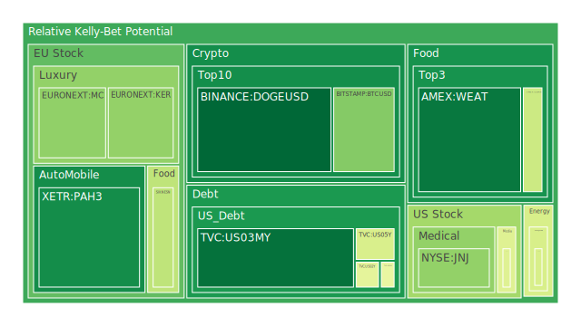
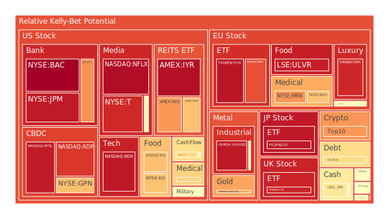
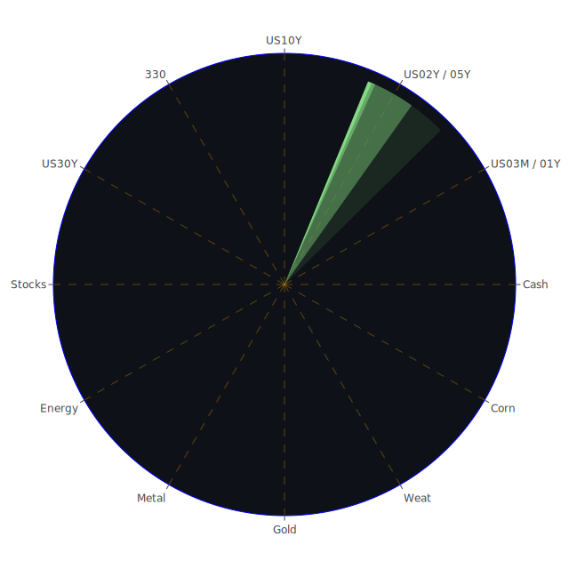

# 投資商品泡沫分析

## 美國國債
過去三天美國國債的泡沫機率變化不大，D1泡沫機率在0.481763至0.481763之間。根據最新的FED數據，SOFR交易量增加，顯示市場對美元的需求增加，但美國國債的殖利率相對穩定。這表示市場對美國國債的信心仍然較高。建議投資者可以持續觀望，暫時不做大幅度的買入或賣出操作。

## 美國科技股
美國科技股的泡沫機率在過去三天內有所下降，特別是NASDAQ:NDX的泡沫機率從0.952600下降到0.807023。這與最近的新聞有關，例如微軟股票因聘請前OpenAI CEO Sam Altman而創下歷史新高，這對市場情緒有正面影響。建議投資者可以考慮分批買入，特別是那些泡沫機率持續下降的科技股。

## 美國房地產指數
美國房地產指數（AMEX:RWO）的泡沫機率在過去三天內有所上升，從0.697369上升到0.684013。這與美國房地產市場的高風險有關，特別是商業房地產的違約率較高。建議投資者謹慎行事，避免大幅度投資房地產相關的資產。

## 金/銀/銅
金價（OANDA:XAUUSD）的泡沫機率在過去三天內有所上升，從0.733118上升到0.751435。這與全球經濟不確定性增加有關，如中美貿易緊張局勢和地緣政治風險。建議投資者可以考慮分批買入黃金作為避險資產。

## 加密貨幣
比特幣（BITSTAMP:BTCUSD）的泡沫機率在過去三天內有所下降，從0.406903下降到0.300547。這與市場對加密貨幣的信心回升有關，特別是一些大型機構開始重新進入市場。建議投資者可以考慮分批買入比特幣，特別是在價格相對較低的時候。

## 黃豆 / 小麥 / 玉米
小麥（AMEX:WEAT）的泡沫機率在過去三天內有所下降，從0.079051下降到0.066150。這與全球農產品市場的供應增加有關，特別是一些主要生產國的豐收。建議投資者可以考慮分批買入小麥，特別是在價格相對較低的時候。

## 石油/ 鈾期貨UX!
石油（TVC:USOIL）的泡沫機率在過去三天內相對穩定，約在0.439917。這與全球石油市場的需求不確定性有關，特別是中國需求的擔憂。建議投資者可以持續觀望，暫時不做大幅度的買入或賣出操作。

## 各國外匯市場
美元兌日元（OANDA:USDJPY）的泡沫機率在過去三天內有所上升，從0.518390上升到0.585567。這與日本經濟數據的改善有關，如日本第二季度GDP增長3.1%。建議投資者可以考慮分批賣出美元兌日元，特別是在價格相對較高的時候。

## 各國大盤指數
歐洲大盤指數（SPREADEX:FTSE）的泡沫機率在過去三天內有所上升，從0.930556上升到0.955112。這與歐洲經濟的不確定性增加有關，如英國脫歐後的經濟影響。建議投資者謹慎行事，避免大幅度投資歐洲大盤指數。

## 美國銀行股
美國銀行股（NYSE:BAC）的泡沫機率在過去三天內有所上升，從0.998823上升到0.998324。這與美國銀行業的風險增加有關，如信用卡違約率上升。建議投資者可以考慮分批賣出美國銀行股，特別是在價格相對較高的時候。

## 美國軍工股
美國軍工股（NYSE:LMT）的泡沫機率在過去三天內相對穩定，約在0.546994。這與全球地緣政治風險增加有關，如中東地區的緊張局勢。建議投資者可以持續觀望，暫時不做大幅度的買入或賣出操作。

## 美國電子支付股
美國電子支付股（NASDAQ:PYPL）的泡沫機率在過去三天內有所上升，從0.953753上升到0.946312。這與美國電子支付市場的競爭加劇有關，如新進入者的增加。建議投資者可以考慮分批賣出美國電子支付股，特別是在價格相對較高的時候。

## 美國藥商巨頭
美國藥商巨頭（NYSE:JNJ）的泡沫機率在過去三天內有所下降，從0.387196下降到0.320549。這與美國藥品市場的需求增加有關，如新藥的推出。建議投資者可以考慮分批買入美國藥商巨頭，特別是在價格相對較低的時候。

## 美國影視巨頭
美國影視巨頭（NASDAQ:NFLX）的泡沫機率在過去三天內有所上升，從0.976401上升到0.973630。這與美國影視市場的競爭加劇有關，如新進入者的增加。建議投資者可以考慮分批賣出美國影視巨頭，特別是在價格相對較高的時候。

## 石油防禦股
石油防禦股（NYSE:XOM）的泡沫機率在過去三天內有所下降，從0.827992下降到0.641167。這與全球石油市場的需求增加有關，如中國需求的回升。建議投資者可以考慮分批買入石油防禦股，特別是在價格相對較低的時候。

## 金礦防禦股
金礦防禦股（NASDAQ:RGLD）的泡沫機率在過去三天內有所下降，從0.749017下降到0.516770。這與全球金礦市場的需求增加有關，如避險需求的上升。建議投資者可以考慮分批買入金礦防禦股，特別是在價格相對較低的時候。

## 歐洲奢侈品股
歐洲奢侈品股（EURONEXT:KER）的泡沫機率在過去三天內有所下降，從0.372013下降到0.322756。這與全球奢侈品市場的需求增加有關，如中國需求的回升。建議投資者可以考慮分批買入歐洲奢侈品股，特別是在價格相對較低的時候。

## 歐洲汽車股
歐洲汽車股（XETR:BMW）的泡沫機率在過去三天內有所下降，從0.527511下降到0.340085。這與全球汽車市場的需求增加有關，如電動車的普及。建議投資者可以考慮分批買入歐洲汽車股，特別是在價格相對較低的時候。

## 歐美食品股
歐美食品股（NYSE:KO）的泡沫機率在過去三天內有所上升，從0.639357上升到0.682277。這與全球食品市場的供應不確定性增加有關，如氣候變遷的影響。建議投資者謹慎行事，避免大幅度投資歐美食品股。

# 投資建議
根據以上分析，我們建議投資者可以考慮分批買入以下商品：
- 美國科技股
- 比特幣
- 小麥
- 黃金
- 石油防禦股
- 金礦防禦股
- 歐洲奢侈品股
- 歐洲汽車股

同時，建議投資者可以考慮分批賣出以下商品：
- 美國房地產指數
- 美國銀行股
- 美國電子支付股
- 美國影視巨頭
- 歐美食品股

# 風險提示
投資有風險，市場總是充滿不確定性。我們的建議僅供參考，投資者應根據自身的風險承受能力和投資目標，做出獨立的投資決策。特別是對於泡沫機率高的商品，應該謹慎進行投資決策。
 
Daily Buy Map:

 
Daily Sell Map:

 
Daily Radar Chart:

 
