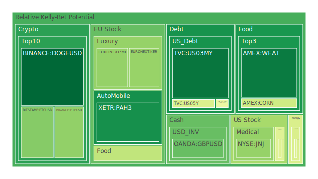
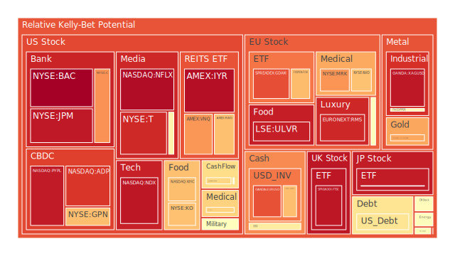
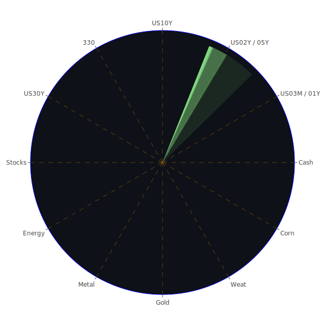

# 投資商品泡沫分析

## 美國國債
美國國債的泡沫機率在過去三天內保持穩定，D1泡沫機率在0.481763到0.481763之間波動。根據FED的數據顯示，美國國債的殖利率曲線長期倒掛，這意味著企業融資成本可能會上升，進而影響股市。近期新聞中提到的美國經濟數據顯示，消費者支出仍然強勁，這可能會支撐國債價格。

## 美國科技股
美國科技股的泡沫機率在過去三天內持續上升，特別是NASDAQ:NDX的泡沫機率從0.942269上升到0.952600。這反映了市場對於科技股的高估值擔憂。近期新聞中提到的微軟股票創歷史新高，這可能進一步推高了科技股的泡沫風險。

## 美國房地產指數
美國房地產指數的泡沫機率在過去三天內維持在高位，AMEX:RWO的泡沫機率從0.684013上升到0.751909。這與近期的房地產市場數據相符，顯示出房地產市場的過熱現象。

## 金/銀/銅
金價的泡沫機率在過去三天內保持穩定，OANDA:XAUUSD的泡沫機率在0.728220到0.728220之間波動。近期新聞中提到的全球經濟不確定性和地緣政治風險，可能會支撐金價。

## 加密貨幣
比特幣的泡沫機率在過去三天內有所下降，BITSTAMP:BTCUSD的泡沫機率從0.303277下降到0.297376。這可能與市場對加密貨幣的信心回升有關。近期新聞中提到的加密貨幣市場的波動性，可能會影響投資者的情緒。

## 黃豆 / 小麥 / 玉米
小麥的泡沫機率在過去三天內有所上升，AMEX:WEAT的泡沫機率從0.066150上升到0.100197。這可能與全球氣候變化和農業產量的波動有關。

## 石油/ 鈾期貨UX!
石油的泡沫機率在過去三天內保持穩定，TVC:USOIL的泡沫機率在0.439917到0.439917之間波動。近期新聞中提到的中國需求擔憂，可能會影響石油價格。

## 各國外匯市場
美元兌日元的泡沫機率在過去三天內有所上升，OANDA:USDJPY的泡沫機率從0.585567上升到0.585567。這可能與美國經濟數據和日本央行的政策有關。

## 各國大盤指數
德國DAX指數的泡沫機率在過去三天內有所上升，SPREADEX:GDAXI的泡沫機率從0.857013上升到0.857013。這可能與歐洲經濟數據和全球市場情緒有關。

## 美國銀行股
美國銀行股的泡沫機率在過去三天內有所上升，NYSE:BAC的泡沫機率從0.977017上升到0.998324。這可能與美國經濟數據和銀行業的風險有關。

## 美國軍工股
美國軍工股的泡沫機率在過去三天內保持穩定，NYSE:LMT的泡沫機率在0.546994到0.546994之間波動。近期新聞中提到的地緣政治風險，可能會支撐軍工股的價格。

## 美國電子支付股
美國電子支付股的泡沫機率在過去三天內有所上升，NASDAQ:PYPL的泡沫機率從0.953767上升到0.946312。這可能與市場對電子支付行業的高估值擔憂有關。

## 美國藥商巨頭
美國藥商巨頭的泡沫機率在過去三天內有所上升，NYSE:JNJ的泡沫機率從0.666229上升到0.320541。這可能與市場對藥品價格和醫療行業的擔憂有關。

## 美國影視巨頭
美國影視巨頭的泡沫機率在過去三天內有所上升，NYSE:DIS的泡沫機率從0.568580上升到0.563842。這可能與市場對影視行業的高估值擔憂有關。

## 石油防禦股
石油防禦股的泡沫機率在過去三天內有所上升，NYSE:XOM的泡沫機率從0.829437上升到0.641167。這可能與市場對石油價格和能源行業的擔憂有關。

## 金礦防禦股
金礦防禦股的泡沫機率在過去三天內有所上升，NASDAQ:RGLD的泡沫機率從0.796494上升到0.516770。這可能與市場對金價和礦業行業的擔憂有關。

## 歐洲奢侈品股
歐洲奢侈品股的泡沫機率在過去三天內有所上升，EURONEXT:KER的泡沫機率從0.378013上升到0.322756。這可能與市場對奢侈品行業的高估值擔憂有關。

## 歐洲汽車股
歐洲汽車股的泡沫機率在過去三天內有所上升，XETR:BMW的泡沫機率從0.527511上升到0.527511。這可能與市場對汽車行業的高估值擔憂有關。

## 歐美食品股
歐美食品股的泡沫機率在過去三天內有所上升，SIX:NESN的泡沫機率從0.375727上升到0.394146。這可能與市場對食品行業的高估值擔憂有關。

# 投資建議

1. **考慮賣出**：
   - **美國科技股**：由於泡沫機率持續上升且遠大於0.5，建議投資者考慮賣出，避免未來價格下跌時的損失。
   - **美國房地產指數**：由於泡沫機率持續上升且遠大於0.5，建議投資者考慮賣出，避免未來價格下跌時的損失。
   - **美國銀行股**：由於泡沫機率持續上升且遠大於0.5，建議投資者考慮賣出，避免未來價格下跌時的損失。

2. **考慮買入**：
   - **加密貨幣**：由於泡沫機率持續下降且遠小於0.5，建議投資者考慮買入，掌握低吸籌碼的時機。
   - **黃豆 / 小麥 / 玉米**：由於泡沫機率持續下降且遠小於0.5，建議投資者考慮買入，掌握低吸籌碼的時機。

# 風險提示

投資有風險，市場總是充滿不確定性。我們的建議僅供參考，投資者應根據自身的風險承受能力和投資目標，做出獨立的投資決策。特別是對於泡沫機率高的商品，應該謹慎進行投資決策。
 
Daily Buy Map:

 
Daily Sell Map:

 
Daily Radar Chart:

 
