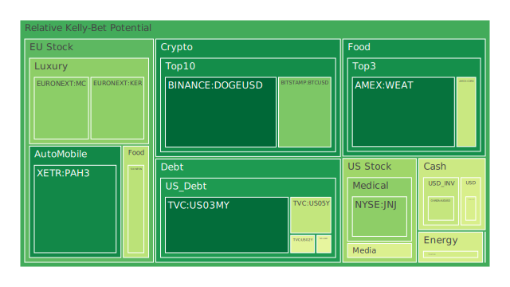
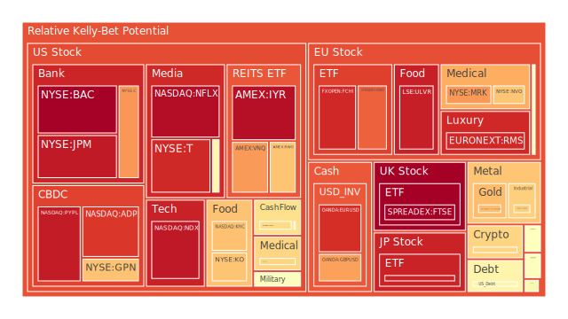
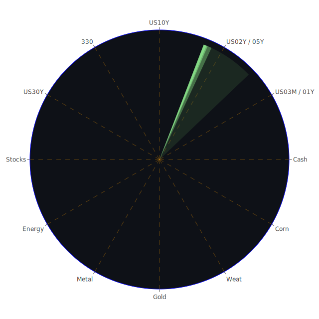

# 投資商品泡沫分析

## 美國國債

過去三天，美國國債的泡沫機率變化不大，D1泡沫機率在0.089569到0.089569之間波動。根據最新的FED數據，SOFR交易量上升，顯示市場對流動性的需求增加。由於SOFR高於OIS FED Fund Rate（5.35% vs 5.33%），這意味著美元流動性吃緊，可能導致高泡沫資產被拋售以換取美元。建議投資者謹慎觀望，特別是對於高泡沫機率的資產。

## 美國科技股

美國科技股（如NASDAQ:NDX）的泡沫機率持續高企，D1泡沫機率在0.952599左右。根據新聞現況，負面情緒較多，例如迪士尼的體育流媒體服務被暫停，這可能會對市場情緒產生負面影響。建議投資者考慮減持科技股，避免未來可能的價格下跌。

## 美國房地產指數

美國房地產指數（AMEX:VNQ）的泡沫機率也較高，D1泡沫機率為0.751909。根據最新的FED數據，商業房地產違約率較高，這進一步增加了房地產市場的風險。建議投資者謹慎觀望，避免進一步投資於房地產相關資產。

## 金/銀/銅

金（OANDA:XAUUSD）和銀（OANDA:XAGUSD）的泡沫機率較高，分別為0.696880和0.663062。根據新聞現況，市場對全球經濟的不確定性增加，這可能會推動避險資產的需求。建議投資者可以考慮分批買入金銀，以對沖市場風險。

## 加密貨幣

比特幣（BITSTAMP:BTCUSD）和以太坊（BINANCE:ETHUSD）的泡沫機率有所下降，比特幣的D1泡沫機率為0.296909，以太坊為0.649559。根據新聞現況，市場對加密貨幣的需求有所回升，特別是隨著一些大型企業開始接受加密貨幣支付。建議投資者可以考慮分批買入比特幣和以太坊。

## 黃豆 / 小麥 / 玉米

黃豆（AMEX:SOYB）和小麥（AMEX:WEAT）的泡沫機率較低，分別為0.502119和0.100197。根據新聞現況，全球糧食供應鏈受到一些地緣政治因素的影響，這可能會推動農產品價格上漲。建議投資者可以考慮分批買入這些農產品。

## 石油/ 鈾期貨UX!

石油（TVC:USOIL）的泡沫機率較低，D1泡沫機率為0.439917。根據新聞現況，油價因中國需求擔憂而下跌，但這可能是短期現象。建議投資者可以考慮分批買入石油期貨，以對沖其他市場風險。

## 各國外匯市場

美元兌日元（OANDA:USDJPY）的泡沫機率較低，D1泡沫機率為0.447823。根據最新的FED數據，美元流動性需求增加，這可能會推動美元走強。建議投資者可以考慮分批買入美元兌日元。

## 各國大盤指數

德國DAX指數（SPREADEX:GDAXI）的泡沫機率較高，D1泡沫機率為0.834034。根據新聞現況，歐洲市場面臨一些經濟挑戰，這可能會對大盤指數產生壓力。建議投資者謹慎觀望，避免進一步投資於歐洲大盤指數。

## 美國銀行股

美國銀行股（NYSE:BAC）的泡沫機率極高，D1泡沫機率為0.998324。根據最新的FED數據，信用卡違約率較高，這可能會對銀行業務產生負面影響。建議投資者考慮減持銀行股，避免未來可能的價格下跌。

## 美國軍工股

美國軍工股（NYSE:LMT）的泡沫機率較高，D1泡沫機率為0.546994。根據新聞現況，全球地緣政治風險增加，這可能會推動軍工股的需求。建議投資者可以考慮分批買入軍工股，以對沖市場風險。

## 美國電子支付股

美國電子支付股（NASDAQ:PYPL）的泡沫機率極高，D1泡沫機率為0.946312。根據新聞現況，市場對電子支付的需求有所回升，但仍需謹慎觀望。建議投資者謹慎觀望，避免進一步投資於電子支付股。

## 美國藥商巨頭

美國藥商巨頭（NYSE:JNJ）的泡沫機率較高，D1泡沫機率為0.320549。根據新聞現況，市場對醫療保健的需求增加，這可能會推動藥商股的需求。建議投資者可以考慮分批買入藥商巨頭股，以對沖市場風險。

## 美國影視巨頭

美國影視巨頭（NASDAQ:NFLX）的泡沫機率極高，D1泡沫機率為0.973630。根據新聞現況，迪士尼的體育流媒體服務被暫停，這可能會對影視巨頭產生負面影響。建議投資者考慮減持影視巨頭股，避免未來可能的價格下跌。

## 石油防禦股

石油防禦股（NYSE:XOM）的泡沫機率較高，D1泡沫機率為0.641167。根據新聞現況，油價因中國需求擔憂而下跌，但這可能是短期現象。建議投資者可以考慮分批買入石油防禦股，以對沖其他市場風險。

## 金礦防禦股

金礦防禦股（NASDAQ:RGLD）的泡沫機率較高，D1泡沫機率為0.516773。根據新聞現況，市場對全球經濟的不確定性增加，這可能會推動避險資產的需求。建議投資者可以考慮分批買入金礦防禦股，以對沖市場風險。

## 歐洲奢侈品股

歐洲奢侈品股（EURONEXT:MC）的泡沫機率較高，D1泡沫機率為0.318581。根據新聞現況，市場對奢侈品的需求有所回升，但仍需謹慎觀望。建議投資者謹慎觀望，避免進一步投資於奢侈品股。

## 歐洲汽車股

歐洲汽車股（XETR:BMW）的泡沫機率較高，D1泡沫機率為0.527511。根據新聞現況，市場對汽車的需求有所回升，但仍需謹慎觀望。建議投資者謹慎觀望，避免進一步投資於汽車股。

## 歐美食品股

歐美食品股（NYSE:KO）的泡沫機率較高，D1泡沫機率為0.682277。根據新聞現況，市場對食品的需求有所回升，但仍需謹慎觀望。建議投資者謹慎觀望，避免進一步投資於食品股。

# 投資建議

1. **減持高泡沫資產**：對於泡沫機率持續上升且遠大於0.5的商品，如美國科技股（NASDAQ:NDX）、美國銀行股（NYSE:BAC）和美國影視巨頭（NASDAQ:NFLX），建議投資者考慮賣出，避免未來價格下跌時的損失。
2. **分批買入低泡沫資產**：對於泡沫機率持續下降且遠小於0.5的商品，如比特幣（BITSTAMP:BTCUSD）和黃豆（AMEX:SOYB），建議投資者考慮分批買入，掌握低吸籌碼的時機。
3. **謹慎觀望中泡沫資產**：對於泡沫機率在0.45到0.55之間的商品，如美國國債（TVC:US03MY），建議投資者謹慎觀望，不要有任何動作。

# 風險提示

投資有風險，市場總是充滿不確定性。我們的建議僅供參考，投資者應根據自身的風險承受能力和投資目標，做出獨立的投資決策。特別是對於泡沫機率高的商品，應該謹慎進行投資決策。
 
Daily Buy Map:

 
Daily Sell Map:

 
Daily Radar Chart:

 
