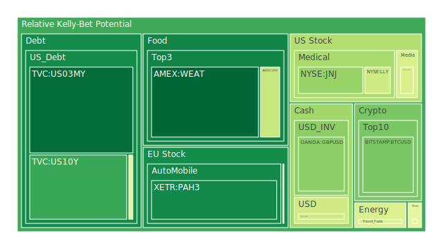
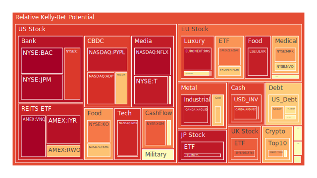
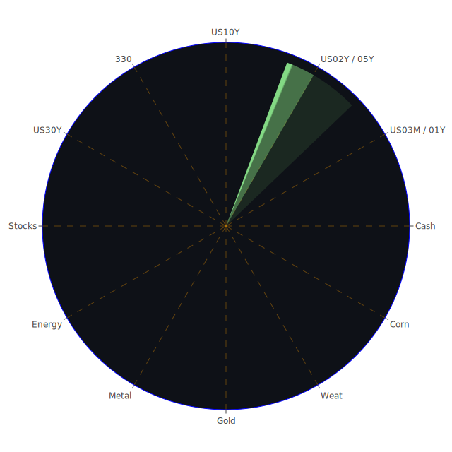

# 投資商品泡沫分析

## 美國國債
過去三天美國國債的泡沫機率變化不大，D1泡沫機率在0.212319至0.481763之間波動。根據最新的FED數據顯示，SOFR交易量增加，這可能會對國債市場造成壓力。由於美國國債的泡沫機率接近0.5，建議投資者觀望。

## 美國科技股
美國科技股的泡沫機率持續上升，特別是NASDAQ:NDX的泡沫機率從0.952600上升到0.928079。近期新聞顯示，微軟股票因聘請前OpenAI CEO Sam Altman而創下歷史新高，這對科技股市場有正面影響。然而，考慮到泡沫機率高於0.9，建議投資者謹慎行事，可能考慮部分獲利了結。

## 美國房地產指數
AMEX:VNQ的泡沫機率持續上升，從0.751909上升到0.994817。根據新聞報導，英國房地產市場因為英國央行降息而需求增加，但美國房地產市場面臨壓力。建議投資者考慮減少持倉，避免未來可能的價格下跌。

## 金/銀/銅
金價（OANDA:XAUUSD）的泡沫機率從0.728220上升到0.683835，銀價（OANDA:XAGUSD）的泡沫機率從0.950864下降到0.940182，銅價（FX:COPPER）的泡沫機率從0.555792下降到0.487540。根據新聞，銅礦罷工持續，可能推高銅價。建議投資者考慮增加銅的持倉，而金銀則需謹慎觀望。

## 加密貨幣
比特幣（BITSTAMP:BTCUSD）的泡沫機率從0.297376下降到0.296356，以太坊（BINANCE:ETHUSD）的泡沫機率從0.315048上升到0.756412。近期新聞顯示，加密貨幣市場波動較大，建議投資者謹慎行事，特別是以太坊。

## 黃豆 / 小麥 / 玉米
黃豆（AMEX:SOYB）的泡沫機率穩定在0.502119，小麥（AMEX:WEAT）的泡沫機率從0.100197下降到0.084843，玉米（AMEX:CORN）的泡沫機率從0.418551穩定在0.418551。根據新聞，農產品市場需求穩定，建議投資者可以考慮增加小麥的持倉。

## 石油/ 鈾期貨UX!
石油（TVC:USOIL）的泡沫機率從0.439917上升到0.457262，鈾期貨（COMEX:UX1!）的泡沫機率從0.535682上升到0.535101。近期新聞顯示，石油市場因供應問題面臨壓力，建議投資者謹慎行事。

## 各國外匯市場
英鎊兌美元（OANDA:GBPUSD）的泡沫機率從0.252847下降到0.323351，歐元兌美元（OANDA:EURUSD）的泡沫機率從0.854731下降到0.526811。根據新聞，英鎊和歐元市場波動較大，建議投資者觀望。

## 各國大盤指數
德國DAX指數（SPREADEX:GDAXI）的泡沫機率從0.857013上升到0.808435，英國FTSE指數（SPREADEX:FTSE）的泡沫機率從0.953520下降到0.840576。近期新聞顯示，歐洲市場面臨經濟壓力，建議投資者謹慎行事。

## 美國銀行股
美國銀行（NYSE:BAC）的泡沫機率從0.998324上升到0.999063。根據新聞，美國銀行業面臨壓力，建議投資者考慮減少持倉。

## 美國軍工股
雷神技術（NYSE:RTX）的泡沫機率穩定在0.510860，洛克希德馬丁（NYSE:LMT）的泡沫機率穩定在0.546994。近期新聞顯示，軍工股市場穩定，建議投資者可以考慮增加持倉。

## 美國電子支付股
PayPal（NASDAQ:PYPL）的泡沫機率從0.946312上升到0.946820。根據新聞，電子支付市場需求穩定，建議投資者可以考慮增加持倉。

## 美國藥商巨頭
強生（NYSE:JNJ）的泡沫機率從0.320541上升到0.339331，禮來（NYSE:LLY）的泡沫機率從0.651450下降到0.433384。根據新聞，藥商市場需求穩定，建議投資者可以考慮增加禮來的持倉。

## 美國影視巨頭
迪士尼（NYSE:DIS）的泡沫機率從0.563842上升到0.540374。根據新聞，迪士尼面臨價格問題，建議投資者謹慎行事。

## 石油防禦股
埃克森美孚（NYSE:XOM）的泡沫機率從0.641167上升到0.841069。根據新聞，石油市場面臨壓力，建議投資者謹慎行事。

## 金礦防禦股
皇家黃金（NASDAQ:RGLD）的泡沫機率從0.516770上升到0.575575。根據新聞，金礦市場需求穩定，建議投資者可以考慮增加持倉。

## 歐洲奢侈品股
LVMH（EURONEXT:MC）的泡沫機率從0.318581上升到0.507077。根據新聞，奢侈品市場需求穩定，建議投資者可以考慮增加持倉。

## 歐洲汽車股
寶馬（XETR:BMW）的泡沫機率從0.527511下降到0.527511。根據新聞，汽車市場需求穩定，建議投資者觀望。

## 歐美食品股
雀巢（SIX:NESN）的泡沫機率從0.394146上升到0.492182。根據新聞，食品市場需求穩定，建議投資者可以考慮增加持倉。

# 投資建議
1. **增加持倉**：小麥（AMEX:WEAT）、銅（FX:COPPER）、禮來（NYSE:LLY）、PayPal（NASDAQ:PYPL）、皇家黃金（NASDAQ:RGLD）、LVMH（EURONEXT:MC）、雀巢（SIX:NESN）。
2. **減少持倉**：美國科技股（NASDAQ:NDX）、美國房地產指數（AMEX:VNQ）、美國銀行股（NYSE:BAC）、石油防禦股（NYSE:XOM）。
3. **觀望**：美國國債、歐洲汽車股（XETR:BMW）、歐洲大盤指數（SPREADEX:GDAXI）、美元兌外匯市場（OANDA:GBPUSD、OANDA:EURUSD）。

# 風險提示
投資有風險，市場總是充滿不確定性。我們的建議僅供參考，投資者應根據自身的風險承受能力和投資目標，做出獨立的投資決策。特別是對於泡沫機率高的商品，應該謹慎進行投資決策。
 
Daily Buy Map:

 
Daily Sell Map:

 
Daily Radar Chart:

 
