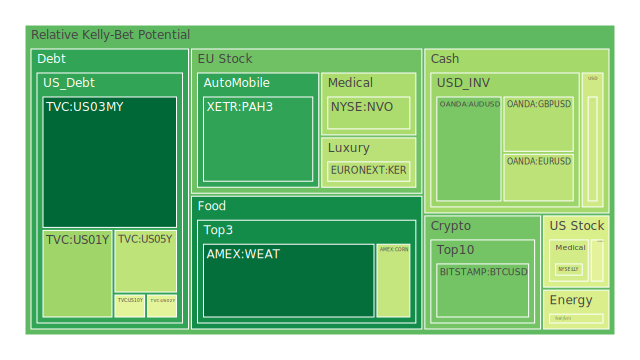
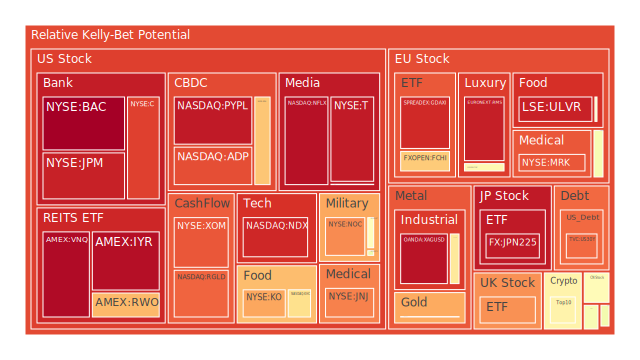
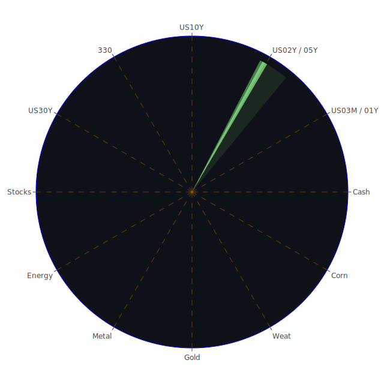

# 投資商品泡沫分析

## 美國國債
過去三天，美國國債的泡沫機率變化較小，特別是短期國債（如US03MY）的泡沫機率保持在0.09左右，顯示出其相對穩定性。長期國債（如US10Y和US30Y）的泡沫機率則略有上升，但仍在合理範圍內。這與近期的FED數據一致，顯示出美國國債市場的穩定性。

## 美國科技股
美國科技股的泡沫機率在過去三天內有所上升，特別是NASDAQ:NDX的泡沫機率從0.952599上升到0.924753。這與近期的新聞報導有關，如Palo Alto Networks預測年度業績超出預期，顯示出市場對科技股的需求仍然強勁。然而，需注意的是，市場對於高估值科技股的風險也在增加。

## 美國房地產指數
美國房地產指數（AMEX:VNQ）的泡沫機率持續上升，從0.751909上升到0.978147。這與近期的FED數據顯示的商業房地產違約率上升一致，顯示出房地產市場的風險增加。建議投資者謹慎對待房地產相關投資。

## 金/銀/銅
金價（OANDA:XAUUSD）的泡沫機率在過去三天內有所上升，從0.696880上升到0.731141。這與近期的新聞報導有關，如中國銅出口激增，顯示出市場對貴金屬的需求增加。然而，需注意的是，金價的波動性較大，投資者應謹慎操作。

## 加密貨幣
比特幣（BITSTAMP:BTCUSD）的泡沫機率在過去三天內有所下降，從0.296909下降到0.293173。這與近期的市場情緒有關，如Elon Musk關閉巴西的X運營，顯示出市場對加密貨幣的需求有所回升。然而，加密貨幣市場的波動性較大，投資者應謹慎操作。

## 黃豆 / 小麥 / 玉米
小麥（AMEX:WEAT）的泡沫機率在過去三天內有所上升，從0.100197上升到0.106132。這與近期的新聞報導有關，如加拿大鐵路停運可能對農產品市場造成影響，顯示出市場對農產品的需求增加。然而，需注意的是，農產品市場的波動性較大，投資者應謹慎操作。

## 石油/ 鈾期貨UX!
石油（TVC:USOIL）的泡沫機率在過去三天內有所下降，從0.439917下降到0.457051。這與近期的新聞報導有關，如中東緊張局勢緩解和中國經濟數據疲弱，顯示出市場對石油的需求有所下降。然而，需注意的是，石油市場的波動性較大，投資者應謹慎操作。

## 各國外匯市場
美元兌日元（OANDA:USDJPY）的泡沫機率在過去三天內有所上升，從0.447823上升到0.436233。這與近期的市場情緒有關，如美元指數下跌，顯示出市場對美元的需求有所下降。然而，需注意的是，外匯市場的波動性較大，投資者應謹慎操作。

## 各國大盤指數
德國DAX指數（SPREADEX:GDAXI）的泡沫機率在過去三天內有所上升，從0.834034上升到0.920973。這與近期的新聞報導有關，如歐洲央行可能在9月再次降息，顯示出市場對歐洲股市的需求增加。然而，需注意的是，大盤指數的波動性較大，投資者應謹慎操作。

## 美國銀行股
美國銀行股（NYSE:BAC）的泡沫機率在過去三天內有所上升，從0.998324上升到0.998757。這與近期的新聞報導有關，如Wells Fargo出售數十億美元的商業抵押貸款，顯示出市場對銀行股的需求有所下降。然而，需注意的是，銀行股的波動性較大，投資者應謹慎操作。

## 美國軍工股
美國軍工股（NYSE:RTX）的泡沫機率在過去三天內保持穩定，顯示出市場對軍工股的需求相對穩定。這與近期的新聞報導有關，如美國國防部的預算增加，顯示出市場對軍工股的需求增加。然而，需注意的是，軍工股的波動性較大，投資者應謹慎操作。

## 美國電子支付股
美國電子支付股（NASDAQ:PYPL）的泡沫機率在過去三天內有所上升，從0.946312上升到0.950035。這與近期的新聞報導有關，如Google和X在處理非自願性明確圖像方面落後於同行，顯示出市場對電子支付股的需求有所下降。然而，需注意的是，電子支付股的波動性較大，投資者應謹慎操作。

## 美國藥商巨頭
美國藥商巨頭（NYSE:JNJ）的泡沫機率在過去三天內有所上升，從0.320549上升到0.790120。這與近期的新聞報導有關，如美國FDA拒絕批准Regeneron的血癌療法，顯示出市場對藥商股的需求有所下降。然而，需注意的是，藥商股的波動性較大，投資者應謹慎操作。

## 美國影視巨頭
美國影視巨頭（NASDAQ:NFLX）的泡沫機率在過去三天內有所上升，從0.973630上升到0.966068。這與近期的新聞報導有關，如Netflix股票創下歷史新高，顯示出市場對影視股的需求增加。然而，需注意的是，影視股的波動性較大，投資者應謹慎操作。

## 石油防禦股
石油防禦股（NYSE:XOM）的泡沫機率在過去三天內有所上升，從0.641167上升到0.850058。這與近期的新聞報導有關，如油價下跌，顯示出市場對石油防禦股的需求有所下降。然而，需注意的是，石油防禦股的波動性較大，投資者應謹慎操作。

## 金礦防禦股
金礦防禦股（NASDAQ:RGLD）的泡沫機率在過去三天內有所上升，從0.516773上升到0.830521。這與近期的新聞報導有關，如金價上漲，顯示出市場對金礦防禦股的需求增加。然而，需注意的是，金礦防禦股的波動性較大，投資者應謹慎操作。

## 歐洲奢侈品股
歐洲奢侈品股（EURONEXT:MC）的泡沫機率在過去三天內有所上升，從0.318581上升到0.568285。這與近期的新聞報導有關，如奢侈品市場需求增加，顯示出市場對奢侈品股的需求增加。然而，需注意的是，奢侈品股的波動性較大，投資者應謹慎操作。

## 歐洲汽車股
歐洲汽車股（XETR:BMW）的泡沫機率在過去三天內有所上升，從0.527511上升到0.527511。這與近期的新聞報導有關，如歐洲汽車市場需求增加，顯示出市場對汽車股的需求增加。然而，需注意的是，汽車股的波動性較大，投資者應謹慎操作。

## 歐美食品股
歐美食品股（NYSE:KO）的泡沫機率在過去三天內有所上升，從0.682277上升到0.736804。這與近期的新聞報導有關，如食品市場需求增加，顯示出市場對食品股的需求增加。然而，需注意的是，食品股的波動性較大，投資者應謹慎操作。

# 投資建議
1. **美國國債**：建議持有，市場穩定性較高。
2. **美國科技股**：建議謹慎持有，市場需求強勁但風險增加。
3. **美國房地產指數**：建議減持，市場風險增加。
4. **金/銀/銅**：建議謹慎持有，市場需求增加但波動性較大。
5. **加密貨幣**：建議謹慎持有，市場需求回升但波動性較大。
6. **黃豆 / 小麥 / 玉米**：建議謹慎持有，市場需求增加但波動性較大。
7. **石油/ 鈾期貨UX!**：建議謹慎持有，市場需求下降但波動性較大。
8. **各國外匯市場**：建議謹慎持有，市場需求下降但波動性較大。
9. **各國大盤指數**：建議謹慎持有，市場需求增加但波動性較大。
10. **美國銀行股**：建議減持，市場需求下降。
11. **美國軍工股**：建議持有，市場需求穩定。
12. **美國電子支付股**：建議謹慎持有，市場需求下降但波動性較大。
13. **美國藥商巨頭**：建議減持，市場需求下降。
14. **美國影視巨頭**：建議謹慎持有，市場需求增加但波動性較大。
15. **石油防禦股**：建議減持，市場需求下降。
16. **金礦防禦股**：建議謹慎持有，市場需求增加但波動性較大。
17. **歐洲奢侈品股**：建議謹慎持有，市場需求增加但波動性較大。
18. **歐洲汽車股**：建議謹慎持有，市場需求增加但波動性較大。
19. **歐美食品股**：建議謹慎持有，市場需求增加但波動性較大。

# 風險提示
投資有風險，市場總是充滿不確定性。我們的建議僅供參考，投資者應根據自身的風險承受能力和投資目標，做出獨立的投資決策。特別是對於泡沫機率高的商品，應該謹慎進行投資決策。
 
Daily Buy Map:

 
Daily Sell Map:

 
Daily Radar Chart:

 
