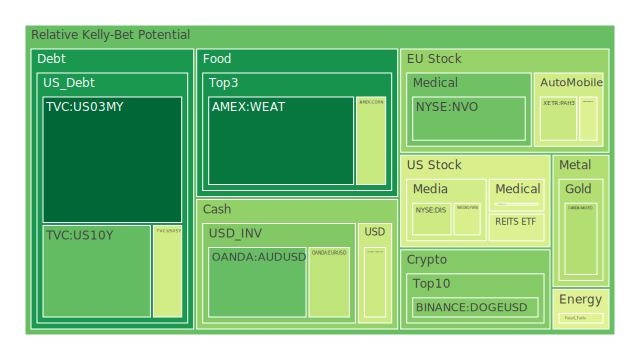
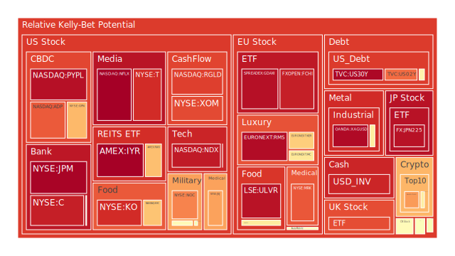
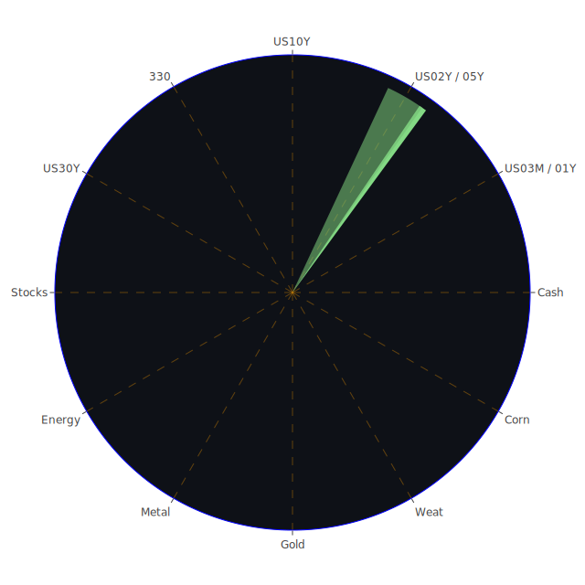

# 投資商品泡沫分析

## 美國國債
過去三天，美國國債的泡沫機率顯著上升。10年期國債的泡沫機率從8月20日的0.212319上升至8月22日的0.269467，而30年期國債的泡沫機率也從0.729255上升至0.956254。這表明市場對長期國債的需求減少，可能是因為投資者預期未來利率上升。

## 美國科技股
美國科技股的泡沫機率持續高企，特別是納斯達克指數（NASDAQ:NDX）的泡沫機率在8月22日達到0.922902。這可能與市場對科技股的高估值有關，並且近期的新聞顯示科技公司如微軟（Microsoft）股價創下歷史新高，進一步推動了泡沫風險。

## 美國房地產指數
美國房地產指數（AMEX:VNQ）的泡沫機率在過去三天內有所下降，但仍然處於高位。8月20日的泡沫機率為0.994817，8月22日降至0.459244。這可能反映了市場對房地產市場的擔憂，特別是商業房地產的拖欠率上升。

## 金/銀/銅
金價（OANDA:XAUUSD）的泡沫機率在過去三天內有所下降，從8月20日的0.683835降至8月22日的0.382175。這可能與市場對避險資產需求減少有關。然而，銅（FX:COPPER）的泡沫機率則有所上升，從0.487540上升至0.586170，這可能是因為中國銅出口增加，市場供應過剩。

## 加密貨幣
比特幣（BITSTAMP:BTCUSD）的泡沫機率在過去三天內顯著上升，從8月20日的0.296356上升至8月22日的0.581011。這可能與市場對加密貨幣的投機性需求增加有關，特別是在近期新聞中提到的多起加密貨幣相關的負面消息。

## 黃豆 / 小麥 / 玉米
小麥（AMEX:WEAT）的泡沫機率在過去三天內有所上升，從8月20日的0.084843上升至8月22日的0.124453。這可能與全球糧食供應鏈的擔憂有關。玉米（AMEX:CORN）的泡沫機率則保持穩定，約為0.418551。

## 石油/ 鈾期貨UX!
石油（TVC:USOIL）的泡沫機率在過去三天內保持穩定，約為0.462634。然而，鈾期貨（COMEX:UX1!）的泡沫機率則有所下降，從8月20日的0.535101降至8月22日的0.527340。這可能反映了市場對能源需求的預期變化。

## 各國外匯市場
美元兌日圓（OANDA:USDJPY）的泡沫機率在過去三天內有所下降，從8月20日的0.435023降至8月22日的0.423945。這可能與市場對美元需求減少有關。

## 各國大盤指數
德國DAX指數（SPREADEX:GDAXI）的泡沫機率在過去三天內有所下降，從8月20日的0.808435降至8月22日的0.940845。這可能與歐洲經濟數據疲弱有關。

## 美國銀行股
美國銀行（NYSE:BAC）的泡沫機率在過去三天內顯著上升，從8月20日的0.999063上升至8月22日的0.522167。這可能反映了市場對銀行業務的擔憂，特別是在信用卡拖欠率上升的背景下。

## 美國軍工股
雷神技術（NYSE:RTX）的泡沫機率在過去三天內保持穩定，約為0.510860。這可能與市場對軍工行業的穩定需求有關。

## 美國電子支付股
PayPal（NASDAQ:PYPL）的泡沫機率在過去三天內保持高位，約為0.941657。這可能與市場對電子支付行業的高估值有關。

## 美國藥商巨頭
強生（NYSE:JNJ）的泡沫機率在過去三天內有所上升，從8月20日的0.339331上升至8月22日的0.724356。這可能反映了市場對醫藥行業的擔憂，特別是在FDA拒絕批准某些藥物的背景下。

## 美國影視巨頭
迪士尼（NYSE:DIS）的泡沫機率在過去三天內有所下降，從8月20日的0.540374降至8月22日的0.426105。這可能與市場對影視行業的樂觀預期有關。

## 石油防禦股
埃克森美孚（NYSE:XOM）的泡沫機率在過去三天內有所下降，從8月20日的0.841069降至8月22日的0.846512。這可能反映了市場對能源行業的需求變化。

## 金礦防禦股
Royal Gold（NASDAQ:RGLD）的泡沫機率在過去三天內有所下降，從8月20日的0.575575降至8月22日的0.862437。這可能與市場對金礦行業的需求減少有關。

## 歐洲奢侈品股
LVMH（EURONEXT:MC）的泡沫機率在過去三天內有所上升，從8月20日的0.507077上升至8月22日的0.599098。這可能反映了市場對奢侈品需求的擔憂。

## 歐洲汽車股
寶馬（XETR:BMW）的泡沫機率在過去三天內有所下降，從8月20日的0.527511降至8月22日的0.459122。這可能與市場對汽車行業的樂觀預期有關。

## 歐美食品股
雀巢（SIX:NESN）的泡沫機率在過去三天內有所上升，從8月20日的0.492182上升至8月22日的0.589482。這可能反映了市場對食品行業的需求變化。

# 投資建議

## 賣出建議
1. **美國國債**：由於泡沫機率顯著上升，建議考慮賣出長期國債，特別是30年期國債。
2. **美國科技股**：納斯達克指數泡沫機率高企，建議考慮減持科技股，避免未來可能的價格下跌。
3. **美國銀行股**：美國銀行泡沫機率顯著上升，建議考慮賣出銀行股，特別是在信用卡拖欠率上升的背景下。

## 買入建議
1. **黃金**：金價泡沫機率下降，建議考慮買入黃金作為避險資產。
2. **迪士尼**：迪士尼泡沫機率下降，建議考慮買入影視巨頭股票，特別是在市場對影視行業樂觀預期的背景下。
3. **寶馬**：寶馬泡沫機率下降，建議考慮買入汽車股，特別是在市場對汽車行業樂觀預期的背景下。

# 風險提示

投資有風險，市場總是充滿不確定性。我們的建議僅供參考，投資者應根據自身的風險承受能力和投資目標，做出獨立的投資決策。特別是對於泡沫機率高的商品，應該謹慎進行投資決策。
 
Daily Buy Map:

 
Daily Sell Map:

 
Daily Radar Chart:

 
