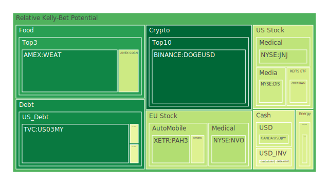
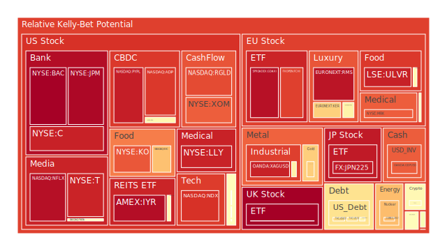
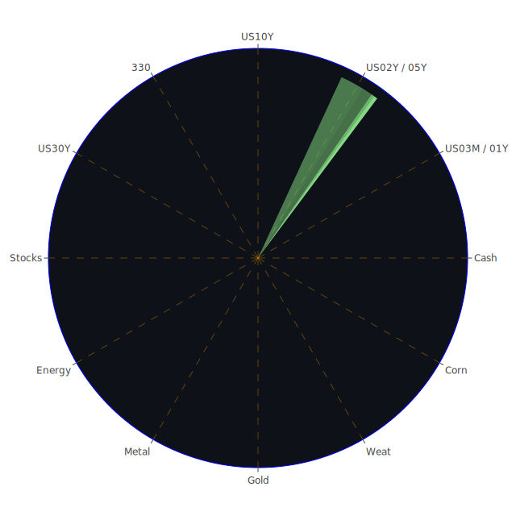

# 投資商品泡沫分析

## 美國國債
過去三天，美國國債的泡沫機率持續上升，特別是10年期國債（TVC:US10Y）和2年期國債（TVC:US02Y）。這與近期的新聞和經濟數據吻合，特別是美國聯邦儲備系統（FED）總資產下降，商業地產和消費者違約率上升，顯示出市場對於流動性和信用風險的擔憂。建議投資者謹慎觀望，避免在此時大幅增加國債持有量。

## 美國科技股
美國科技股的泡沫機率普遍較高，特別是納斯達克指數（NASDAQ:NDX）和Netflix（NASDAQ:NFLX）。近期新聞顯示，科技股受到市場壓力，特別是隨著聯準會即將在Jackson Hole會議上發表講話，市場對於未來利率走向的不確定性增加。建議投資者考慮減持部分科技股，避免未來可能的價格下跌。

## 美國房地產指數
美國房地產指數（AMEX:VNQ）的泡沫機率持續上升，這與商業地產違約率上升和消費者信用卡違約率上升有關。近期新聞也顯示，Wells Fargo正在出售大量商業抵押貸款，進一步加劇市場對房地產的擔憂。建議投資者減持房地產相關資產，避免未來價格下跌的風險。

## 金/銀/銅
黃金（OANDA:XAUUSD）和銅（FX:COPPER）的泡沫機率較高，特別是黃金。這與近期新聞中提到的中國經濟數據疲弱和市場對於全球經濟增長的擔憂有關。建議投資者謹慎觀望，避免在此時大幅增加貴金屬持有量。

## 加密貨幣
比特幣（BITSTAMP:BTCUSD）和以太幣（BINANCE:ETHUSD）的泡沫機率有所下降，但仍處於較高水平。近期新聞顯示，加密貨幣市場受到監管壓力和市場波動的影響。建議投資者謹慎觀望，避免在此時大幅增加加密貨幣持有量。

## 黃豆 / 小麥 / 玉米
黃豆（AMEX:SOYB）和小麥（AMEX:WEAT）的泡沫機率有所上升，這與近期新聞中提到的全球農產品市場波動有關。建議投資者謹慎觀望，避免在此時大幅增加農產品持有量。

## 石油/ 鈾期貨UX!
石油（TVC:USOIL）和鈾期貨（COMEX:UX1!）的泡沫機率較高，特別是石油。近期新聞顯示，中東地區的供應擔憂有所緩解，但全球經濟增長疲弱對於石油需求的影響仍然存在。建議投資者謹慎觀望，避免在此時大幅增加能源資產持有量。

## 各國外匯市場
美元兌日元（OANDA:USDJPY）和歐元兌美元（OANDA:EURUSD）的泡沫機率較高，這與近期新聞中提到的全球經濟不確定性和市場對於美元需求的擔憂有關。建議投資者謹慎觀望，避免在此時大幅增加外匯持有量。

## 各國大盤指數
德國DAX指數（SPREADEX:GDAXI）和法國CAC指數（FXOPEN:FCHI）的泡沫機率較高，這與近期新聞中提到的歐洲經濟數據疲弱和市場對於全球經濟增長的擔憂有關。建議投資者謹慎觀望，避免在此時大幅增加歐洲大盤指數持有量。

## 美國銀行股
美國銀行（NYSE:BAC）和摩根大通（NYSE:JPM）的泡沫機率較高，這與近期新聞中提到的商業地產違約率上升和消費者信用卡違約率上升有關。建議投資者減持銀行股，避免未來價格下跌的風險。

## 美國軍工股
雷神技術（NYSE:RTX）和洛克希德馬丁（NYSE:LMT）的泡沫機率較高，這與近期新聞中提到的全球地緣政治風險增加有關。建議投資者謹慎觀望，避免在此時大幅增加軍工股持有量。

## 美國電子支付股
PayPal（NASDAQ:PYPL）的泡沫機率較高，這與近期新聞中提到的市場對於電子支付行業的競爭加劇和監管壓力有關。建議投資者減持電子支付股，避免未來價格下跌的風險。

## 美國藥商巨頭
默克（NYSE:MRK）和禮來（NYSE:LLY）的泡沫機率較高，這與近期新聞中提到的美國食品藥品監督管理局（FDA）拒絕批准某些藥物有關。建議投資者減持藥商巨頭股票，避免未來價格下跌的風險。

## 美國影視巨頭
迪士尼（NYSE:DIS）的泡沫機率較高，這與近期新聞中提到的家庭債務增加和消費者支出減少有關。建議投資者減持影視巨頭股票，避免未來價格下跌的風險。

## 石油防禦股
埃克森美孚（NYSE:XOM）的泡沫機率較高，這與近期新聞中提到的全球經濟增長疲弱和石油需求減少有關。建議投資者減持石油防禦股，避免未來價格下跌的風險。

## 金礦防禦股
Royal Gold（NASDAQ:RGLD）的泡沫機率較高，這與近期新聞中提到的黃金價格波動和市場對於全球經濟增長的擔憂有關。建議投資者減持金礦防禦股，避免未來價格下跌的風險。

## 歐洲奢侈品股
LVMH（EURONEXT:MC）的泡沫機率較高，這與近期新聞中提到的全球經濟增長疲弱和消費者支出減少有關。建議投資者減持奢侈品股，避免未來價格下跌的風險。

## 歐洲汽車股
BMW（XETR:BMW）的泡沫機率較高，這與近期新聞中提到的全球經濟增長疲弱和汽車需求減少有關。建議投資者減持汽車股，避免未來價格下跌的風險。

## 歐美食品股
雀巢（SIX:NESN）和可口可樂（NYSE:KO）的泡沫機率較高，這與近期新聞中提到的消費者支出減少和市場對於全球經濟增長的擔憂有關。建議投資者減持食品股，避免未來價格下跌的風險。

# 投資建議

1. **減持高泡沫機率的資產**：特別是美國科技股、房地產指數、銀行股、軍工股、電子支付股、藥商巨頭、影視巨頭、石油防禦股、金礦防禦股、歐洲奢侈品股、歐洲汽車股和歐美食品股。
2. **謹慎觀望**：對於泡沫機率在0.45到0.55之間的資產，如某些外匯市場和大盤指數，建議投資者保持觀望，不要有任何大幅度的動作。
3. **關注市場風險**：特別是對於泡沫機率高的商品，應該謹慎進行投資決策，避免未來價格下跌時的損失。

# 風險提示

投資有風險，市場總是充滿不確定性。我們的建議僅供參考，投資者應根據自身的風險承受能力和投資目標，做出獨立的投資決策。
 
Daily Buy Map:

 
Daily Sell Map:

 
Daily Radar Chart:

 
