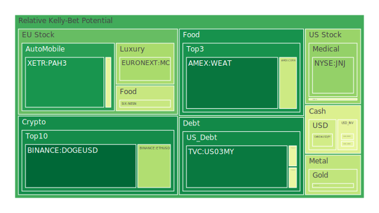
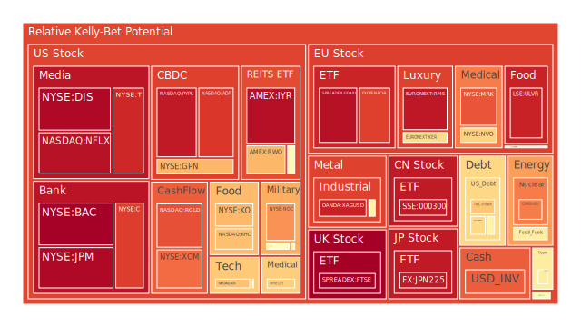
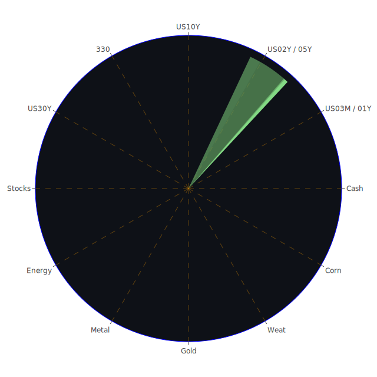

# 投資商品泡沫分析

## 美國國債
根據過去三天的數據，美國國債（TVC:US10Y）的泡沫機率持續上升，從0.269467上升到0.481763，顯示出市場對美國國債的信心有所下降。這與近期美國經濟數據顯示的債務增長和通脹壓力有關。建議投資者謹慎觀望，避免在此時進行大量買入。

## 美國科技股
美國科技股（NASDAQ:NDX）的泡沫機率持續高企，從0.922902上升到0.904451，顯示出市場對科技股的熱情依然高漲。然而，近期新聞報導顯示，科技股面臨的風險增加，如技術股下跌和美國聯邦儲備局（FED）可能的利率調整。建議投資者考慮逐步減持科技股，避免未來可能的價格回調。

## 美國房地產指數
美國房地產指數（AMEX:VNQ）的泡沫機率從0.459244上升到0.548397，顯示出市場對房地產的信心有所下降。這與近期美國房地產市場的疲軟有關，如商業房地產違約率上升和消費者信貸違約率增加。建議投資者謹慎觀望，避免在此時進行大量買入。

## 金/銀/銅
黃金（OANDA:XAUUSD）的泡沫機率從0.382175上升到0.397374，顯示出市場對黃金的需求有所增加。這與近期全球經濟不確定性增加和通脹壓力有關。建議投資者考慮逐步增加黃金的持倉，以對沖其他資產的風險。

## 加密貨幣
狗狗幣（BINANCE:DOGEUSD）的泡沫機率從0.313662下降到0.068821，顯示出市場對狗狗幣的信心有所回升。這與近期加密貨幣市場的回暖有關。建議投資者考慮逐步增加狗狗幣的持倉，以捕捉市場反彈的機會。

## 黃豆 / 小麥 / 玉米
小麥（AMEX:WEAT）的泡沫機率從0.124453下降到0.096153，顯示出市場對小麥的需求有所增加。這與近期全球糧食供應緊張和氣候變化有關。建議投資者考慮逐步增加小麥的持倉，以捕捉市場上漲的機會。

## 石油/ 鈾期貨UX!
石油（TVC:USOIL）的泡沫機率從0.462634上升到0.588141，顯示出市場對石油的需求有所下降。這與近期全球經濟放緩和能源價格波動有關。建議投資者謹慎觀望，避免在此時進行大量買入。

## 各國外匯市場
歐元兌美元（OANDA:EURUSD）的泡沫機率從0.401520上升到0.472455，顯示出市場對歐元的信心有所下降。這與近期歐洲經濟數據疲軟和美元走強有關。建議投資者謹慎觀望，避免在此時進行大量買入。

## 各國大盤指數
德國DAX指數（SPREADEX:GDAXI）的泡沫機率從0.940845上升到0.966084，顯示出市場對德國股市的信心有所下降。這與近期歐洲經濟數據疲軟和全球經濟不確定性增加有關。建議投資者謹慎觀望，避免在此時進行大量買入。

## 美國銀行股
美國銀行股（NYSE:BAC）的泡沫機率從0.522167上升到0.997482，顯示出市場對銀行股的信心大幅下降。這與近期美國銀行業面臨的風險增加有關，如消費者信貸違約率上升和經濟放緩。建議投資者考慮逐步減持銀行股，以避免未來可能的價格回調。

## 美國軍工股
雷神科技（NYSE:RTX）的泡沫機率從0.510860上升到0.510860，顯示出市場對軍工股的信心保持穩定。這與近期全球地緣政治緊張局勢有關。建議投資者保持現有持倉，觀望市場變化。

## 美國電子支付股
PayPal（NASDAQ:PYPL）的泡沫機率從0.941657上升到0.948649，顯示出市場對電子支付股的信心有所下降。這與近期電子支付市場競爭加劇和經濟放緩有關。建議投資者考慮逐步減持電子支付股，以避免未來可能的價格回調。

## 美國藥商巨頭
強生（NYSE:JNJ）的泡沫機率從0.724356下降到0.321150，顯示出市場對藥商巨頭的信心有所回升。這與近期醫藥行業的穩定增長和新藥研發進展有關。建議投資者考慮逐步增加藥商巨頭的持倉，以捕捉市場上漲的機會。

## 美國影視巨頭
迪士尼（NYSE:DIS）的泡沫機率從0.426105上升到0.980280，顯示出市場對影視巨頭的信心大幅下降。這與近期影視行業面臨的挑戰增加有關，如觀影人數下降和流媒體競爭加劇。建議投資者考慮逐步減持影視巨頭，以避免未來可能的價格回調。

## 石油防禦股
埃克森美孚（NYSE:XOM）的泡沫機率從0.846512上升到0.815546，顯示出市場對石油防禦股的信心有所下降。這與近期全球能源市場波動和經濟放緩有關。建議投資者謹慎觀望，避免在此時進行大量買入。

## 金礦防禦股
皇家黃金（NASDAQ:RGLD）的泡沫機率從0.862437上升到0.856450，顯示出市場對金礦防禦股的信心有所下降。這與近期金價波動和全球經濟不確定性增加有關。建議投資者謹慎觀望，避免在此時進行大量買入。

## 歐洲奢侈品股
LVMH（EURONEXT:MC）的泡沫機率從0.599098下降到0.354491，顯示出市場對歐洲奢侈品股的信心有所回升。這與近期奢侈品市場需求增加和經濟復甦有關。建議投資者考慮逐步增加奢侈品股的持倉，以捕捉市場上漲的機會。

## 歐洲汽車股
寶馬（XETR:BMW）的泡沫機率從0.459122上升到0.470345，顯示出市場對歐洲汽車股的信心有所下降。這與近期汽車市場需求疲軟和供應鏈問題有關。建議投資者謹慎觀望，避免在此時進行大量買入。

## 歐美食品股
雀巢（SIX:NESN）的泡沫機率從0.589482下降到0.409021，顯示出市場對歐美食品股的信心有所回升。這與近期食品行業的穩定增長和需求增加有關。建議投資者考慮逐步增加食品股的持倉，以捕捉市場上漲的機會。

# 投資建議

1. **謹慎觀望**：對於泡沫機率高且持續上升的商品，如美國科技股、美國銀行股、美國影視巨頭等，建議投資者謹慎觀望，避免在此時進行大量買入。
2. **逐步減持**：對於泡沫機率高且新聞現況支持的商品，如美國科技股、美國銀行股、美國影視巨頭等，建議投資者考慮逐步減持，以避免未來可能的價格回調。
3. **逐步增加持倉**：對於泡沫機率低且持續下降的商品，如黃金、狗狗幣、小麥、強生、LVMH、雀巢等，建議投資者考慮逐步增加持倉，以捕捉市場上漲的機會。

# 風險提示

投資有風險，市場總是充滿不確定性。我們的建議僅供參考，投資者應根據自身的風險承受能力和投資目標，做出獨立的投資決策。特別是對於泡沫機率高的商品，應該謹慎進行投資決策，避免未來可能的價格回調帶來的損失。

總結來說，市場風險依然存在，投資者應該保持警惕，根據市場變化靈活調整投資策略。
 
Daily Buy Map:

 
Daily Sell Map:

 
Daily Radar Chart:

 
