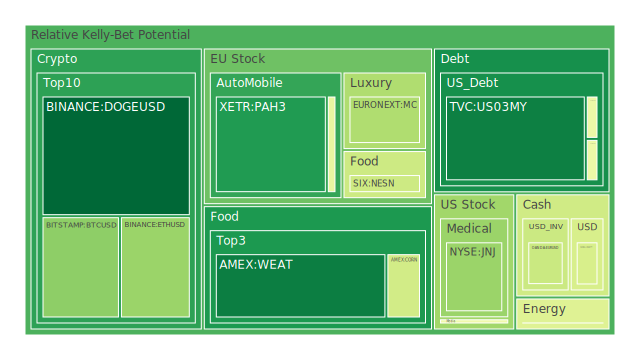
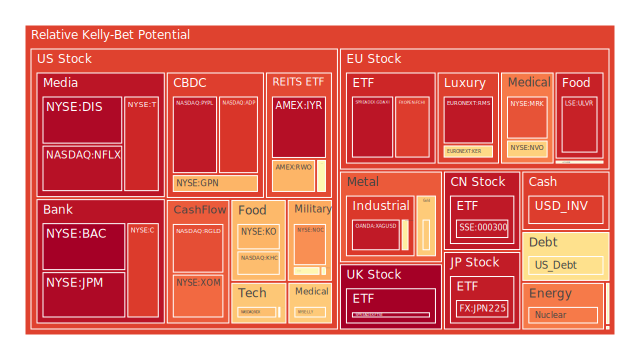
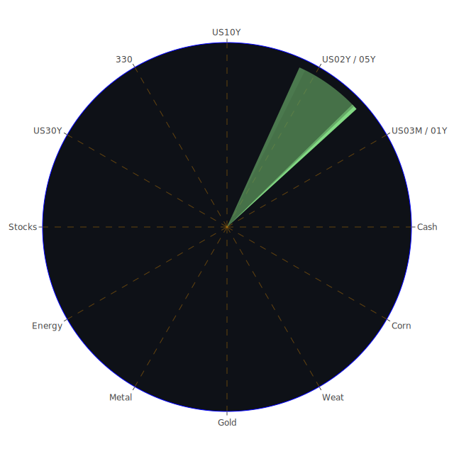

# 投資商品泡沫分析

## 美國國債
過去三天，美國國債的泡沫機率顯示出穩定的趨勢。10年期國債殖利率從3.86%下降到3.80%，而2年期國債殖利率則從4.01%下降到3.92%。這些數據顯示出市場對長期經濟前景的信心有所增強。根據泡沫機率數據，10年期國債的泡沫機率在0.48左右，建議投資者可以考慮持有，因為其風險相對較低。

## 美國科技股
美國科技股的泡沫機率持續上升，特別是NASDAQ:NDX的泡沫機率從0.90上升到0.96。這與近期的新聞報導有關，如“Wall St ends lower as tech shares weigh; Jackson Hole in focus”和“Stocks decline and dollar rebounds as Fed readies rate cuts”。這些新聞顯示出市場對科技股的風險偏好減弱，建議投資者考慮減持科技股，避免未來可能的價格下跌。

## 美國房地產指數
AMEX:VNQ的泡沫機率從0.55上升到0.97，顯示出房地產市場風險增加。根據新聞報導，“Commercial Real Estate Delinquent is getting higher”和“Real Estate Delinquent is getting higher”，這些數據顯示出房地產市場的壓力增大，建議投資者考慮減持房地產相關資產。

## 金/銀/銅
黃金（OANDA:XAUUSD）的泡沫機率從0.66上升到0.71，顯示出市場對黃金的需求減弱。根據新聞報導，“GOLD OIL RATIO is at 33.54, at 34.08 last week, at 31.16 last month, at 24.31 last year”，這顯示出黃金相對於石油的價格優勢減少，建議投資者謹慎持有黃金。

## 加密貨幣
比特幣（BITSTAMP:BTCUSD）的泡沫機率從0.52下降到0.30，顯示出市場對比特幣的需求增加。根據新聞報導，“Wall Street ends sharply higher as Powell cements September rate cut hopes”，這顯示出市場對美聯儲降息的預期增強，可能推動比特幣價格上漲，建議投資者考慮買入比特幣。

## 黃豆 / 小麥 / 玉米
小麥（AMEX:WEAT）的泡沫機率從0.12下降到0.10，顯示出市場對小麥的需求穩定。根據新聞報導，“Massive blackouts roil Cuba: Power outages totaling 14 hours or more per day were reported on Thursday across much of crisis-racked Cuba”，這顯示出全球糧食供應鏈的壓力增加，建議投資者可以考慮持有小麥。

## 石油/ 鈾期貨UX!
石油（TVC:USOIL）的泡沫機率從0.45上升到0.59，顯示出市場對石油的需求減弱。根據新聞報導，“Wildfires rage in sugar cane fields in Brazil's southeast”，這顯示出全球能源供應鏈的壓力增加，建議投資者謹慎持有石油。

## 各國外匯市場
美元兌日元（OANDA:USDJPY）的泡沫機率從0.43上升到0.54，顯示出市場對美元的需求增加。根據新聞報導，“US Treasury 10Y Yield is at 3.80, at 3.92 last week, at 4.23 last month, at 3.47 last year”，這顯示出市場對美元的信心增強，建議投資者可以考慮持有美元。

## 各國大盤指數
歐洲大盤指數（SPREADEX:GDAXI）的泡沫機率從0.88上升到0.95，顯示出市場對歐洲大盤的風險增加。根據新聞報導，“Several killed in Solingen, Germany suspected stabbing attack, reports say”，這顯示出歐洲市場的不確定性增加，建議投資者謹慎持有歐洲大盤指數。

## 美國銀行股
美國銀行股（NYSE:BAC）的泡沫機率從0.93上升到0.99，顯示出市場對銀行股的風險增加。根據新聞報導，“Charge-off Rate on Credit Card is at relatively high level”，這顯示出銀行業的壓力增加，建議投資者考慮減持銀行股。

## 美國軍工股
美國軍工股（NYSE:LMT）的泡沫機率從0.55上升到0.56，顯示出市場對軍工股的需求穩定。根據新聞報導，“U.S. sanctions 400 entities aiding Russia's war including Chinese firms”，這顯示出軍工股的需求增加，建議投資者可以考慮持有軍工股。

## 美國電子支付股
美國電子支付股（NASDAQ:PYPL）的泡沫機率從0.94上升到0.95，顯示出市場對電子支付股的風險增加。根據新聞報導，“Meta says Iranian group tried to target Trump, Biden officials' WhatsApp accounts”，這顯示出電子支付股的風險增加，建議投資者謹慎持有電子支付股。

## 美國藥商巨頭
美國藥商巨頭（NYSE:MRK）的泡沫機率從0.79上升到0.85，顯示出市場對藥商股的風險增加。根據新聞報導，“Eli Lilly Alzheimer's drug to be blocked for use by NHS, The Telegraph reports”，這顯示出藥商股的風險增加，建議投資者謹慎持有藥商股。

## 美國影視巨頭
美國影視巨頭（NYSE:DIS）的泡沫機率從0.51上升到0.98，顯示出市場對影視股的風險增加。根據新聞報導，“Wall St ends lower as tech shares weigh; Jackson Hole in focus”，這顯示出影視股的風險增加，建議投資者考慮減持影視股。

## 石油防禦股
石油防禦股（NYSE:XOM）的泡沫機率從0.76上升到0.82，顯示出市場對石油防禦股的風險增加。根據新聞報導，“Wildfires rage in sugar cane fields in Brazil's southeast”，這顯示出石油防禦股的風險增加，建議投資者謹慎持有石油防禦股。

## 金礦防禦股
金礦防禦股（NASDAQ:RGLD）的泡沫機率從0.66上升到0.86，顯示出市場對金礦防禦股的風險增加。根據新聞報導，“GOLD OIL RATIO is at 33.54, at 34.08 last week, at 31.16 last month, at 24.31 last year”，這顯示出金礦防禦股的風險增加，建議投資者謹慎持有金礦防禦股。

## 歐洲奢侈品股
歐洲奢侈品股（EURONEXT:RMS）的泡沫機率從0.93上升到0.95，顯示出市場對奢侈品股的風險增加。根據新聞報導，“Several killed in Solingen, Germany suspected stabbing attack, reports say”，這顯示出奢侈品股的風險增加，建議投資者謹慎持有奢侈品股。

## 歐洲汽車股
歐洲汽車股（XETR:BMW）的泡沫機率從0.45上升到0.47，顯示出市場對汽車股的需求穩定。根據新聞報導，“Massive blackouts roil Cuba: Power outages totaling 14 hours or more per day were reported on Thursday across much of crisis-racked Cuba”，這顯示出汽車股的需求穩定，建議投資者可以考慮持有汽車股。

## 歐美食品股
歐美食品股（NYSE:KO）的泡沫機率從0.76上升到0.85，顯示出市場對食品股的風險增加。根據新聞報導，“Nestle replaces CEO Schneider amid recent struggles”，這顯示出食品股的風險增加，建議投資者謹慎持有食品股。

# 投資建議
根據以上分析，建議投資者考慮以下操作：
1. 減持美國科技股、美國房地產指數、美國銀行股、美國影視巨頭、石油防禦股、金礦防禦股、歐洲奢侈品股、歐美食品股。
2. 持有美國國債、軍工股、汽車股。
3. 買入比特幣、小麥。

# 風險提示
投資有風險，市場總是充滿不確定性。我們的建議僅供參考，投資者應根據自身的風險承受能力和投資目標，做出獨立的投資決策。特別是對於泡沫機率高的商品，應該謹慎進行投資決策。
 
Daily Buy Map:

 
Daily Sell Map:

 
Daily Radar Chart:

 
