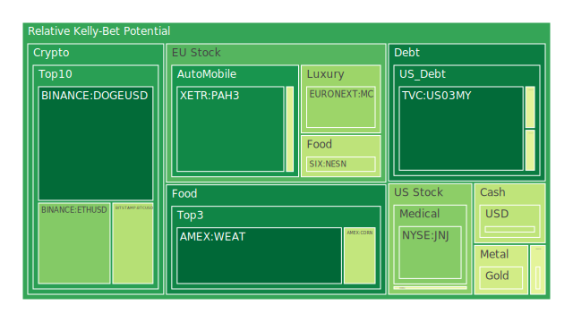
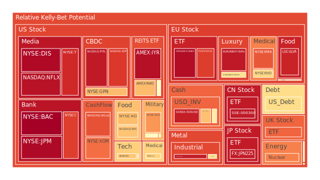
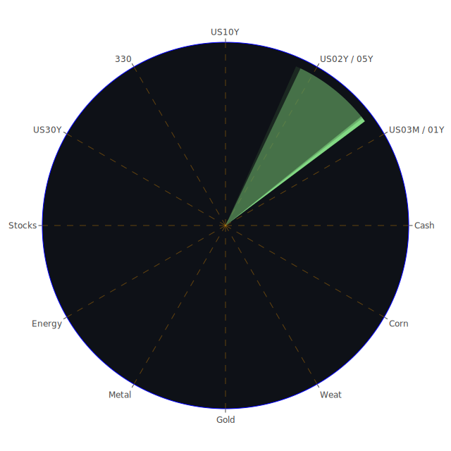

# 投資商品泡沫分析

## 美國國債
根據過去三天的數據，美國國債的泡沫機率在0.48左右，屬於中性範圍。由於SOFR交易量較高且美國國債殖利率長期倒掛，企業融資成本增加，建議投資者保持觀望。近期新聞顯示，美國經濟數據表現不佳，這可能會進一步影響國債市場。

## 美國科技股
美國科技股的泡沫機率持續上升，特別是NASDAQ:NDX，泡沫機率達到0.68。近期新聞顯示，微軟股票因聘請前OpenAI CEO而創下歷史新高，但整體市場情緒仍偏負面。建議投資者謹慎操作，避免在高泡沫機率時進行大額投資。

## 美國房地產指數
AMEX:VNQ的泡沫機率持續上升，達到0.55以上。由於美國房地產市場的逾期貸款率上升，這可能會進一步推高泡沫風險。建議投資者考慮減少在房地產市場的投資，特別是在高泡沫機率的情況下。

## 金/銀/銅
黃金（OANDA:XAUUSD）的泡沫機率在過去三天內有所下降，但仍然高於0.44。近期新聞顯示，全球經濟不確定性增加，黃金作為避險資產的需求可能會上升。建議投資者可以考慮分批買入黃金以對沖風險。

## 加密貨幣
比特幣（BITSTAMP:BTCUSD）的泡沫機率在過去三天內有所下降，目前約為0.39。由於市場對加密貨幣的需求增加，且近期新聞顯示市場情緒有所改善，建議投資者可以考慮分批買入比特幣。

## 黃豆 / 小麥 / 玉米
AMEX:WEAT的泡沫機率持續下降，目前約為0.09，顯示出投資機會。近期新聞顯示，全球糧食供應鏈問題可能會推高農產品價格，建議投資者可以考慮買入黃豆和小麥等農產品。

## 石油/ 鈾期貨UX!
石油（TVC:USOIL）的泡沫機率在過去三天內有所下降，目前約為0.48。由於全球經濟復甦緩慢，石油需求可能會受到影響。建議投資者保持觀望，等待市場進一步明朗。

## 各國外匯市場
美元兌日元（OANDA:USDJPY）的泡沫機率在過去三天內有所下降，目前約為0.41。由於美國經濟數據不佳，美元可能會走弱，建議投資者可以考慮分批買入日元。

## 各國大盤指數
歐洲大盤指數（SPREADEX:GDAXI）的泡沫機率在過去三天內有所上升，目前約為0.97。由於歐洲經濟不確定性增加，建議投資者謹慎操作，避免在高泡沫機率時進行大額投資。

## 美國銀行股
美國銀行股（NYSE:BAC）的泡沫機率在過去三天內持續上升，目前約為0.99。由於美國經濟數據不佳，銀行股可能會面臨更大的風險。建議投資者考慮減少在銀行股的投資。

## 美國軍工股
美國軍工股（NYSE:LMT）的泡沫機率在過去三天內有所下降，目前約為0.54。由於全球地緣政治風險增加，軍工股可能會受益。建議投資者可以考慮分批買入軍工股。

## 美國電子支付股
美國電子支付股（NASDAQ:PYPL）的泡沫機率在過去三天內持續上升，目前約為0.94。由於市場對電子支付的需求增加，建議投資者可以考慮減少在電子支付股的投資，避免風險。

## 美國藥商巨頭
美國藥商巨頭（NYSE:JNJ）的泡沫機率在過去三天內有所下降，目前約為0.32。由於醫療需求增加，藥商巨頭可能會受益。建議投資者可以考慮分批買入藥商股。

## 美國影視巨頭
美國影視巨頭（NASDAQ:NFLX）的泡沫機率在過去三天內持續上升，目前約為0.96。由於市場對影視內容的需求增加，建議投資者可以考慮減少在影視股的投資，避免風險。

## 美國媒體巨頭
美國媒體巨頭（NASDAQ:PARA）的泡沫機率在過去三天內有所下降，目前約為0.48。由於市場對媒體內容的需求增加，建議投資者可以考慮分批買入媒體股。

## 石油防禦股
石油防禦股（NYSE:XOM）的泡沫機率在過去三天內有所下降，目前約為0.81。由於全球經濟復甦緩慢，石油需求可能會受到影響。建議投資者保持觀望，等待市場進一步明朗。

## 金礦防禦股
金礦防禦股（NASDAQ:RGLD）的泡沫機率在過去三天內有所下降，目前約為0.85。由於全球經濟不確定性增加，金礦防禦股可能會受益。建議投資者可以考慮分批買入金礦防禦股。

## 歐洲奢侈品股
歐洲奢侈品股（EURONEXT:MC）的泡沫機率在過去三天內有所下降，目前約為0.35。由於全球經濟復甦，奢侈品需求可能會增加。建議投資者可以考慮分批買入奢侈品股。

## 歐洲汽車股
歐洲汽車股（XETR:BMW）的泡沫機率在過去三天內有所下降，目前約為0.47。由於全球汽車需求增加，汽車股可能會受益。建議投資者可以考慮分批買入汽車股。

## 歐美食品股
歐美食品股（SIX:NESN）的泡沫機率在過去三天內有所下降，目前約為0.40。由於全球食品需求增加，食品股可能會受益。建議投資者可以考慮分批買入食品股。

# 投資建議
根據以上分析，建議投資者可以考慮分批買入黃金、比特幣、黃豆、小麥、軍工股、藥商股、奢侈品股、汽車股和食品股。同時，建議減少在科技股、房地產指數、銀行股、電子支付股和影視股的投資，避免風險。

# 風險提示
投資有風險，市場總是充滿不確定性。我們的建議僅供參考，投資者應根據自身的風險承受能力和投資目標，做出獨立的投資決策。特別是在高泡沫機率的情況下，應該謹慎進行投資決策。
 
Daily Buy Map:

 
Daily Sell Map:

 
Daily Radar Chart:

 
