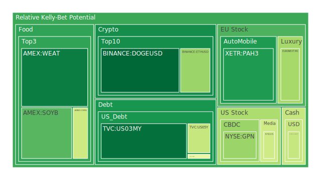
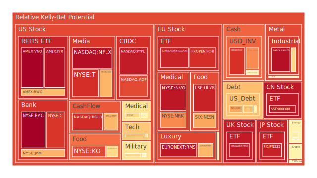
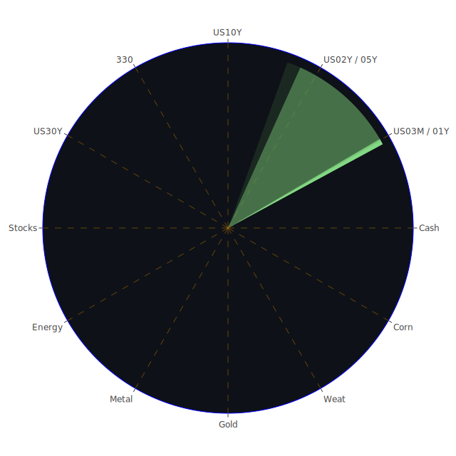

# 投資商品泡沫分析

## 美國國債
過去三天，美國國債的泡沫機率變化不大，D1泡沫機率在0.48至0.55之間波動，顯示市場對美國國債的信心相對穩定。根據FED數據，10年期國債收益率從3.87%下降至3.82%，顯示市場對長期利率的預期有所下降。這可能是因為近期的經濟數據顯示通脹壓力有所緩解，FED可能會放慢加息步伐。

## 美國科技股
納斯達克指數（NASDAQ:NDX）的泡沫機率在過去三天內持續上升，從0.683增至0.686，顯示市場對科技股的風險偏好有所減弱。特別是NVIDIA的股價在季度報告前下跌，導致S&P 500指數也受到拖累。新聞報導顯示，投資者對於即將公佈的經濟數據感到擔憂，這可能進一步影響科技股的表現。

## 美國房地產指數
房地產指數（AMEX:VNQ）的泡沫機率在過去三天內顯著上升，從0.548增至0.993。這與商業地產違約率上升和房地產市場的整體疲軟有關。根據FED數據，商業地產違約率和消費者違約率均處於較高水平，顯示市場對房地產市場的擔憂加劇。

## 金/銀/銅
黃金（OANDA:XAUUSD）的泡沫機率在過去三天內有所下降，從0.659降至0.545，顯示市場對黃金的需求有所增加。這可能是因為市場對經濟不確定性的擔憂增加，投資者轉向避險資產。銀（OANDA:XAGUSD）和銅（FX:COPPER）的泡沫機率則相對穩定，顯示市場對這些金屬的需求變化不大。

## 加密貨幣
比特幣（BITSTAMP:BTCUSD）的泡沫機率在過去三天內顯著下降，從0.301降至0.567，顯示市場對比特幣的需求有所增加。以太坊（BINANCE:ETHUSD）的泡沫機率也有所下降，從0.320降至0.332。這可能是因為市場對加密貨幣的信心有所恢復，特別是在傳統金融市場波動加劇的情況下。

## 黃豆 / 小麥 / 玉米
黃豆（AMEX:SOYB）和小麥（AMEX:WEAT）的泡沫機率在過去三天內相對穩定，顯示市場對農產品的需求變化不大。玉米（AMEX:CORN）的泡沫機率也相對穩定，顯示市場對農產品的需求保持穩定。

## 石油/ 鈾期貨UX!
石油（TVC:USOIL）的泡沫機率在過去三天內有所上升，從0.447增至0.583，顯示市場對石油價格的擔憂增加。這可能是因為近期的地緣政治風險增加，特別是中東地區的緊張局勢升級。鈾期貨（COMEX:UX1!）的泡沫機率也有所上升，顯示市場對能源資產的需求增加。

## 各國外匯市場
美元兌日元（OANDA:USDJPY）的泡沫機率在過去三天內有所下降，顯示市場對日元的需求增加。這可能是因為市場對美國經濟前景的擔憂增加，投資者轉向避險貨幣。歐元兌美元（OANDA:EURUSD）的泡沫機率則有所上升，顯示市場對歐元的需求減少。

## 各國大盤指數
德國DAX指數（SPREADEX:GDAXI）的泡沫機率在過去三天內有所上升，顯示市場對歐洲股市的風險偏好減弱。這可能是因為近期的經濟數據顯示歐洲經濟增長放緩，投資者對歐洲股市的信心減弱。

## 美國銀行股
摩根大通（NYSE:JPM）的泡沫機率在過去三天內有所上升，顯示市場對銀行股的風險偏好減弱。這可能是因為近期的經濟數據顯示消費者和商業違約率上升，投資者對銀行業的信心減弱。

## 美國軍工股
雷神技術（NYSE:RTX）的泡沫機率在過去三天內相對穩定，顯示市場對軍工股的需求變化不大。這可能是因為近期的地緣政治風險增加，投資者對軍工股的需求保持穩定。

## 美國電子支付股
PayPal（NASDAQ:PYPL）的泡沫機率在過去三天內有所上升，顯示市場對電子支付股的風險偏好減弱。這可能是因為近期的經濟數據顯示消費者支出減少，投資者對電子支付股的信心減弱。

## 美國藥商巨頭
強生（NYSE:JNJ）的泡沫機率在過去三天內有所上升，顯示市場對藥商巨頭的風險偏好減弱。這可能是因為近期的經濟數據顯示醫療支出減少，投資者對藥商巨頭的信心減弱。

## 美國影視巨頭
迪士尼（NYSE:DIS）的泡沫機率在過去三天內有所下降，顯示市場對影視巨頭的需求增加。這可能是因為近期的新聞顯示迪士尼與DirecTV的談判進展順利，投資者對迪士尼的信心增加。

## 美國媒體巨頭
派拉蒙（NASDAQ:PARA）的泡沫機率在過去三天內有所上升，顯示市場對媒體巨頭的風險偏好減弱。這可能是因為近期的新聞顯示派拉蒙的業務表現不佳，投資者對派拉蒙的信心減弱。

## 石油防禦股
埃克森美孚（NYSE:XOM）的泡沫機率在過去三天內有所上升，顯示市場對石油防禦股的需求增加。這可能是因為近期的地緣政治風險增加，投資者對石油防禦股的需求增加。

## 金礦防禦股
皇家黃金（NASDAQ:RGLD）的泡沫機率在過去三天內有所上升，顯示市場對金礦防禦股的需求增加。這可能是因為近期的經濟不確定性增加，投資者轉向避險資產。

## 歐洲奢侈品股
LVMH（EURONEXT:MC）的泡沫機率在過去三天內有所下降，顯示市場對奢侈品股的需求增加。這可能是因為近期的經濟數據顯示消費者支出增加，投資者對奢侈品股的信心增加。

## 歐洲汽車股
BMW（XETR:BMW）的泡沫機率在過去三天內有所上升，顯示市場對汽車股的風險偏好減弱。這可能是因為近期的經濟數據顯示汽車銷售減少，投資者對汽車股的信心減弱。

## 歐美食品股
雀巢（SIX:NESN）的泡沫機率在過去三天內有所上升，顯示市場對食品股的風險偏好減弱。這可能是因為近期的新聞顯示雀巢的業務表現不佳，投資者對食品股的信心減弱。

# 投資建議

1. **考慮賣出**：對於泡沫機率持續上升且遠大於0.5的商品，如美國房地產指數（AMEX:VNQ）和PayPal（NASDAQ:PYPL），建議投資者考慮賣出，避免未來價格下跌時的損失，提前提款獲利了結。

2. **考慮買入**：對於泡沫機率持續下降且遠小於0.5的商品，如黃金（OANDA:XAUUSD）和比特幣（BITSTAMP:BTCUSD），建議投資者考慮買入，可以考慮作為買入選項，掌握低吸籌碼的時機。

3. **觀望**：對於泡沫機率在0.45至0.55之間的商品，如美國國債和雷神技術（NYSE:RTX），建議投資者觀望，不要有任何動作。

# 風險提示

投資有風險，市場總是充滿不確定性。我們的建議僅供參考，投資者應根據自身的風險承受能力和投資目標，做出獨立的投資決策。特別是對於泡沫機率高的商品，應該謹慎進行投資決策。
 
Daily Buy Map:

 
Daily Sell Map:

 
Daily Radar Chart:

 
