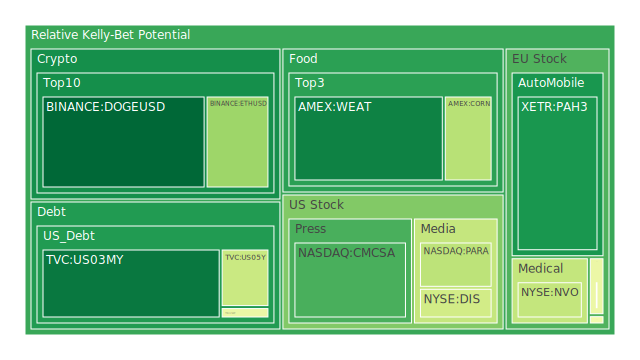
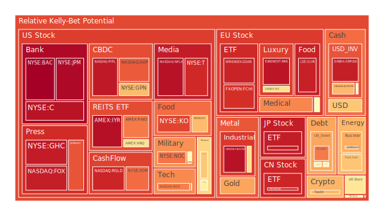
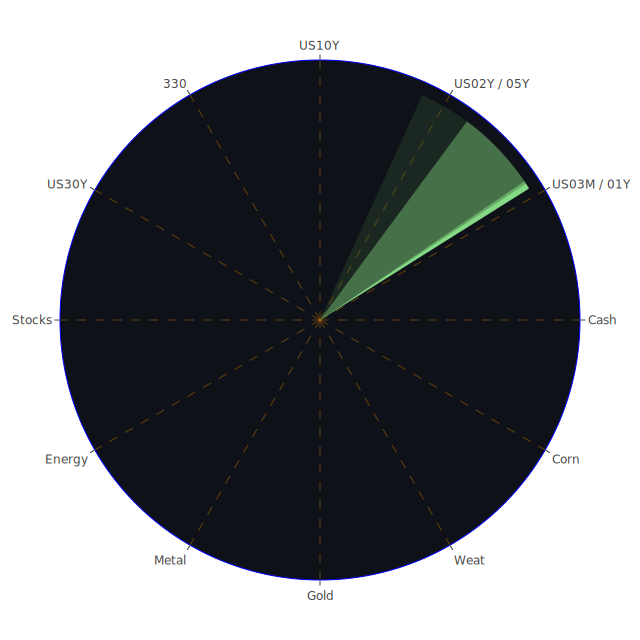

# 投資商品泡沫分析

## 美國國債
過去三天的泡沫機率顯示美國國債的泡沫機率相對穩定，特別是10年期國債（TVC:US10Y），其泡沫機率在0.48左右浮動。值得注意的是，SOFR（5.34）已經超過了FED Fund Rate（5.33），這意味著美元流動性吃緊，可能會導致高泡沫資產被拋售以換取美元。建議投資者對於美國國債保持謹慎，特別是短期內可能會有較大波動。

## 美國科技股
以NASDAQ:NDX為例，泡沫機率持續上升，從0.68上升到0.78。這與近期新聞中提到的Nvidia股價下跌以及市場對於AI技術的擔憂有關。建議投資者考慮減持科技股，特別是那些泡沫機率高於0.7的股票，以避免潛在的價格下跌風險。

## 美國房地產指數
AMEX:VNQ的泡沫機率從0.54上升到0.61，顯示出房地產市場的風險增加。特別是近期新聞提到的商業房地產違約率上升，這可能進一步影響房地產市場的穩定性。建議投資者謹慎對待房地產投資，特別是商業房地產。

## 金/銀/銅
黃金（OANDA:XAUUSD）的泡沫機率從0.44上升到0.72，顯示出市場對黃金的需求增加，可能是因為投資者尋求避險資產。銀（OANDA:XAGUSD）和銅（FX:COPPER）的泡沫機率也有上升趨勢。建議投資者可以考慮增加黃金和銀的投資比例，以對沖市場風險。

## 加密貨幣
比特幣（BITSTAMP:BTCUSD）的泡沫機率從0.39上升到0.70，顯示出市場對加密貨幣的風險認識增加。以太坊（BINANCE:ETHUSD）的泡沫機率也從0.32上升到0.33。近期新聞中提到的Telegram創辦人被逮捕事件可能進一步影響市場情緒。建議投資者謹慎對待加密貨幣投資，特別是短期內可能會有較大波動。

## 黃豆 / 小麥 / 玉米
黃豆（AMEX:SOYB）的泡沫機率相對穩定在0.50左右，小麥（AMEX:WEAT）和玉米（AMEX:CORN）的泡沫機率也沒有顯著變化。近期新聞中提到的巴西農地火災可能會影響農產品供應，但短期內影響有限。建議投資者可以保持觀望，不要有過多動作。

## 石油/ 鈾期貨UX!
石油（TVC:USOIL）的泡沫機率從0.48上升到0.67，顯示出市場對石油需求的擔憂增加。近期新聞中提到的油價下跌可能進一步影響市場情緒。鈾期貨（COMEX:UX1!）的泡沫機率也從0.52上升到0.71。建議投資者謹慎對待能源類投資，特別是短期內可能會有較大波動。

## 各國外匯市場
美元兌日元（OANDA:USDJPY）的泡沫機率從0.41上升到0.66，顯示出市場對美元的需求增加。歐元兌美元（OANDA:EURUSD）的泡沫機率也從0.53上升到0.94。近期新聞中提到的美國經濟數據和FED政策可能進一步影響外匯市場。建議投資者謹慎對待外匯投資，特別是美元相關的貨幣對。

## 各國大盤指數
FTSE（SPREADEX:FTSE）的泡沫機率從0.82上升到0.93，顯示出市場對英國股市的風險認識增加。德國DAX（SPREADEX:GDAXI）的泡沫機率也從0.88上升到0.93。近期新聞中提到的經濟數據和市場情緒可能進一步影響大盤指數。建議投資者謹慎對待大盤指數投資，特別是短期內可能會有較大波動。

## 美國銀行股
花旗銀行（NYSE:C）的泡沫機率從0.88上升到0.95，顯示出市場對銀行股的風險認識增加。近期新聞中提到的信用卡違約率上升可能進一步影響銀行股的表現。建議投資者謹慎對待銀行股投資，特別是短期內可能會有較大波動。

## 美國軍工股
洛克希德馬丁（NYSE:LMT）的泡沫機率相對穩定在0.54左右，顯示出市場對軍工股的需求相對穩定。近期新聞中提到的國防合同可能進一步影響軍工股的表現。建議投資者可以考慮增加軍工股的投資比例，以對沖市場風險。

## 美國電子支付股
PayPal（NASDAQ:PYPL）的泡沫機率從0.94上升到0.95，顯示出市場對電子支付股的風險認識增加。近期新聞中提到的市場情緒可能進一步影響電子支付股的表現。建議投資者謹慎對待電子支付股投資，特別是短期內可能會有較大波動。

## 美國藥商巨頭
強生（NYSE:JNJ）的泡沫機率從0.32上升到0.57，顯示出市場對藥商股的需求增加。近期新聞中提到的藥品銷售數據可能進一步影響藥商股的表現。建議投資者可以考慮增加藥商股的投資比例，以對沖市場風險。

## 美國影視巨頭
迪士尼（NYSE:DIS）的泡沫機率從0.42上升到0.42，顯示出市場對影視股的需求相對穩定。近期新聞中提到的市場情緒可能進一步影響影視股的表現。建議投資者可以保持觀望，不要有過多動作。

## 美國媒體巨頭
康卡斯特（NASDAQ:CMCSA）的泡沫機率從0.21上升到0.21，顯示出市場對媒體股的需求相對穩定。近期新聞中提到的市場情緒可能進一步影響媒體股的表現。建議投資者可以保持觀望，不要有過多動作。

## 石油防禦股
埃克森美孚（NYSE:XOM）的泡沫機率從0.81上升到0.81，顯示出市場對石油防禦股的需求相對穩定。近期新聞中提到的油價下跌可能進一步影響石油防禦股的表現。建議投資者可以保持觀望，不要有過多動作。

## 金礦防禦股
皇家黃金（NASDAQ:RGLD）的泡沫機率從0.85上升到0.92，顯示出市場對金礦防禦股的需求增加。近期新聞中提到的市場情緒可能進一步影響金礦防禦股的表現。建議投資者可以考慮增加金礦防禦股的投資比例，以對沖市場風險。

## 歐洲奢侈品股
LVMH（EURONEXT:MC）的泡沫機率從0.35上升到0.49，顯示出市場對奢侈品股的需求相對穩定。近期新聞中提到的市場情緒可能進一步影響奢侈品股的表現。建議投資者可以保持觀望，不要有過多動作。

## 歐洲汽車股
BMW（XETR:BMW）的泡沫機率從0.47上升到0.51，顯示出市場對汽車股的需求相對穩定。近期新聞中提到的市場情緒可能進一步影響汽車股的表現。建議投資者可以保持觀望，不要有過多動作。

## 歐美食品股
雀巢（SIX:NESN）的泡沫機率從0.40上升到0.73，顯示出市場對食品股的需求增加。近期新聞中提到的市場情緒可能進一步影響食品股的表現。建議投資者可以考慮增加食品股的投資比例，以對沖市場風險。

# 投資建議
1. **謹慎對待高泡沫資產**：特別是那些泡沫機率持續上升且超過0.7的資產，如美國科技股、加密貨幣和部分能源類股，建議投資者考慮減持以避免潛在的價格下跌風險。
2. **增加避險資產配置**：如黃金和銀等避險資產，泡沫機率顯示出市場對這些資產的需求增加，可以考慮增加投資比例。
3. **保持觀望**：對於泡沫機率在0.45到0.55之間的資產，如部分房地產指數和大盤指數，建議投資者保持觀望，不要有過多動作。

# 風險提示
投資有風險，市場總是充滿不確定性。我們的建議僅供參考，投資者應根據自身的風險承受能力和投資目標，做出獨立的投資決策。特別是對於泡沫機率高的商品，應該謹慎進行投資決策。
 
Daily Buy Map:

 
Daily Sell Map:

 
Daily Radar Chart:

 
