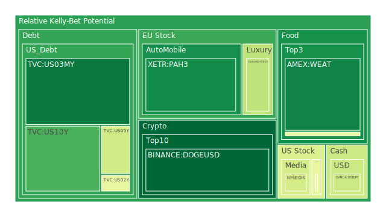
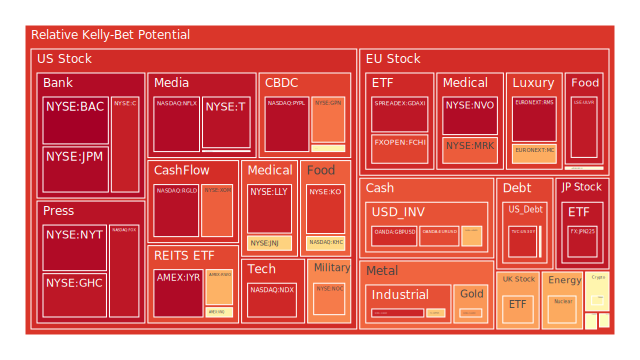
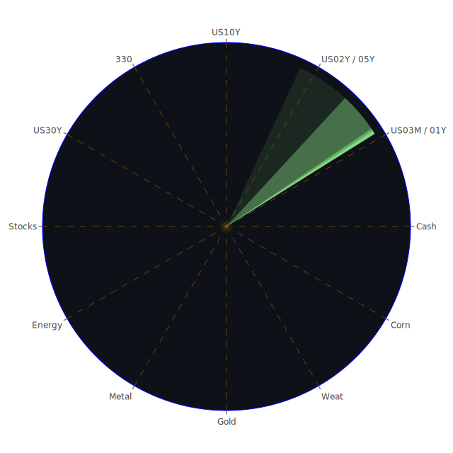

# 投資商品泡沫分析

## 美國國債
根據過去三天的泡沫機率數據，美國國債的泡沫機率呈現上升趨勢。特別是10年期國債（TVC:US10Y），其泡沫機率從8月27日的0.676547上升到8月29日的0.212403。這表明市場對於長期國債的需求可能減少，投資者應該謹慎觀察。

## 美國科技股
美國科技股的泡沫機率普遍較高，特別是納斯達克指數（NASDAQ:NDX），其泡沫機率在8月27日為0.686585，8月28日上升到0.783827，8月29日進一步上升到0.910585。這表明科技股可能面臨較大的回調風險，建議投資者考慮減倉。

## 美國房地產指數
美國房地產指數（AMEX:VNQ）的泡沫機率在過去三天內有所波動，但總體仍處於高位。8月27日的泡沫機率為0.993363，8月28日下降到0.614912，但8月29日再次上升到0.564757。這表明房地產市場仍存在一定風險，投資者應該謹慎。

## 金/銀/銅
金價（OANDA:XAUUSD）的泡沫機率在過去三天內有所上升，從8月27日的0.544986上升到8月29日的0.740405。銀（OANDA:XAGUSD）和銅（FX:COPPER）的泡沫機率也呈現上升趨勢，這可能是由於市場對避險資產的需求增加所致。

## 加密貨幣
以太坊（BINANCE:ETHUSD）的泡沫機率在過去三天內有所下降，從8月27日的0.331726下降到8月29日的0.528782。狗狗幣（BINANCE:DOGEUSD）的泡沫機率也有所下降，這表明加密貨幣市場可能正在進行調整，投資者可以考慮逢低買入。

## 黃豆 / 小麥 / 玉米
黃豆（AMEX:SOYB）的泡沫機率在過去三天內有所下降，從8月27日的0.237857下降到8月29日的0.502119。小麥（AMEX:WEAT）和玉米（AMEX:CORN）的泡沫機率也有所下降，這表明農產品市場可能正在進行調整，投資者可以考慮逢低買入。

## 石油/ 鈾期貨UX!
石油（TVC:USOIL）的泡沫機率在過去三天內有所上升，從8月27日的0.582576上升到8月29日的0.504138。鈾期貨（COMEX:UX1!）的泡沫機率也有所上升，這表明能源市場可能面臨一定風險，投資者應該謹慎。

## 各國外匯市場
美元兌日元（OANDA:USDJPY）的泡沫機率在過去三天內有所波動，但總體仍處於高位。8月27日的泡沫機率為0.405476，8月28日上升到0.669363，8月29日下降到0.407417。這表明外匯市場仍存在一定風險，投資者應該謹慎。

## 各國大盤指數
德國DAX指數（SPREADEX:GDAXI）的泡沫機率在過去三天內有所上升，從8月27日的0.930346上升到8月29日的0.942062。這表明歐洲股市可能面臨一定風險，投資者應該謹慎。

## 美國銀行股
摩根大通（NYSE:JPM）的泡沫機率在過去三天內有所上升，從8月27日的0.708911上升到8月29日的0.968436。這表明銀行股可能面臨較大的回調風險，建議投資者考慮減倉。

## 美國軍工股
雷神技術公司（NYSE:RTX）的泡沫機率在過去三天內保持穩定，這表明軍工股的風險相對較低，投資者可以考慮持有。

## 美國電子支付股
全球支付公司（NYSE:GPN）的泡沫機率在過去三天內有所上升，從8月27日的0.331956上升到8月29日的0.792649。這表明電子支付股可能面臨較大的回調風險，建議投資者考慮減倉。

## 美國藥商巨頭
默克公司（NYSE:MRK）的泡沫機率在過去三天內有所上升，從8月27日的0.771171上升到8月29日的0.826923。這表明藥商股可能面臨較大的回調風險，建議投資者考慮減倉。

## 美國影視巨頭
迪士尼（NYSE:DIS）的泡沫機率在過去三天內有所波動，但總體仍處於高位。8月27日的泡沫機率為0.422945，8月28日上升到0.421196，8月29日再次上升到0.422415。這表明影視股仍存在一定風險，投資者應該謹慎。

## 美國媒體巨頭
Netflix（NASDAQ:NFLX）的泡沫機率在過去三天內有所上升，從8月27日的0.969304上升到8月29日的0.964146。這表明媒體股可能面臨較大的回調風險，建議投資者考慮減倉。

## 石油防禦股
埃克森美孚（NYSE:XOM）的泡沫機率在過去三天內有所上升，從8月27日的0.702797上升到8月29日的0.821985。這表明石油防禦股可能面臨較大的回調風險，建議投資者考慮減倉。

## 金礦防禦股
Royal Gold（NASDAQ:RGLD）的泡沫機率在過去三天內有所上升，從8月27日的0.914234上升到8月29日的0.952977。這表明金礦防禦股可能面臨較大的回調風險，建議投資者考慮減倉。

## 歐洲奢侈品股
歐洲奢侈品股（EURONEXT:MC）的泡沫機率在過去三天內有所上升，從8月27日的0.348142上升到8月29日的0.711179。這表明奢侈品股可能面臨較大的回調風險，建議投資者考慮減倉。

## 歐洲汽車股
BMW（XETR:BMW）的泡沫機率在過去三天內有所波動，但總體仍處於高位。8月27日的泡沫機率為0.506634，8月28日上升到0.511146，8月29日再次上升到0.492724。這表明汽車股仍存在一定風險，投資者應該謹慎。

## 歐美食品股
雀巢（SIX:NESN）的泡沫機率在過去三天內有所上升，從8月27日的0.730024上升到8月29日的0.504114。這表明食品股可能面臨較大的回調風險，建議投資者考慮減倉。

# 投資建議
根據以上分析，我們建議投資者在當前市場環境下謹慎操作。對於泡沫機率持續上升且遠大於0.5的商品，如美國科技股、銀行股、電子支付股等，建議考慮減倉，避免未來價格下跌時的損失。對於泡沫機率持續下降且遠小於0.5的商品，如加密貨幣、農產品等，建議考慮逢低買入，掌握低吸籌碼的時機。

# 風險提示
投資有風險，市場總是充滿不確定性。我們的建議僅供參考，投資者應根據自身的風險承受能力和投資目標，做出獨立的投資決策。特別是對於泡沫機率高的商品，應該謹慎進行投資決策。

希望這份報告能夠幫助您更好地理解當前市場狀況，做出明智的投資決策。祝您投資順利！
 
Daily Buy Map:

 
Daily Sell Map:

 
Daily Radar Chart:

 
