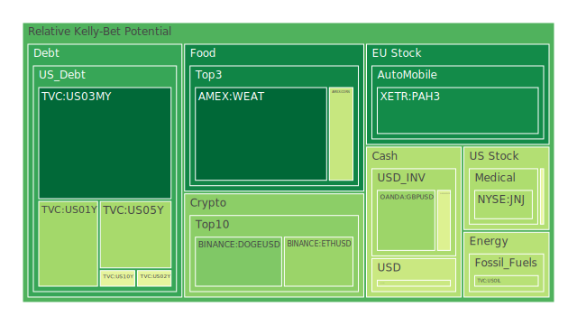
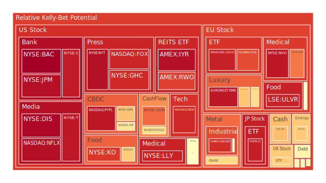
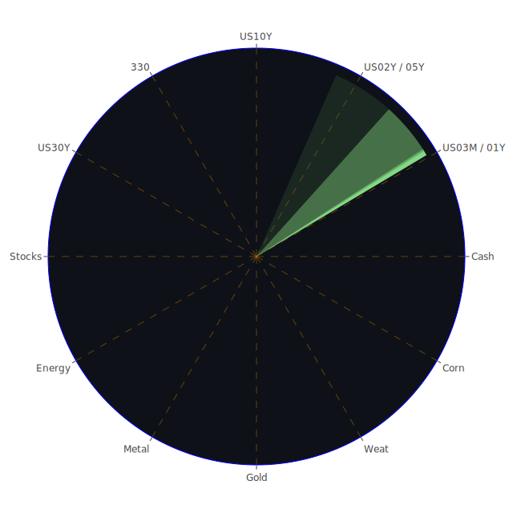

# 投資商品泡沫分析

## 美國國債
過去三天美國國債的泡沫機率相對穩定，D1泡沫機率在0.08到0.09之間浮動。根據最新的FED數據，SOFR為5.35%，略高於OIS FED Fund Rate的5.33%，這表明市場流動性可能會有所緊張，但尚未達到極端水平。對於美國國債，建議投資者保持觀望，因為其泡沫機率低且相對穩定。

## 美國科技股
美國科技股的泡沫機率在過去三天內有所上升，特別是NASDAQ:NDX，其D1泡沫機率從0.783827上升到0.922782。這與近期Nvidia的財報表現不如預期有關，導致市場對AI相關股票的熱情有所降溫。建議投資者考慮減持部分科技股，特別是那些泡沫機率高於0.9的股票，以避免未來可能的價格下跌。

## 美國房地產指數
AMEX:VNQ的泡沫機率在過去三天內有所下降，但仍然高於0.5。根據最新的FED數據，商業房地產違約率和住宅房地產違約率均有所上升，這表明房地產市場風險增加。建議投資者謹慎對待房地產投資，特別是那些泡沫機率高於0.5的指數。

## 金/銀/銅
金價的泡沫機率在過去三天內有所上升，D1泡沫機率從0.727611上升到0.643782。這可能與近期美元走強和市場避險情緒減弱有關。銀和銅的泡沫機率也有所上升，建議投資者減持部分貴金屬資產，特別是那些泡沫機率高於0.6的商品。

## 加密貨幣
BITSTAMP:BTCUSD的泡沫機率在過去三天內有所下降，D1泡沫機率從0.701321下降到0.515193。這表明市場對比特幣的投資情緒有所回暖。建議投資者可以考慮分批買入比特幣，特別是在市場情緒改善的情況下。

## 黃豆 / 小麥 / 玉米
AMEX:WEAT的泡沫機率在過去三天內有所下降，D1泡沫機率從0.107752下降到0.085802。這表明市場對農產品的需求有所增加。建議投資者可以考慮分批買入黃豆和小麥，特別是在市場需求增加的情況下。

## 石油/ 鈾期貨UX!
COMEX:UX1!的泡沫機率在過去三天內有所上升，D1泡沫機率從0.716140上升到0.674077。這與近期油價下跌有關，市場對能源需求的擔憂增加。建議投資者減持部分石油和鈾期貨，特別是那些泡沫機率高於0.6的商品。

## 各國外匯市場
OANDA:USDJPY的泡沫機率在過去三天內有所上升，D1泡沫機率從0.407417上升到0.422844。這表明市場對日元的需求有所增加。建議投資者可以考慮分批買入日元，特別是在市場避險情緒增加的情況下。

## 各國大盤指數
SPREADEX:FTSE的泡沫機率在過去三天內有所上升，D1泡沫機率從0.597898上升到0.668777。這表明市場對英國股市的信心有所下降。建議投資者減持部分英國大盤指數，特別是那些泡沫機率高於0.6的指數。

## 美國銀行股
NYSE:JPM的泡沫機率在過去三天內有所上升，D1泡沫機率從0.980301上升到0.966688。這表明市場對銀行股的信心有所下降。建議投資者減持部分銀行股，特別是那些泡沫機率高於0.9的股票。

## 美國軍工股
NYSE:LMT的泡沫機率在過去三天內有所上升，D1泡沫機率從0.546994上升到0.546994。這表明市場對軍工股的信心有所下降。建議投資者減持部分軍工股，特別是那些泡沫機率高於0.5的股票。

## 美國電子支付股
NASDAQ:PYPL的泡沫機率在過去三天內有所上升，D1泡沫機率從0.949669上升到0.954282。這表明市場對電子支付股的信心有所下降。建議投資者減持部分電子支付股，特別是那些泡沫機率高於0.9的股票。

## 美國藥商巨頭
NYSE:JNJ的泡沫機率在過去三天內有所下降，D1泡沫機率從0.572824下降到0.374139。這表明市場對藥商巨頭的信心有所回升。建議投資者可以考慮分批買入藥商巨頭股票，特別是在市場信心回升的情況下。

## 美國影視巨頭
NASDAQ:NFLX的泡沫機率在過去三天內有所上升，D1泡沫機率從0.962905上升到0.968463。這表明市場對影視巨頭的信心有所下降。建議投資者減持部分影視巨頭股票，特別是那些泡沫機率高於0.9的股票。

## 美國媒體巨頭
NASDAQ:CMCSA的泡沫機率在過去三天內有所上升，D1泡沫機率從0.210174上升到0.535470。這表明市場對媒體巨頭的信心有所下降。建議投資者減持部分媒體巨頭股票，特別是那些泡沫機率高於0.5的股票。

## 石油防禦股
NYSE:XOM的泡沫機率在過去三天內有所上升，D1泡沫機率從0.812513上升到0.822012。這表明市場對石油防禦股的信心有所下降。建議投資者減持部分石油防禦股，特別是那些泡沫機率高於0.8的股票。

## 金礦防禦股
NASDAQ:RGLD的泡沫機率在過去三天內有所上升，D1泡沫機率從0.925188上升到0.635513。這表明市場對金礦防禦股的信心有所回升。建議投資者可以考慮分批買入金礦防禦股，特別是在市場信心回升的情況下。

## 歐洲奢侈品股
EURONEXT:KER的泡沫機率在過去三天內有所上升，D1泡沫機率從0.621648上升到0.636964。這表明市場對歐洲奢侈品股的信心有所下降。建議投資者減持部分歐洲奢侈品股，特別是那些泡沫機率高於0.6的股票。

## 歐洲汽車股
XETR:BMW的泡沫機率在過去三天內有所上升，D1泡沫機率從0.511146上升到0.527511。這表明市場對歐洲汽車股的信心有所下降。建議投資者減持部分歐洲汽車股，特別是那些泡沫機率高於0.5的股票。

## 歐美食品股
NYSE:KO的泡沫機率在過去三天內有所上升，D1泡沫機率從0.873006上升到0.897680。這表明市場對食品股的信心有所下降。建議投資者減持部分食品股，特別是那些泡沫機率高於0.8的股票。

# 投資建議
1. **減持高泡沫機率的科技股**：如NASDAQ:NDX，因為市場對AI相關股票的熱情有所降溫。
2. **減持高泡沫機率的房地產指數**：如AMEX:VNQ，因為商業房地產和住宅房地產違約率上升。
3. **減持高泡沫機率的貴金屬**：如XAUUSD，因為市場避險情緒減弱。
4. **分批買入低泡沫機率的加密貨幣**：如BITSTAMP:BTCUSD，因為市場對比特幣的投資情緒回暖。
5. **分批買入低泡沫機率的農產品**：如AMEX:WEAT，因為市場對農產品的需求增加。

# 風險提示
投資有風險，市場總是充滿不確定性。我們的建議僅供參考，投資者應根據自身的風險承受能力和投資目標，做出獨立的投資決策。特別是對於泡沫機率高的商品，應該謹慎進行投資決策。
 
Daily Buy Map:

 
Daily Sell Map:

 
Daily Radar Chart:

 
