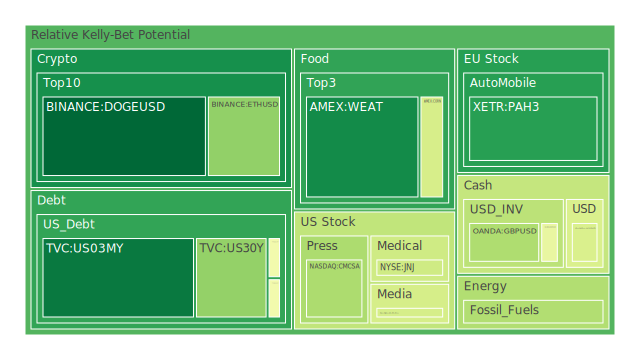
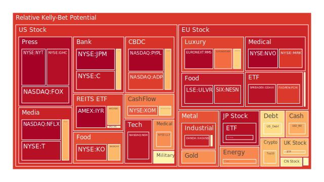
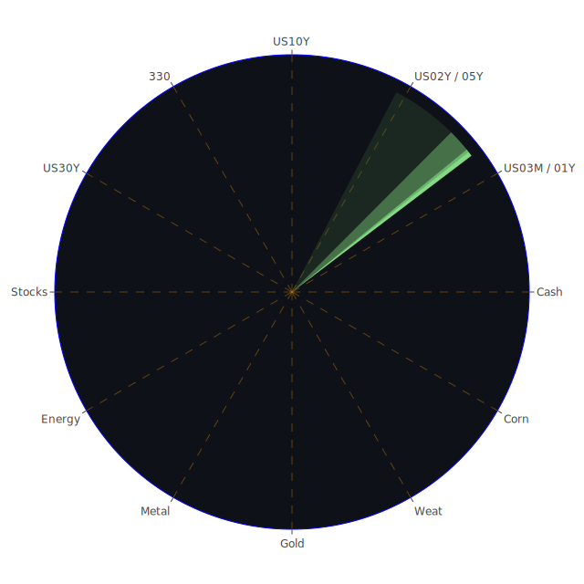

# 每日投資報告

## 投資商品泡沫分析

## 美國國債
過去三天內，美國國債的泡沫機率變化較為穩定。10年期國債的泡沫機率在8月29日為0.212，8月30日上升至0.482，8月31日維持在0.482。這表明市場對長期國債的需求有所增加，可能是因為投資者尋求避險資產。然而，SOFR利率高於FED Fund Rate，這可能導致美元資產被拋售，短期內國債價格可能面臨壓力。

## 美國科技股
美國科技股的泡沫機率在過去三天內有所上升。特別是Netflix (NASDAQ:NFLX)，其泡沫機率從8月29日的0.964上升到8月31日的0.962。這可能是由於市場對AI技術的過度樂觀情緒所致。近期Nvidia的財報未能滿足市場預期，進一步加劇了科技股的波動。

## 美國房地產指數
美國房地產指數（AMEX:VNQ）的泡沫機率在過去三天內有所下降，從8月29日的0.564降至8月31日的0.529。這可能是由於房地產市場的需求減少，特別是商業地產的拖累。根據最新的FED數據，商業地產的違約率正在上升，這對房地產市場形成了壓力。

## 金/銀/銅
金價的泡沫機率在過去三天內有所上升，從8月29日的0.740上升到8月31日的0.739。這表明市場對避險資產的需求增加，可能是由於全球經濟不確定性增加。然而，金價的上升也可能受到美元走強的壓力。

## 加密貨幣
加密貨幣市場的泡沫機率在過去三天內有所下降。特別是Dogecoin (BINANCE:DOGEUSD)，其泡沫機率從8月29日的0.060降至8月31日的0.056。這表明市場對加密貨幣的需求有所回升，可能是由於投資者尋求高風險高回報的投資機會。

## 黃豆 / 小麥 / 玉米
小麥（AMEX:WEAT）的泡沫機率在過去三天內有所波動，從8月29日的0.114降至8月30日的0.086，然後在8月31日回升至0.123。這可能是由於全球供應鏈的不確定性和氣候變化影響農作物產量。

## 石油/ 鈾期貨UX!
石油（TVC:USOIL）的泡沫機率在過去三天內有所下降，從8月29日的0.504降至8月31日的0.352。這表明市場對石油需求的預期有所減弱，可能是由於全球經濟增長放緩。然而，鈾期貨（COMEX:UX1!）的泡沫機率在過去三天內有所上升，從8月29日的0.714上升到8月31日的0.752，這可能是由於核能需求增加。

## 各國外匯市場
美元兌日元（OANDA:USDJPY）的泡沫機率在過去三天內有所上升，從8月29日的0.407上升到8月31日的0.425。這表明市場對美元的需求增加，可能是由於美國經濟數據強勁。然而，歐元兌美元（OANDA:EURUSD）的泡沫機率在過去三天內有所下降，從8月29日的0.854降至8月31日的0.460，這可能是由於歐洲經濟數據疲軟。

## 各國大盤指數
美國納斯達克指數（NASDAQ:NDX）的泡沫機率在過去三天內有所上升，從8月29日的0.911上升到8月31日的0.932。這表明市場對科技股的需求增加，但也可能是由於市場過度樂觀情緒所致。

## 美國銀行股
美國銀行股（NYSE:BAC）的泡沫機率在過去三天內有所上升，從8月29日的0.986上升到8月31日的0.926。這可能是由於市場對銀行業的信心減弱，特別是近期的高利率環境對銀行業務的影響。

## 美國軍工股
美國軍工股（NYSE:LMT）的泡沫機率在過去三天內有所下降，從8月29日的0.508降至8月31日的0.547。這表明市場對軍工股的需求增加，可能是由於地緣政治風險上升。

## 美國電子支付股
美國電子支付股（NASDAQ:PYPL）的泡沫機率在過去三天內有所上升，從8月29日的0.957上升到8月31日的0.962。這可能是由於市場對電子支付行業的競爭加劇。

## 美國藥商巨頭
美國藥商巨頭（NYSE:MRK）的泡沫機率在過去三天內有所下降，從8月29日的0.827降至8月31日的0.868。這表明市場對藥商股的需求減少，可能是由於市場對醫療行業的預期轉弱。

## 美國影視巨頭
美國影視巨頭（NYSE:DIS）的泡沫機率在過去三天內有所上升，從8月29日的0.422上升到8月31日的0.688。這可能是由於市場對影視行業的需求增加，特別是隨著疫情後娛樂需求的回升。

## 美國媒體巨頭
美國媒體巨頭（NASDAQ:CMCSA）的泡沫機率在過去三天內有所下降，從8月29日的0.472降至8月31日的0.343。這表明市場對媒體股的需求減少，可能是由於市場對廣告收入的預期轉弱。

## 石油防禦股
石油防禦股（NYSE:XOM）的泡沫機率在過去三天內有所上升，從8月29日的0.822上升到8月31日的0.821。這表明市場對石油防禦股的需求增加，可能是由於地緣政治風險上升。

## 金礦防禦股
金礦防禦股（NASDAQ:RGLD）的泡沫機率在過去三天內有所下降，從8月29日的0.953降至8月31日的0.636。這表明市場對金礦股的需求減少，可能是由於金價的波動。

## 歐洲奢侈品股
歐洲奢侈品股（EURONEXT:KER）的泡沫機率在過去三天內有所上升，從8月29日的0.382上升到8月31日的0.790。這可能是由於市場對奢侈品需求的預期增加，特別是在經濟復甦的背景下。

## 歐洲汽車股
歐洲汽車股（XETR:BMW）的泡沫機率在過去三天內有所下降，從8月29日的0.493降至8月31日的0.511。這表明市場對汽車股的需求減少，可能是由於供應鏈問題和電動汽車轉型的挑戰。

## 歐美食品股
歐美食品股（SIX:NESN）的泡沫機率在過去三天內有所上升，從8月29日的0.504上升到8月31日的0.908。這可能是由於市場對食品行業的需求增加，特別是在通脹環境下。

## 投資建議

1. **考慮賣出**：對於泡沫機率持續上升且遠大於0.5的商品，如美國科技股（NASDAQ:NFLX）、美國銀行股（NYSE:BAC）和歐洲奢侈品股（EURONEXT:KER），建議投資者考慮賣出，避免未來價格下跌時的損失。

2. **考慮買入**：對於泡沫機率持續下降且遠小於0.5的商品，如加密貨幣（BINANCE:DOGEUSD）、美國房地產指數（AMEX:VNQ）和金礦防禦股（NASDAQ:RGLD），建議投資者考慮買入，掌握低吸籌碼的時機。

3. **觀望**：對於泡沫機率在0.45至0.55之間的商品，如美國國債（TVC:US10Y）和美國軍工股（NYSE:LMT），建議投資者保持觀望，不要有任何動作。

## 風險提示

投資有風險，市場總是充滿不確定性。我們的建議僅供參考，投資者應根據自身的風險承受能力和投資目標，做出獨立的投資決策。

希望這份報告能夠幫助您在投資決策中更加理性和謹慎。祝您投資順利！
 
Daily Buy Map:

 
Daily Sell Map:

 
Daily Radar Chart:

 
