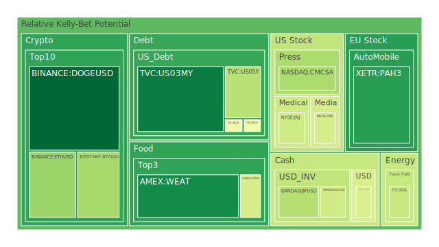
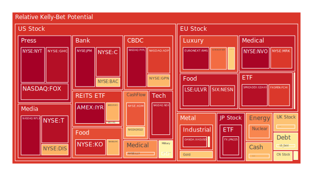
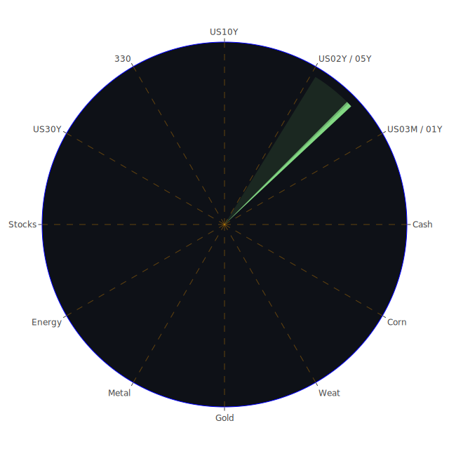

# 投資商品泡沫分析

## 美國國債
過去三天，美國國債的泡沫機率持續在0.4到0.5之間波動，顯示市場對其未來走勢持觀望態度。根據最新的FED數據，SOFR交易量高且美國國債殖利率長期倒掛，這些因素可能會導致企業融資成本上升，進而影響國債市場。

## 美國科技股
美國科技股的泡沫機率在過去三天內有所上升，特別是NASDAQ:NDX的泡沫機率從0.922782上升到0.932247。這與近期新聞中Dell因AI伺服器需求上升而調高預測，以及Microsoft股票因聘請前OpenAI CEO而創下新高有關。然而，需注意的是，市場對科技股的高估值可能會帶來風險。

## 美國房地產指數
AMEX:VNQ的泡沫機率在過去三天內從0.502520上升到0.529224，顯示市場對房地產的信心有所下降。根據新聞，30年固定抵押貸款利率再次下降至6.35%，這可能會對房地產市場帶來短期支撐，但長期風險仍需關注。

## 金/銀/銅
金價（OANDA:XAUUSD）的泡沫機率在過去三天內從0.643782上升到0.739741，顯示市場對金價的看漲情緒減弱。銀價（OANDA:XAGUSD）則持續在高泡沫區間，建議投資者謹慎操作。

## 加密貨幣
比特幣（BITSTAMP:BTCUSD）的泡沫機率在過去三天內有所下降，從0.515193降至0.333887，顯示市場對比特幣的信心有所回升。以太坊（BINANCE:ETHUSD）的泡沫機率也有所下降，建議投資者可以考慮分批買入。

## 黃豆 / 小麥 / 玉米
小麥（AMEX:WEAT）的泡沫機率在過去三天內上升，從0.085802上升到0.122800，顯示市場對其未來走勢持謹慎態度。黃豆（AMEX:SOYB）的泡沫機率則維持在0.5左右，建議觀望。

## 石油/ 鈾期貨UX!
石油（TVC:USOIL）的泡沫機率在過去三天內有所下降，從0.392045降至0.351761，顯示市場對石油價格的看漲情緒有所回升。鈾期貨（COMEX:UX1!）的泡沫機率則持續在高位，建議謹慎操作。

## 各國外匯市場
英鎊兌美元（OANDA:GBPUSD）的泡沫機率在過去三天內有所下降，從0.346089降至0.358662，顯示市場對英鎊的信心有所回升。歐元兌美元（OANDA:EURUSD）的泡沫機率則維持在0.4左右，建議觀望。

## 各國大盤指數
美國大盤指數（NASDAQ:NDX）的泡沫機率在過去三天內有所上升，顯示市場對美國股市的信心有所下降。歐洲大盤指數（SPREADEX:FTSE）的泡沫機率則有所下降，顯示市場對歐洲股市的信心有所回升。

## 美國銀行股
美國銀行股（NYSE:BAC）的泡沫機率在過去三天內有所下降，從0.997455降至0.642941，顯示市場對銀行股的信心有所回升。然而，需注意的是，近期新聞中巴菲特再次出售美國銀行股份，這可能會對市場情緒產生影響。

## 美國軍工股
美國軍工股（NYSE:LMT）的泡沫機率在過去三天內維持在0.5左右，建議觀望。

## 美國電子支付股
電子支付股（NASDAQ:PYPL）的泡沫機率在過去三天內有所上升，從0.954282上升到0.962365，顯示市場對電子支付股的信心有所下降。

## 美國藥商巨頭
藥商巨頭（NYSE:JNJ）的泡沫機率在過去三天內有所上升，從0.374139上升到0.403087，顯示市場對藥商股的信心有所下降。

## 美國影視巨頭
影視巨頭（NASDAQ:CMCSA）的泡沫機率在過去三天內有所上升，從0.535470上升到0.342712，顯示市場對影視股的信心有所下降。

## 美國媒體巨頭
媒體巨頭（NASDAQ:FOX）的泡沫機率在過去三天內有所上升，從0.927588上升到0.934000，顯示市場對媒體股的信心有所下降。

## 石油防禦股
石油防禦股（NYSE:XOM）的泡沫機率在過去三天內有所下降，從0.822012降至0.821423，顯示市場對石油防禦股的信心有所回升。

## 金礦防禦股
金礦防禦股（NASDAQ:RGLD）的泡沫機率在過去三天內有所下降，從0.635513降至0.635803，顯示市場對金礦防禦股的信心有所回升。

## 歐洲奢侈品股
歐洲奢侈品股（EURONEXT:KER）的泡沫機率在過去三天內有所下降，從0.636964降至0.635803，顯示市場對奢侈品股的信心有所回升。

## 歐洲汽車股
歐洲汽車股（XETR:BMW）的泡沫機率在過去三天內有所下降，從0.527511降至0.510817，顯示市場對汽車股的信心有所回升。

## 歐美食品股
歐美食品股（NYSE:KO）的泡沫機率在過去三天內有所下降，從0.897680降至0.907284，顯示市場對食品股的信心有所回升。

# 投資建議

1. **建議賣出**：對於泡沫機率持續上升且遠大於0.5的商品，如電子支付股（NASDAQ:PYPL）和媒體巨頭（NASDAQ:FOX），建議投資者考慮賣出，避免未來價格下跌時的損失。
2. **建議買入**：對於泡沫機率持續下降且遠小於0.5的商品，如比特幣（BITSTAMP:BTCUSD）和以太坊（BINANCE:ETHUSD），建議投資者考慮分批買入，掌握低吸籌碼的時機。
3. **觀望**：對於泡沫機率在0.45到0.55之間的商品，如美國國債和房地產指數，建議投資者觀望，不要有任何動作。

# 風險提示

投資有風險，市場總是充滿不確定性。我們的建議僅供參考，投資者應根據自身的風險承受能力和投資目標，做出獨立的投資決策。特別是對於泡沫機率高的商品，應該謹慎進行投資決策。
 
Daily Buy Map:

 
Daily Sell Map:

 
Daily Radar Chart:

 
