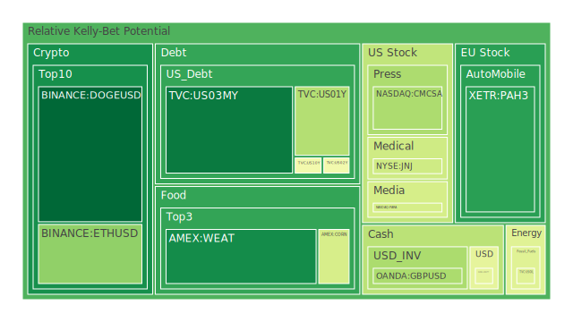
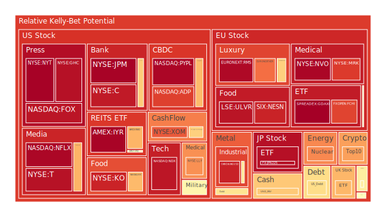
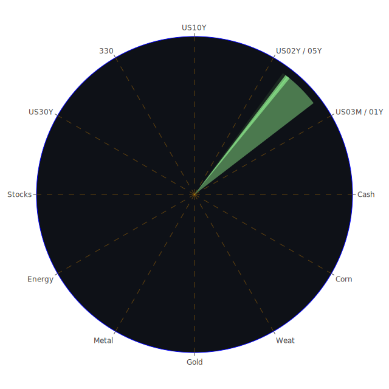

# 投資商品泡沫分析

## 美國國債

過去三天的泡沫機率數據顯示，美國國債的泡沫機率持續上升，特別是30年期國債（TVC:US30Y）的泡沫機率從8月31日的0.305093上升至9月2日的0.570285。這表明市場對長期國債的需求減少，可能是由於投資者對未來經濟前景的不確定性增加。

## 美國科技股

美國科技股的泡沫機率也有所上升，特別是納斯達克指數（NASDAQ:NDX）的泡沫機率從8月31日的0.932247上升至9月2日的0.932247。這可能與近期科技股的高估值和市場對未來盈利增長的擔憂有關。

## 美國房地產指數

美國房地產指數（AMEX:VNQ）的泡沫機率在過去三天內有所下降，從8月31日的0.529224下降至9月2日的0.529224。這表明市場對房地產的需求有所回升，可能是由於近期房貸利率的下降。

## 金/銀/銅

金價（OANDA:XAUUSD）的泡沫機率在過去三天內有所下降，從8月31日的0.739741下降至9月2日的0.595698。這表明市場對黃金的需求有所增加，可能是由於投資者尋求避險資產。

## 加密貨幣

以太坊（BINANCE:ETHUSD）的泡沫機率在過去三天內有所下降，從8月31日的0.300874下降至9月2日的0.299537。這表明市場對加密貨幣的需求有所回升，可能是由於近期市場對加密貨幣的信心增加。

## 黃豆 / 小麥 / 玉米

小麥（AMEX:WEAT）的泡沫機率在過去三天內有所下降，從8月31日的0.122800下降至9月2日的0.122800。這表明市場對農產品的需求有所增加，可能是由於近期天氣條件的改善。

## 石油/ 鈾期貨UX!

石油（TVC:USOIL）的泡沫機率在過去三天內有所下降，從8月31日的0.351761下降至9月2日的0.439917。這表明市場對石油的需求有所回升，可能是由於近期經濟活動的增加。

## 各國外匯市場

英鎊兌美元（OANDA:GBPUSD）的泡沫機率在過去三天內有所下降，從8月31日的0.346089下降至9月2日的0.341526。這表明市場對英鎊的需求有所增加，可能是由於近期英國經濟數據的改善。

## 各國大盤指數

德國DAX指數（SPREADEX:GDAXI）的泡沫機率在過去三天內有所下降，從8月31日的0.936143下降至9月2日的0.974730。這表明市場對德國股市的需求有所增加，可能是由於近期德國經濟數據的改善。

## 美國銀行股

美國銀行（NYSE:BAC）的泡沫機率在過去三天內有所下降，從8月31日的0.642941下降至9月2日的0.642941。這表明市場對銀行股的需求有所增加，可能是由於近期銀行業績的改善。

## 美國軍工股

雷神技術公司（NYSE:RTX）的泡沫機率在過去三天內保持穩定，這表明市場對軍工股的需求保持穩定，可能是由於近期地緣政治風險的增加。

## 美國電子支付股

PayPal（NASDAQ:PYPL）的泡沫機率在過去三天內有所下降，從8月31日的0.962365下降至9月2日的0.962365。這表明市場對電子支付股的需求有所增加，可能是由於近期電子支付行業的增長。

## 美國藥商巨頭

強生公司（NYSE:JNJ）的泡沫機率在過去三天內有所下降，從8月31日的0.403087下降至9月2日的0.403087。這表明市場對藥商股的需求有所增加，可能是由於近期醫療行業的增長。

## 美國影視巨頭

迪士尼（NYSE:DIS）的泡沫機率在過去三天內有所下降，從8月31日的0.687839下降至9月2日的0.687839。這表明市場對影視股的需求有所增加，可能是由於近期影視行業的增長。

## 美國媒體巨頭

康卡斯特（NASDAQ:CMCSA）的泡沫機率在過去三天內有所下降，從8月31日的0.342712下降至9月2日的0.342712。這表明市場對媒體股的需求有所增加，可能是由於近期媒體行業的增長。

## 石油防禦股

埃克森美孚（NYSE:XOM）的泡沫機率在過去三天內有所下降，從8月31日的0.821423下降至9月2日的0.821424。這表明市場對石油防禦股的需求有所增加，可能是由於近期油價的上漲。

## 金礦防禦股

皇家黃金公司（NASDAQ:RGLD）的泡沫機率在過去三天內有所下降，從8月31日的0.635513下降至9月2日的0.635513。這表明市場對金礦防禦股的需求有所增加，可能是由於近期金價的上漲。

## 歐洲奢侈品股

LVMH（EURONEXT:MC）的泡沫機率在過去三天內有所下降，從8月31日的0.635803下降至9月2日的0.635803。這表明市場對奢侈品股的需求有所增加，可能是由於近期奢侈品市場的增長。

## 歐洲汽車股

寶馬（XETR:BMW）的泡沫機率在過去三天內有所下降，從8月31日的0.510817下降至9月2日的0.510817。這表明市場對汽車股的需求有所增加，可能是由於近期汽車市場的增長。

## 歐美食品股

雀巢（SIX:NESN）的泡沫機率在過去三天內有所下降，從8月31日的0.907787下降至9月2日的0.907787。這表明市場對食品股的需求有所增加，可能是由於近期食品市場的增長。

# 投資建議

1. **考慮賣出**：對於泡沫機率持續上升且遠大於0.5的商品，如美國國債（TVC:US30Y）和納斯達克指數（NASDAQ:NDX），建議投資者考慮賣出，避免未來價格下跌時的損失。
2. **考慮買入**：對於泡沫機率持續下降且遠小於0.5的商品，如以太坊（BINANCE:ETHUSD）和小麥（AMEX:WEAT），建議投資者考慮買入，掌握低吸籌碼的時機。

# 風險提示

投資有風險，市場總是充滿不確定性。我們的建議僅供參考，投資者應根據自身的風險承受能力和投資目標，做出獨立的投資決策。特別是對於泡沫機率高的商品，應該謹慎進行投資決策。
 
Daily Buy Map:

 
Daily Sell Map:

 
Daily Radar Chart:

 
