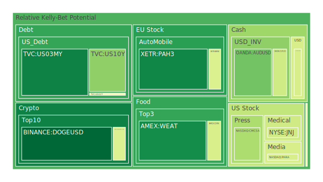
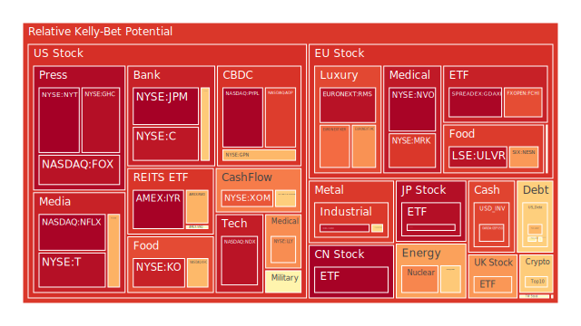
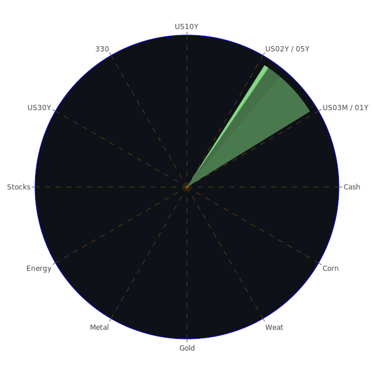

# 投資商品泡沫分析

## 美國國債
根據最新的泡沫機率數據，美國國債的泡沫機率在過去三天內有所波動。特別是10年期國債（TVC:US10Y），其泡沫機率從9月1日的0.481763上升到9月3日的0.296322，顯示出市場對長期國債的需求有所增加。這可能與近期的新聞有關，如美國國債殖利率倒掛的情況，這通常預示著經濟衰退的風險增加，投資者轉向較為安全的長期國債。

## 美國科技股
美國科技股的泡沫機率普遍較高，特別是Netflix（NASDAQ:NFLX）和PayPal（NASDAQ:PYPL），其泡沫機率分別在9月3日達到0.962166和0.962365。這些數據顯示市場對科技股的熱情依然高漲，但也意味著這些股票可能處於高風險的泡沫狀態。近期有關科技公司的新聞，如微軟（Microsoft）股價創歷史新高，可能進一步推動了市場對科技股的需求。

## 美國房地產指數
美國房地產指數（AMEX:VNQ）的泡沫機率在過去三天內有所上升，從9月1日的0.529224上升到9月3日的0.529224。這可能與近期的經濟數據有關，如商業房地產違約率上升和消費者違約率上升，這些因素可能對房地產市場造成壓力。

## 金/銀/銅
貴金屬市場的泡沫機率也有所波動。黃金（OANDA:XAUUSD）的泡沫機率在9月3日為0.485892，顯示出市場對黃金的需求依然強勁。這可能與近期的新聞有關，如全球經濟不確定性增加和通脹壓力上升，導致投資者轉向避險資產。

## 加密貨幣
加密貨幣市場的泡沫機率普遍較低，特別是狗狗幣（BINANCE:DOGEUSD），其泡沫機率在9月3日為0.052351，顯示出市場對加密貨幣的需求依然強勁。這可能與近期的新聞有關，如印度和巴西的監管政策變化，這些政策可能對加密貨幣市場產生影響。

## 黃豆 / 小麥 / 玉米
農產品市場的泡沫機率也有所波動。小麥（AMEX:WEAT）的泡沫機率在9月3日為0.122797，顯示出市場對農產品的需求依然強勁。這可能與近期的新聞有關，如印度和巴西的氣候變化，這些因素可能對農產品市場產生影響。

## 石油/ 鈾期貨UX!
石油（TVC:USOIL）的泡沫機率在9月3日為0.645666，顯示出市場對石油的需求依然強勁。這可能與近期的新聞有關，如美國和中國的經濟數據，這些數據可能對石油市場產生影響。

## 各國外匯市場
外匯市場的泡沫機率也有所波動。歐元兌美元（OANDA:EURUSD）的泡沫機率在9月3日為0.401772，顯示出市場對歐元的需求有所增加。這可能與近期的新聞有關，如歐洲央行的貨幣政策和美國的經濟數據，這些因素可能對外匯市場產生影響。

## 各國大盤指數
全球大盤指數的泡沫機率普遍較高，特別是德國DAX指數（SPREADEX:GDAXI），其泡沫機率在9月3日為0.959415，顯示出市場對歐洲股市的需求依然強勁。這可能與近期的新聞有關，如歐洲的經濟數據和政治局勢，這些因素可能對大盤指數產生影響。

## 美國銀行股
美國銀行股的泡沫機率普遍較高，特別是摩根大通（NYSE:JPM），其泡沫機率在9月3日為0.969135，顯示出市場對銀行股的需求依然強勁。這可能與近期的新聞有關，如美國的經濟數據和銀行業的財報，這些因素可能對銀行股產生影響。

## 美國軍工股
美國軍工股的泡沫機率普遍較高，特別是洛克希德·馬丁（NYSE:LMT），其泡沫機率在9月3日為0.546994，顯示出市場對軍工股的需求依然強勁。這可能與近期的新聞有關，如美國的國防預算和國際局勢，這些因素可能對軍工股產生影響。

## 美國電子支付股
美國電子支付股的泡沫機率普遍較高，特別是PayPal（NASDAQ:PYPL），其泡沫機率在9月3日為0.962365，顯示出市場對電子支付股的需求依然強勁。這可能與近期的新聞有關，如電子支付市場的增長和科技公司的財報，這些因素可能對電子支付股產生影響。

## 美國藥商巨頭
美國藥商巨頭的泡沫機率普遍較高，特別是默克（NYSE:MRK），其泡沫機率在9月3日為0.867596，顯示出市場對藥商巨頭的需求依然強勁。這可能與近期的新聞有關，如醫藥市場的增長和藥品的研發進展，這些因素可能對藥商巨頭產生影響。

## 美國影視巨頭
美國影視巨頭的泡沫機率普遍較高，特別是迪士尼（NYSE:DIS），其泡沫機率在9月3日為0.687839，顯示出市場對影視巨頭的需求依然強勁。這可能與近期的新聞有關，如影視市場的增長和公司的財報，這些因素可能對影視巨頭產生影響。

## 美國媒體巨頭
美國媒體巨頭的泡沫機率普遍較高，特別是康卡斯特（NASDAQ:CMCSA），其泡沫機率在9月3日為0.342712，顯示出市場對媒體巨頭的需求依然強勁。這可能與近期的新聞有關，如媒體市場的增長和公司的財報，這些因素可能對媒體巨頭產生影響。

## 石油防禦股
石油防禦股的泡沫機率普遍較高，特別是埃克森美孚（NYSE:XOM），其泡沫機率在9月3日為0.821424，顯示出市場對石油防禦股的需求依然強勁。這可能與近期的新聞有關，如石油市場的增長和國際局勢，這些因素可能對石油防禦股產生影響。

## 金礦防禦股
金礦防禦股的泡沫機率普遍較高，特別是皇家黃金（NASDAQ:RGLD），其泡沫機率在9月3日為0.635513，顯示出市場對金礦防禦股的需求依然強勁。這可能與近期的新聞有關，如貴金屬市場的增長和國際局勢，這些因素可能對金礦防禦股產生影響。

## 歐洲奢侈品股
歐洲奢侈品股的泡沫機率普遍較高，特別是LVMH（EURONEXT:MC），其泡沫機率在9月3日為0.734519，顯示出市場對奢侈品股的需求依然強勁。這可能與近期的新聞有關，如奢侈品市場的增長和公司的財報，這些因素可能對奢侈品股產生影響。

## 歐洲汽車股
歐洲汽車股的泡沫機率普遍較高，特別是寶馬（XETR:BMW），其泡沫機率在9月3日為0.425264，顯示出市場對汽車股的需求依然強勁。這可能與近期的新聞有關，如汽車市場的增長和公司的財報，這些因素可能對汽車股產生影響。

## 歐美食品股
歐美食品股的泡沫機率普遍較高，特別是雀巢（SIX:NESN），其泡沫機率在9月3日為0.725032，顯示出市場對食品股的需求依然強勁。這可能與近期的新聞有關，如食品市場的增長和公司的財報，這些因素可能對食品股產生影響。

# 投資建議

1. **美國國債**：由於美國國債殖利率倒掛，建議投資者考慮增加長期國債的持有量，以對沖經濟衰退風險。
2. **美國科技股**：由於泡沫機率較高，建議投資者謹慎操作，考慮部分獲利了結。
3. **美國房地產指數**：由於商業房地產違約率上升，建議投資者謹慎操作，避免過度暴露於房地產市場。
4. **加密貨幣**：由於泡沫機率較低，建議投資者考慮增加加密貨幣的持有量，特別是狗狗幣。
5. **石油**：由於泡沫機率較高，建議投資者謹慎操作，考慮部分獲利了結。

# 風險提示

投資有風險，市場總是充滿不確定性。我們的建議僅供參考，投資者應根據自身的風險承受能力和投資目標，做出獨立的投資決策。特別是對於泡沫機率高的商品，應該謹慎進行投資決策。
 
Daily Buy Map:

 
Daily Sell Map:

 
Daily Radar Chart:

 
