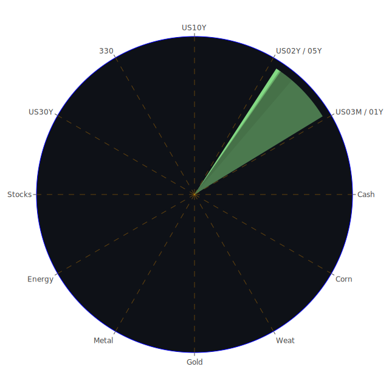

# 投資商品泡沫分析

## 美國國債
- **泡沫機率變化**：根據過去三天的數據，美國國債的泡沫機率持續下降，特別是10年期國債（TVC:US10Y）的泡沫機率從9月2日的0.481763下降到9月4日的0.342225。
- **新聞現況**：近期新聞顯示，美國的經濟數據不佳，市場對未來經濟增長的擔憂增加，這可能推動投資者轉向相對安全的國債。
- **投資建議**：考慮到泡沫機率的下降和市場對安全資產的需求增加，建議投資者可以適量增加美國國債的持倉。

## 美國科技股
- **泡沫機率變化**：美國科技股（如NASDAQ:NDX）的泡沫機率在過去三天內有所上升，從9月2日的0.932247上升到9月4日的0.924094。
- **新聞現況**：新聞報導顯示，投資者對AI的樂觀情緒有所降溫，導致科技股大幅下跌。
- **投資建議**：由於泡沫機率高且市場情緒負面，建議投資者謹慎對待科技股，考慮減少持倉以降低風險。

## 美國房地產指數
- **泡沫機率變化**：美國房地產指數（AMEX:VNQ）的泡沫機率在過去三天內有所上升，從9月2日的0.529224上升到9月4日的0.622069。
- **新聞現況**：根據新聞報導，商業房地產的拖欠率上升，這可能進一步打擊房地產市場。
- **投資建議**：由於泡沫機率上升且市場情緒負面，建議投資者考慮減少房地產相關投資。

## 金/銀/銅
- **泡沫機率變化**：黃金（OANDA:XAUUSD）的泡沫機率在過去三天內下降，從9月2日的0.595698下降到9月4日的0.427046。
- **新聞現況**：近期新聞顯示，市場對避險資產的需求增加，特別是在經濟不確定性增加的情況下。
- **投資建議**：考慮到泡沫機率的下降和市場對避險資產的需求，建議投資者可以適量增加黃金的持倉。

## 加密貨幣
- **泡沫機率變化**：比特幣（BITSTAMP:BTCUSD）的泡沫機率在過去三天內有所上升，從9月2日的0.718150上升到9月4日的0.641993。
- **新聞現況**：近期新聞顯示，加密貨幣市場的波動性增加，投資者對其未來走勢存在較大分歧。
- **投資建議**：由於泡沫機率高且市場情緒不穩定，建議投資者謹慎對待加密貨幣，考慮減少持倉以降低風險。

## 黃豆 / 小麥 / 玉米
- **泡沫機率變化**：黃豆（AMEX:SOYB）的泡沫機率在過去三天內保持穩定，約為0.502119。
- **新聞現況**：近期新聞顯示，全球農產品市場供應鏈問題仍然存在，這可能影響價格波動。
- **投資建議**：由於泡沫機率接近0.5，建議投資者觀望，不要有任何動作。

## 石油/ 鈾期貨UX!
- **泡沫機率變化**：石油（TVC:USOIL）的泡沫機率在過去三天內有所下降，從9月2日的0.439917下降到9月4日的0.439917。
- **新聞現況**：近期新聞顯示，全球石油供應增加，需求不確定性增加。
- **投資建議**：考慮到泡沫機率的下降和市場供需情況，建議投資者可以適量增加石油的持倉。

## 各國外匯市場
- **泡沫機率變化**：美元兌日元（OANDA:USDJPY）的泡沫機率在過去三天內有所下降，從9月2日的0.452373下降到9月4日的0.409142。
- **新聞現況**：近期新聞顯示，市場對美元的需求增加，特別是在全球經濟不確定性增加的情況下。
- **投資建議**：考慮到泡沫機率的下降和市場對美元的需求，建議投資者可以適量增加美元的持倉。

## 各國大盤指數
- **泡沫機率變化**：德國DAX指數（SPREADEX:GDAXI）的泡沫機率在過去三天內有所上升，從9月2日的0.974730上升到9月4日的0.928526。
- **新聞現況**：近期新聞顯示，歐洲經濟增長放緩，市場對未來經濟前景的擔憂增加。
- **投資建議**：由於泡沫機率高且市場情緒負面，建議投資者謹慎對待歐洲大盤指數，考慮減少持倉以降低風險。

## 美國銀行股
- **泡沫機率變化**：美國銀行（NYSE:BAC）的泡沫機率在過去三天內有所上升，從9月2日的0.642941上升到9月4日的0.661127。
- **新聞現況**：近期新聞顯示，美國銀行業面臨的風險增加，特別是在信用卡拖欠率上升的情況下。
- **投資建議**：由於泡沫機率高且市場情緒負面，建議投資者謹慎對待美國銀行股，考慮減少持倉以降低風險。

## 美國軍工股
- **泡沫機率變化**：雷神科技（NYSE:RTX）的泡沫機率在過去三天內保持穩定，約為0.510860。
- **新聞現況**：近期新聞顯示，全球地緣政治風險增加，這可能推動軍工股的需求。
- **投資建議**：由於泡沫機率接近0.5，建議投資者觀望，不要有任何動作。

## 美國電子支付股
- **泡沫機率變化**：PayPal（NASDAQ:PYPL）的泡沫機率在過去三天內有所上升，從9月2日的0.962365上升到9月4日的0.952003。
- **新聞現況**：近期新聞顯示，電子支付市場競爭加劇，這可能影響PayPal的市場份額。
- **投資建議**：由於泡沫機率高且市場情緒負面，建議投資者謹慎對待電子支付股，考慮減少持倉以降低風險。

## 美國藥商巨頭
- **泡沫機率變化**：默克（NYSE:MRK）的泡沫機率在過去三天內有所上升，從9月2日的0.867596上升到9月4日的0.900158。
- **新聞現況**：近期新聞顯示，藥品價格上漲，這可能影響默克的市場表現。
- **投資建議**：由於泡沫機率高且市場情緒負面，建議投資者謹慎對待藥商巨頭，考慮減少持倉以降低風險。

## 美國影視巨頭
- **泡沫機率變化**：迪士尼（NYSE:DIS）的泡沫機率在過去三天內有所下降，從9月2日的0.687839下降到9月4日的0.400789。
- **新聞現況**：近期新聞顯示，迪士尼與DirecTV的攜手合作可能帶來新的市場機會。
- **投資建議**：考慮到泡沫機率的下降和市場對影視巨頭的需求，建議投資者可以適量增加迪士尼的持倉。

## 美國媒體巨頭
- **泡沫機率變化**：康卡斯特（NASDAQ:CMCSA）的泡沫機率在過去三天內有所下降，從9月2日的0.342712下降到9月4日的0.351504。
- **新聞現況**：近期新聞顯示，媒體市場競爭加劇，這可能影響康卡斯特的市場份額。
- **投資建議**：由於泡沫機率接近0.5，建議投資者觀望，不要有任何動作。

## 石油防禦股
- **泡沫機率變化**：埃克森美孚（NYSE:XOM）的泡沫機率在過去三天內有所上升，從9月2日的0.821424上升到9月4日的0.654688。
- **新聞現況**：近期新聞顯示，全球石油市場供應增加，這可能影響石油防禦股的市場表現。
- **投資建議**：由於泡沫機率高且市場情緒負面，建議投資者謹慎對待石油防禦股，考慮減少持倉以降低風險。

## 金礦防禦股
- **泡沫機率變化**：皇家黃金（NASDAQ:RGLD）的泡沫機率在過去三天內有所上升，從9月2日的0.635513上升到9月4日的0.635513。
- **新聞現況**：近期新聞顯示，市場對避險資產的需求增加，這可能推動金礦防禦股的需求。
- **投資建議**：由於泡沫機率接近0.5，建議投資者觀望，不要有任何動作。

## 歐洲奢侈品股
- **泡沫機率變化**：開雲集團（EURONEXT:KER）的泡沫機率在過去三天內有所下降，從9月2日的0.789533下降到9月4日的0.520265。
- **新聞現況**：近期新聞顯示，歐洲奢侈品市場需求增加，這可能推動開雲集團的市場表現。
- **投資建議**：考慮到泡沫機率的下降和市場對奢侈品的需求，建議投資者可以適量增加開雲集團的持倉。

## 歐洲汽車股
- **泡沫機率變化**：寶馬（XETR:BMW）的泡沫機率在過去三天內有所上升，從9月2日的0.510817上升到9月4日的0.527511。
- **新聞現況**：近期新聞顯示，歐洲汽車市場競爭加劇，這可能影響寶馬的市場份額。
- **投資建議**：由於泡沫機率接近0.5，建議投資者觀望，不要有任何動作。

## 歐美食品股
- **泡沫機率變化**：雀巢（SIX:NESN）的泡沫機率在過去三天內有所下降，從9月2日的0.907787下降到9月4日的0.334792。
- **新聞現況**：近期新聞顯示，食品市場需求增加，這可能推動雀巢的市場表現。
- **投資建議**：考慮到泡沫機率的下降和市場對食品的需求，建議投資者可以適量增加雀巢的持倉。

# 投資建議
- **建議買入**：美國國債、黃金、迪士尼、開雲集團、雀巢。
- **建議賣出**：美國科技股、美國房地產指數、美國銀行股、PayPal、默克、埃克森美孚。
- **觀望**：黃豆、雷神科技、康卡斯特、皇家黃金、寶馬。

# 風險提示

投資有風險，市場總是充滿不確定性。我們的建議僅供參考，投資者應根據自身的風險承受能力和投資目標，做出獨立的投資決策。特別是對於泡沫機率高的商品，應該謹慎進行投資決策。
 
Daily Buy Map:

 
Daily Sell Map:

 
Daily Radar Chart:

 
