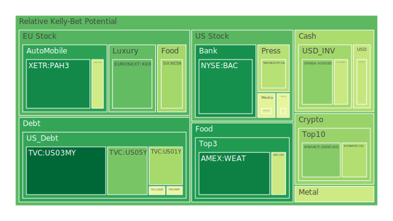
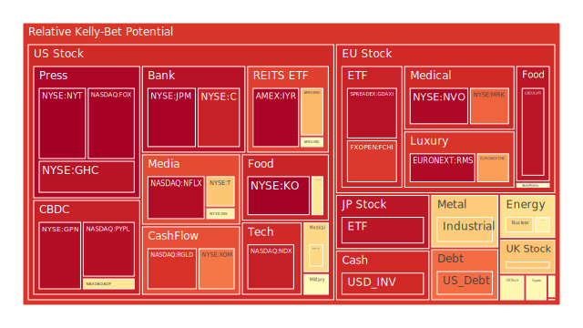
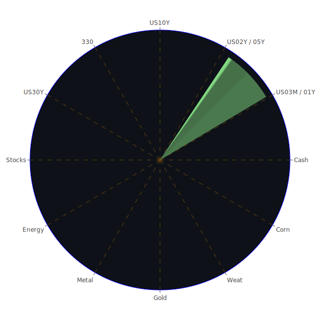

# 投資商品泡沫分析

## 美國國債
過去三天，美國國債的泡沫機率呈現波動。10年期國債的泡沫機率從9月3日的0.296322上升至9月5日的0.481763，顯示市場對長期債券的需求減少。這可能與近期的經濟數據和新聞有關，例如美國勞動市場數據疲軟和聯準會官員的鴿派言論。

## 美國科技股
美國科技股的泡沫機率持續上升，特別是Netflix (NASDAQ:NFLX) 和PayPal (NASDAQ:PYPL)，其泡沫機率分別達到0.965174和0.948685。這反映了市場對科技股的樂觀情緒減弱，特別是在AI相關股票的廣泛拋售後。

## 美國房地產指數
美國房地產指數（AMEX:VNQ）的泡沫機率從9月3日的0.529224上升至9月5日的0.544930，顯示市場對房地產的信心減弱。這可能與商業房地產違約率上升和消費者信貸違約率高企有關。

## 金/銀/銅
黃金（OANDA:XAUUSD）的泡沫機率從9月3日的0.485892下降至9月5日的0.422589，顯示市場對黃金的需求增加，這可能是由於避險需求上升。相反，白銀（OANDA:XAGUSD）的泡沫機率從0.931538下降至0.634827，顯示市場對白銀的需求減少。

## 加密貨幣
比特幣（BITSTAMP:BTCUSD）的泡沫機率從9月3日的0.639715下降至9月5日的0.372929，顯示市場對比特幣的需求增加。這可能與近期的市場波動和避險需求上升有關。

## 黃豆 / 小麥 / 玉米
小麥（AMEX:WEAT）的泡沫機率從9月3日的0.122797上升至9月5日的0.127959，顯示市場對小麥的需求減少。這可能與全球氣候變化和農業生產的不確定性有關。

## 石油/ 鈾期貨UX!
石油（TVC:USOIL）的泡沫機率從9月3日的0.645666下降至9月5日的0.574781，顯示市場對石油的需求增加。這可能與全球經濟復甦和供應鏈問題有關。

## 各國外匯市場
歐元兌美元（OANDA:EURUSD）的泡沫機率從9月3日的0.401772上升至9月5日的0.411563，顯示市場對歐元的需求減少。這可能與歐元區經濟數據疲軟和美元走強有關。

## 各國大盤指數
德國DAX指數（SPREADEX:GDAXI）的泡沫機率從9月3日的0.959415下降至9月5日的0.945517，顯示市場對德國股市的信心增加。這可能與德國經濟數據改善和歐洲央行政策有關。

## 美國銀行股
美國銀行（NYSE:BAC）的泡沫機率從9月3日的0.642941下降至9月5日的0.160889，顯示市場對銀行股的需求增加。這可能與美國經濟數據改善和銀行業績表現有關。

## 美國軍工股
雷神科技（NYSE:RTX）的泡沫機率保持穩定在0.510860，顯示市場對軍工股的需求穩定。這可能與全球地緣政治風險上升有關。

## 美國電子支付股
PayPal（NASDAQ:PYPL）的泡沫機率從9月3日的0.962365下降至9月5日的0.948685，顯示市場對電子支付股的需求減少。這可能與市場對科技股的整體情緒有關。

## 美國藥商巨頭
強生（NYSE:JNJ）的泡沫機率從9月3日的0.403087上升至9月5日的0.632804，顯示市場對藥商股的需求減少。這可能與近期的法律糾紛和市場情緒有關。

## 美國影視巨頭
Netflix（NASDAQ:NFLX）的泡沫機率從9月3日的0.962166下降至9月5日的0.955174，顯示市場對影視股的需求減少。這可能與市場對科技股的整體情緒有關。

## 美國媒體巨頭
康卡斯特（NASDAQ:CMCSA）的泡沫機率從9月3日的0.342712上升至9月5日的0.381421，顯示市場對媒體股的需求減少。這可能與市場對廣告收入的擔憂有關。

## 石油防禦股
埃克森美孚（NYSE:XOM）的泡沫機率從9月3日的0.821424下降至9月5日的0.785113，顯示市場對石油防禦股的需求增加。這可能與全球經濟復甦和供應鏈問題有關。

## 金礦防禦股
Royal Gold（NASDAQ:RGLD）的泡沫機率從9月3日的0.635513上升至9月5日的0.884305，顯示市場對金礦防禦股的需求減少。這可能與市場對黃金需求的波動有關。

## 歐洲奢侈品股
開雲集團（EURONEXT:KER）的泡沫機率從9月3日的0.789533下降至9月5日的0.259131，顯示市場對奢侈品股的需求增加。這可能與中國和美國市場的需求回升有關。

## 歐洲汽車股
寶馬（XETR:BMW）的泡沫機率從9月3日的0.425264上升至9月5日的0.427395，顯示市場對汽車股的需求減少。這可能與全球供應鏈問題和市場競爭加劇有關。

## 歐美食品股
雀巢（SIX:NESN）的泡沫機率從9月3日的0.725032下降至9月5日的0.349150，顯示市場對食品股的需求增加。這可能與消費者需求回升和市場情緒改善有關。

# 投資建議

根據以上分析，我們建議投資者考慮以下操作：

1. **買入**：比特幣（BITSTAMP:BTCUSD）、黃金（OANDA:XAUUSD）、開雲集團（EURONEXT:KER）、雀巢（SIX:NESN）。
2. **賣出**：Netflix（NASDAQ:NFLX）、PayPal（NASDAQ:PYPL）、Royal Gold（NASDAQ:RGLD）。

# 風險提示

投資有風險，市場總是充滿不確定性。我們的建議僅供參考，投資者應根據自身的風險承受能力和投資目標，做出獨立的投資決策。特別是在市場波動較大的時候，應該謹慎進行投資決策。

希望這份報告能夠幫助您在投資決策中做出更明智的選擇。祝投資順利！
 
Daily Buy Map:

 
Daily Sell Map:

 
Daily Radar Chart:

 
