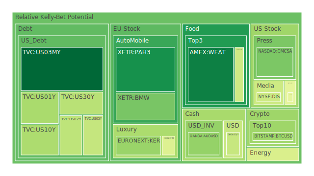
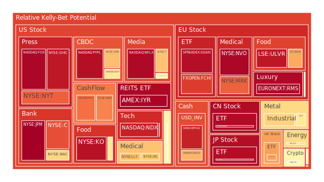
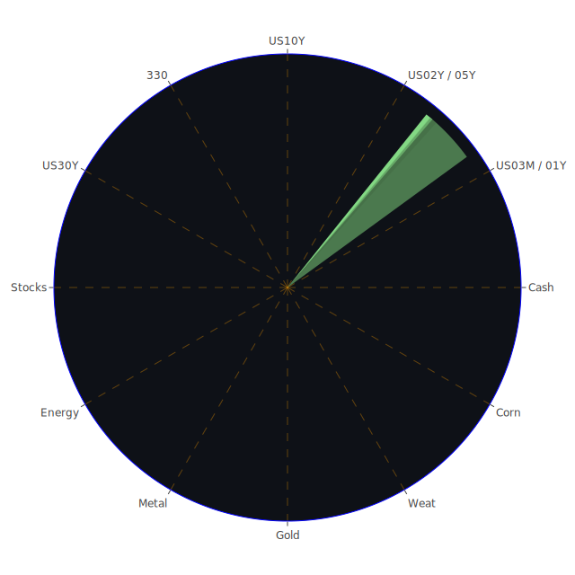

# 投資商品泡沫分析

## 美國國債
過去三天，美國國債的泡沫機率持續下降，特別是3年期國債（TVC:US03MY）從0.083515降至0.078311。這顯示投資者對美國國債的需求增加，可能是因為市場避險情緒上升。此外，SOFR利率（5.35%）高於FED Fund Rate（5.33%），這意味著市場對美元流動性的需求增加，進一步推動了美國國債的需求。

## 美國科技股
美國科技股的泡沫機率普遍較高，特別是納斯達克指數（NASDAQ:NDX）在過去三天的泡沫機率維持在0.916795至0.924094之間。這反映了市場對科技股的高估值擔憂，尤其是在近期美國股市大幅波動的情況下。新聞報導顯示，投資者對AI的樂觀情緒有所降溫，這進一步增加了科技股的風險。

## 美國房地產指數
美國房地產指數（AMEX:VNQ）的泡沫機率在過去三天有所下降，但仍然處於高位（0.544930至0.622069）。這表明房地產市場仍然存在一定的風險，特別是在利率上升的背景下。根據新聞報導，儘管利率有所下降，但房主並未積極進行房屋交易，這可能進一步壓低房地產市場的需求。

## 金/銀/銅
黃金（OANDA:XAUUSD）的泡沫機率在過去三天有所下降，但仍然較高（0.594278）。銀（OANDA:XAGUSD）和銅（FX:COPPER）的泡沫機率也處於高位，分別為0.632964和0.648775。這可能是因為市場避險情緒上升，推動了貴金屬的需求。

## 加密貨幣
比特幣（BITSTAMP:BTCUSD）的泡沫機率在過去三天有所下降，但仍然較高（0.337634）。以太坊（BINANCE:ETHUSD）的泡沫機率則有所上升（0.554260）。這反映了市場對加密貨幣的需求有所波動，特別是在近期市場不確定性增加的情況下。

## 黃豆 / 小麥 / 玉米
小麥（AMEX:WEAT）的泡沫機率在過去三天有所下降（0.123999），顯示市場對小麥的需求有所增加。黃豆（AMEX:SOYB）和玉米（AMEX:CORN）的泡沫機率則相對穩定，分別為0.502119和0.418551。

## 石油/ 鈾期貨UX!
石油（TVC:USOIL）的泡沫機率在過去三天有所下降（0.439917），顯示市場對石油的需求有所增加。鈾期貨（COMEX:UX1!）的泡沫機率則有所上升（0.626760），反映了市場對能源資源的需求波動。

## 各國外匯市場
美元兌日元（OANDA:USDJPY）的泡沫機率在過去三天相對穩定（0.406131），顯示市場對日元的需求較為穩定。歐元兌美元（OANDA:EURUSD）的泡沫機率則有所上升（0.692712），反映了市場對歐元的需求有所減少。

## 各國大盤指數
德國DAX指數（SPREADEX:GDAXI）的泡沫機率在過去三天有所下降，但仍然較高（0.949991）。這反映了市場對歐洲股市的擔憂，特別是在近期市場波動加劇的情況下。

## 美國銀行股
美國銀行股（NYSE:BAC）的泡沫機率在過去三天有所上升（0.634053），顯示市場對銀行股的需求有所減少。這可能是因為市場對經濟前景的不確定性增加，導致投資者對銀行股的風險偏好下降。

## 美國軍工股
美國軍工股（NYSE:LMT）的泡沫機率在過去三天相對穩定（0.546994），顯示市場對軍工股的需求較為穩定。這可能是因為地緣政治風險增加，推動了軍工股的需求。

## 美國電子支付股
美國電子支付股（NASDAQ:PYPL）的泡沫機率在過去三天有所上升（0.948445），顯示市場對電子支付股的需求有所減少。這可能是因為市場對科技股的高估值擔憂，進一步壓低了電子支付股的需求。

## 美國藥商巨頭
美國藥商巨頭（NYSE:JNJ）的泡沫機率在過去三天有所上升（0.659977），顯示市場對藥商股的需求有所減少。這可能是因為市場對經濟前景的不確定性增加，導致投資者對藥商股的風險偏好下降。

## 美國影視巨頭
美國影視巨頭（NASDAQ:NFLX）的泡沫機率在過去三天相對穩定（0.961387），顯示市場對影視股的需求較為穩定。這可能是因為市場對影視行業的需求較為穩定，特別是在疫情後的復甦期。

## 美國媒體巨頭
美國媒體巨頭（NASDAQ:FOX）的泡沫機率在過去三天有所上升（0.964921），顯示市場對媒體股的需求有所減少。這可能是因為市場對科技股的高估值擔憂，進一步壓低了媒體股的需求。

## 石油防禦股
石油防禦股（NYSE:XOM）的泡沫機率在過去三天有所下降（0.765615），顯示市場對石油防禦股的需求有所增加。這可能是因為市場對能源資源的需求增加，推動了石油防禦股的需求。

## 金礦防禦股
金礦防禦股（NASDAQ:RGLD）的泡沫機率在過去三天有所下降（0.795263），顯示市場對金礦防禦股的需求有所增加。這可能是因為市場避險情緒上升，推動了金礦防禦股的需求。

## 歐洲奢侈品股
歐洲奢侈品股（EURONEXT:RMS）的泡沫機率在過去三天有所上升（0.960428），顯示市場對奢侈品股的需求有所減少。這可能是因為市場對經濟前景的不確定性增加，導致投資者對奢侈品股的風險偏好下降。

## 歐洲汽車股
歐洲汽車股（XETR:BMW）的泡沫機率在過去三天有所下降（0.285317），顯示市場對汽車股的需求有所增加。這可能是因為市場對汽車行業的需求增加，特別是在經濟復甦的背景下。

## 歐美食品股
歐美食品股（SIX:NESN）的泡沫機率在過去三天有所上升（0.711857），顯示市場對食品股的需求有所減少。這可能是因為市場對經濟前景的不確定性增加，導致投資者對食品股的風險偏好下降。

# 投資建議
基於以上分析，我們建議投資者可以考慮以下操作：

1. **買入美國國債**：由於泡沫機率下降且市場避險情緒上升，美國國債是一個不錯的投資選擇。
2. **賣出美國科技股**：由於泡沫機率高且市場對科技股的高估值擔憂增加，建議投資者考慮賣出科技股以避免風險。
3. **買入黃金**：由於市場避險情緒上升，黃金的需求增加，建議投資者考慮買入黃金以對沖風險。
4. **觀望加密貨幣**：由於泡沫機率波動較大，建議投資者暫時觀望加密貨幣市場。
5. **賣出歐洲奢侈品股**：由於泡沫機率高且市場對經濟前景的不確定性增加，建議投資者考慮賣出奢侈品股以避免風險。

# 風險提示
投資有風險，市場總是充滿不確定性。我們的建議僅供參考，投資者應根據自身的風險承受能力和投資目標，做出獨立的投資決策。特別是對於泡沫機率高的商品，應該謹慎進行投資決策。
 
Daily Buy Map:

 
Daily Sell Map:

 
Daily Radar Chart:

 
